# Hi, I'm Sam Jackson!
**[System Development Engineer](https://github.com/samueljackson-collab)** · **[DevOps & QA Enthusiast](https://www.linkedin.com/in/sams-jackson)** · **Homelab Builder**

***Building reliable systems, documenting clearly, and sharing what I learn. I turn ambiguous requirements into runbooks, dashboards, and repeatable processes.***

**Status key:** 🟢 Done · 🟠 In Progress · 🔵 Planned · 🔄 Recovery/Rebuild · 📝 Documentation Pending

**Documentation:** Evidence for every project is now centralized in the [Portfolio-Project repository](https://github.com/samueljackson-collab/Portfolio-Project). Each project entry below links directly to its evidence bundle (design docs, runbooks, IaC, tests, and screenshots).

> **Portfolio Note:** This repository is actively being built. Projects marked 🟢 are technically complete but documentation/evidence is being prepared (📝). Projects marked 🔵 are planned roadmap items, and 🔄 indicates recovery/rebuild efforts are underway.
>
> **Note:** Project directories and documentation are currently being structured and will be added progressively.

---
## 🎯 Summary
System-minded engineer specializing in building, securing, and operating infrastructure and data-heavy web systems. Hands-on with homelab → production-like setups (wired rack, UniFi network, VPN, backup/restore drills), and pragmatic DevOps/QA practices.

<details><summary><strong>Alternate summaries for tailoring</strong></summary>

**DevOps-forward** DevOps-leaning systems engineer who builds and operates reliable services end-to-end: homelab→production patterns (networking, virtualization, reverse proxy + TLS, backups), monitoring (golden signals), and CI/CD automation.

**QA-forward** Quality-driven systems engineer turning ambiguous requirements into testable runbooks, acceptance criteria, and regression checklists. Builds monitoring dashboards for golden signals and SLOs.
</details>

---
## 📦 Portfolio Projects (Planned)

The following projects represent planned portfolio work demonstrating various technical skills:

- **Project 1: AWS Infrastructure Automation** — Multi-tool infrastructure-as-code implementation covering Terraform, AWS CDK, and Pulumi with reusable deploy scripts.
- **Project 2: Database Migration Platform** — Change data capture pipelines and automation for zero-downtime migrations.
- **Project 3: Kubernetes CI/CD Pipeline** — GitOps, progressive delivery, and environment promotion policies.
- **Project 4: DevSecOps Pipeline** — Security scanning, SBOM publishing, and policy-as-code enforcement.
- **Project 5: Real-time Data Streaming** — Kafka, Flink, and schema registry patterns for resilient stream processing.
- **Project 6: Machine Learning Pipeline** — End-to-end MLOps workflows with experiment tracking and automated promotion.
- **Project 7: Serverless Data Processing** — Event-driven analytics built on AWS Lambda, Step Functions, and DynamoDB.
- **Project 8: Advanced AI Chatbot** — Retrieval-augmented assistant with vector search, tool execution, and streaming responses.
- **Project 9: Multi-Region Disaster Recovery** — Automated failover, replication validation, and DR runbooks.
- **Project 10: Blockchain Smart Contract Platform** — Hardhat-based DeFi stack with staking contracts and security tooling.
- **Project 11: IoT Data Ingestion & Analytics** — Edge telemetry simulation, ingestion, and real-time dashboards.
- **Project 12: Quantum Computing Integration** — Hybrid quantum/classical optimization workflows using Qiskit.
- **Project 13: Advanced Cybersecurity Platform** — SOAR engine with enrichment adapters and automated response playbooks.
- **Project 14: Edge AI Inference Platform** — ONNX Runtime service optimized for Jetson-class devices.
- **Project 15: Real-time Collaborative Platform** — Operational transform collaboration server with CRDT reconciliation.
- **Project 16: Advanced Data Lake & Analytics** — Medallion architecture transformations and Delta Lake patterns.
- **Project 17: Multi-Cloud Service Mesh** — Istio multi-cluster configuration with mTLS and network overlays.
- **Project 18: GPU-Accelerated Computing** — CuPy-powered Monte Carlo simulations and GPU workload orchestration.
- **Project 19: Advanced Kubernetes Operators** — Kopf-based operator managing portfolio stack lifecycles.
- **Project 20: Blockchain Oracle Service** — Chainlink adapter and consumer contracts for on-chain metrics.
- **Project 21: Quantum-Safe Cryptography** — Hybrid Kyber + ECDH key exchange prototype.
- **Project 22: Autonomous DevOps Platform** — Event-driven remediation workflows and runbooks-as-code.
- **Project 23: Advanced Monitoring & Observability** — Grafana dashboards, alerting rules, and distributed tracing config.
- **Project 24: Portfolio Report Generator** — Automated report templating with Jinja2.
- **Project 25: Portfolio Website & Documentation Hub** — VitePress-powered portal aggregating all documentation and guides.

---
## 📊 Portfolio Status Board

> **Note:** This Status Board tracks the actual implementation and delivery progress of portfolio projects. The [Portfolio Blueprints](#-portfolio-blueprints) section provides the corresponding architectural references and planned structures.

🟢 Done · 🟠 In Progress · 🔵 Planned

**🟢 Done**
- **Project 1: AWS Infrastructure Automation**
  - What it is: Terraform/CDK/Pulumi baseline for AWS with reusable deploy scripts.
  - What’s done: CI for fmt/validate/tfsec/plan/apply; 250+ lines of pytest coverage validating variables, outputs, and security controls.
  - Evidence: [Portfolio-Project › AWS Infrastructure Automation](https://github.com/samueljackson-collab/Portfolio-Project/tree/main/aws-infrastructure-automation)

- **Project 2: Database Migration Platform**
  - What it is: Debezium + AWS DMS–driven zero-downtime migration orchestrator.
  - What’s done: 680-line orchestrator, Dockerized runtime, 300+ lines of unit tests, CI for lint/test/build/publish, Debezium connector config.
  - Evidence: [Portfolio-Project › Database Migration Platform](https://github.com/samueljackson-collab/Portfolio-Project/tree/main/database-migration-platform)

- **Project 3: Kubernetes CI/CD Pipeline**
  - What it is: GitOps-ready CI/CD for Kubernetes with progressive delivery.
  - What’s done: GitHub Actions with YAML/K8s validation, image builds, Trivy scans, ArgoCD sync, blue-green deploys, automated rollbacks.
  - Evidence: [Portfolio-Project › Kubernetes CI/CD Pipeline](https://github.com/samueljackson-collab/Portfolio-Project/tree/main/kubernetes-cicd-pipeline)

- **Project 4: DevSecOps Pipeline**
  - What it is: Security-first pipeline covering SAST, SCA, secrets, SBOM, and DAST.
  - What’s done: Semgrep, Bandit, CodeQL, Gitleaks/TruffleHog, Syft SBOM, Trivy/Dockle, OWASP ZAP, and compliance policy validation.
  - Evidence: [Portfolio-Project › DevSecOps Pipeline](https://github.com/samueljackson-collab/Portfolio-Project/tree/main/devsecops-pipeline)

- **Project 23: Advanced Monitoring & Observability**
  - What it is: Monitoring stack for metrics, logs, and tracing across services.
  - What’s done: Automated Prometheus/Grafana/Loki/Otel deployment, dashboard linting, alert rule checks, health verification.
  - Evidence: [Portfolio-Project › Advanced Monitoring & Observability](https://github.com/samueljackson-collab/Portfolio-Project/tree/main/advanced-monitoring-observability)


**🟠 In Progress**
- **Project 6: Machine Learning Pipeline**
  - Focus: Phase 2 expansion—experiment tracking, model promotion gates, Docker images for training/serving.
  - Next: Integrate experiment registry and CI hooks for promotion approvals.
  - Evidence: [Portfolio-Project › Machine Learning Pipeline](https://github.com/samueljackson-collab/Portfolio-Project/tree/main/machine-learning-pipeline)

- **Project 7: Serverless Data Processing**
  - Focus: Lambda/Step Functions pipelines with IaC and CDC ingestion.
  - Next: Add unit tests and failure-handling paths; wire to validation harness.
  - Evidence: [Portfolio-Project › Serverless Data Processing](https://github.com/samueljackson-collab/Portfolio-Project/tree/main/serverless-data-processing)

- **Project 8: Advanced AI Chatbot**
  - Focus: RAG pipeline and tool-execution flow with evaluation harness.
  - Next: Containerize services, add retrieval evals, and wire telemetry.
  - Evidence: [Portfolio-Project › Advanced AI Chatbot](https://github.com/samueljackson-collab/Portfolio-Project/tree/main/advanced-ai-chatbot)

- **Project 10: Blockchain Smart Contract Platform**
  - Focus: Hardhat-based contracts with audits and deployment automation.
  - Next: Expand CI coverage, add audit scripts, and release pipelines.
  - Evidence: [Portfolio-Project › Blockchain Smart Contract Platform](https://github.com/samueljackson-collab/Portfolio-Project/tree/main/blockchain-smart-contract-platform)

- **Project 15: Real-time Collaborative Platform**
  - Focus: CRDT/OT engine for collaborative editing.
  - Next: Conflict resolution tests, latency simulations, and deploy automation.
  - Evidence: [Portfolio-Project › Real-time Collaborative Platform](https://github.com/samueljackson-collab/Portfolio-Project/tree/main/real-time-collaboration-platform)

- **Project 25: Portfolio Website & Documentation Hub**
  - Focus: VitePress site hosting portfolio docs and reports.
  - Next: Improve navigation/badges, automate report publishing, and add status cards.
  - Evidence: [Portfolio-Project › Portfolio Website & Documentation Hub](https://github.com/samueljackson-collab/Portfolio-Project/tree/main/portfolio-website-documentation-hub)


**🔵 Planned**
- **Project 5: Real-time Data Streaming**
  - Plan: Kafka/Flink data plane with schema registry, CDC ingestion, and stream quality checks.
  - Roadmap: P0 build producer/consumer harness → P1 add Flink jobs + schema registry → P2 integrate quality gates + latency SLOs.
  - Timeline: Sprint 1 (foundation) · Sprint 2 (jobs + registry) · Sprint 3 (quality/SLO evidence)

- **Project 9: Multi-Region Disaster Recovery**
  - Plan: DR drills, replication validation, automated failover tests, and runbooks.
  - Roadmap: P0 document RPO/RTO targets → P1 automate replication checks → P2 run failover game days with evidence capture.
  - Timeline: Sprint 1 (RPO/RTO + replication) · Sprint 2 (failover automation) · Sprint 3 (runbook + reporting)

- **Project 11: IoT Data Ingestion & Analytics**
  - Plan: Edge telemetry simulators feeding stream processing and dashboards.
  - Roadmap: P0 device simulators + gateway → P1 stream processors + storage → P2 dashboarding + anomaly alerts.
  - Timeline: Sprint 1 (sim + gateway) · Sprint 2 (processing/storage) · Sprint 3 (dashboards/alerts)

- **Project 12: Quantum Computing Integration**
  - Plan: Qiskit hybrid workflows for optimization experiments.
  - Roadmap: P0 define optimization targets → P1 wire classical optimizer → P2 hybrid loop + error mitigation evidence.
  - Timeline: Sprint 1 (problem framing) · Sprint 2 (hybrid loops) · Sprint 3 (mitigation + results)

- **Project 13: Advanced Cybersecurity Platform**
  - Plan: SOAR pipeline with enrichment adapters, detections, and response playbooks.
  - Roadmap: P0 detection catalog + SOAR skeleton → P1 enrichment adapters → P2 response playbooks + audit trails.
  - Timeline: Sprint 1 (detections) · Sprint 2 (enrichment) · Sprint 3 (response + evidence)

- **Project 14: Edge AI Inference Platform**
  - Plan: ONNX Runtime service for Jetson-class deployments with perf tuning and telemetry.
  - Roadmap: P0 model selection/quantization → P1 runtime packaging + perf tests → P2 telemetry/export + OTA updates.
  - Timeline: Sprint 1 (models) · Sprint 2 (runtime/perf) · Sprint 3 (telemetry/OTA)

- **Project 16: Advanced Data Lake & Analytics**
  - Plan: Medallion architecture, Delta Lake transformations, and data quality checks.
  - Roadmap: P0 raw/bronze ingestion → P1 silver/gold transformations → P2 data quality + BI dashboards.
  - Timeline: Sprint 1 (raw/bronze) · Sprint 2 (silver/gold) · Sprint 3 (DQ + BI)

- **Project 17: Multi-Cloud Service Mesh**
  - Plan: Istio multi-cluster blueprint with mTLS, policy controls, and failover scenarios.
  - Roadmap: P0 base Istio install + mTLS → P1 multi-cluster linking + policy overlay → P2 failover drills + tracing dashboards.
  - Timeline: Sprint 1 (install/mTLS) · Sprint 2 (multi-cluster/policy) · Sprint 3 (failover + obs)

- **Project 18: GPU-Accelerated Computing**
  - Plan: CuPy-powered Monte Carlo workloads and orchestration patterns.
  - Roadmap: P0 GPU runners + job scheduler → P1 Monte Carlo kernels + profiling → P2 scaling + cost/perf reports.
  - Timeline: Sprint 1 (runners) · Sprint 2 (kernels/profiles) · Sprint 3 (scaling/reports)

- **Project 19: Advanced Kubernetes Operators**
  - Plan: Kopf-based operator managing portfolio lifecycle automation.
  - Roadmap: P0 CRD design + reconciliation loop → P1 lifecycle automation flows → P2 status/telemetry exports + chaos tests.
  - Timeline: Sprint 1 (CRDs) · Sprint 2 (automation flows) · Sprint 3 (telemetry/chaos)

- **Project 20: Blockchain Oracle Service**
  - Plan: Chainlink adapters plus consumer contracts with monitoring hooks.
  - Roadmap: P0 adapter scaffold + mock feeds → P1 consumer contracts + tests → P2 monitoring hooks + on-chain proof reports.
  - Timeline: Sprint 1 (adapter) · Sprint 2 (consumers/tests) · Sprint 3 (monitoring/proofs)

- **Project 21: Quantum-Safe Cryptography**
  - Plan: Hybrid Kyber + ECDH key exchange prototype with interoperability tests.
  - Roadmap: P0 hybrid handshake design → P1 interoperability harness + perf tests → P2 docs + compatibility matrix.
  - Timeline: Sprint 1 (design) · Sprint 2 (interop/perf) · Sprint 3 (docs/matrix)

- **Project 22: Autonomous DevOps Platform**
  - Plan: Event-driven remediation flows, runbooks-as-code, and policy-driven automation.
  - Roadmap: P0 event taxonomy + bus → P1 runbooks-as-code automation → P2 policy/approval gates + evidence export.
  - Timeline: Sprint 1 (taxonomy/bus) · Sprint 2 (runbooks) · Sprint 3 (policy/evidence)

- **Project 24: Portfolio Report Generator**
  - Plan: Jinja2-driven document factory with CLI/CI hooks for batch publishing and evidence packaging.
  - Roadmap: P0 template library + CLI scaffold → P1 CI batch publishing + packaging → P2 recruiter-ready bundles + change log.
  - Timeline: Sprint 1 (templates/CLI) · Sprint 2 (CI publishing) · Sprint 3 (bundles/changelog)

### Planned Project Timeline Snapshot

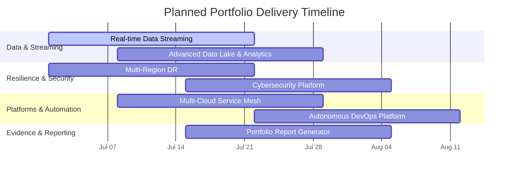


---
## 🧭 Portfolio Blueprints & Evidence

> High-level diagrams synthesized from the [Portfolio-Project](https://github.com/samueljackson-collab/Portfolio-Project) repository to show architecture and delivery patterns. Each blueprint is intentionally concise for quick recruiter review and will be accompanied by deeper runbooks and artifacts as they are published.

<details><summary><strong>🟢 Completed Blueprints</strong></summary>

**Project 1: AWS Infrastructure Automation**

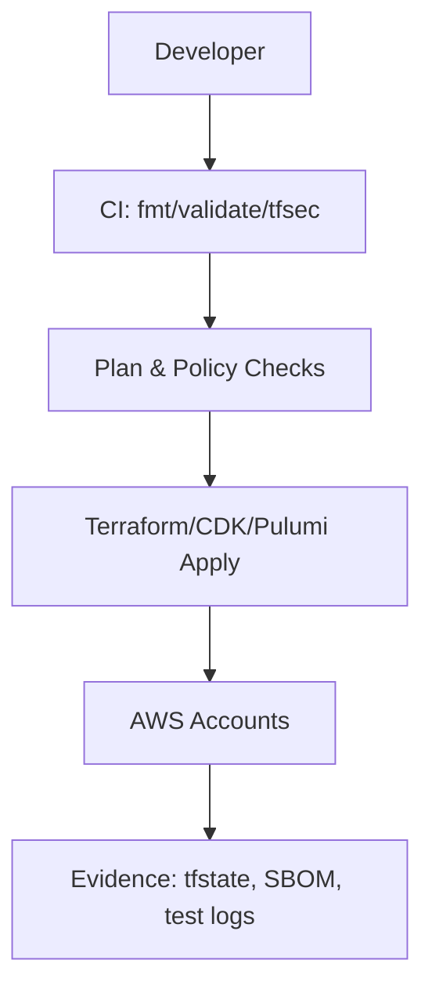

**Project 2: Database Migration Platform**

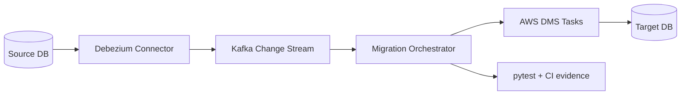

**Project 3: Kubernetes CI/CD Pipeline**

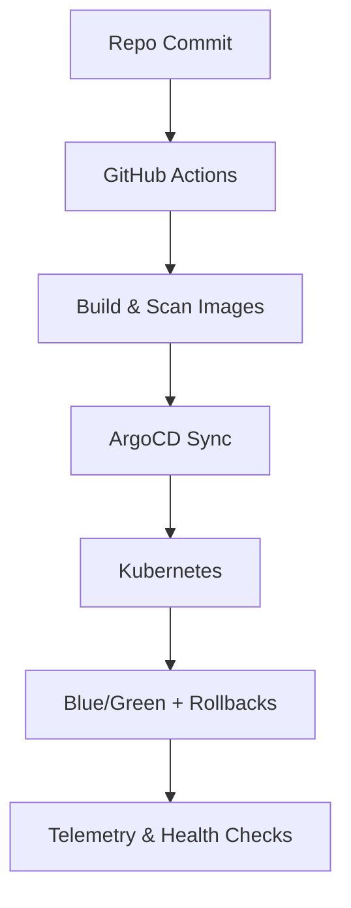

**Project 4: DevSecOps Pipeline**

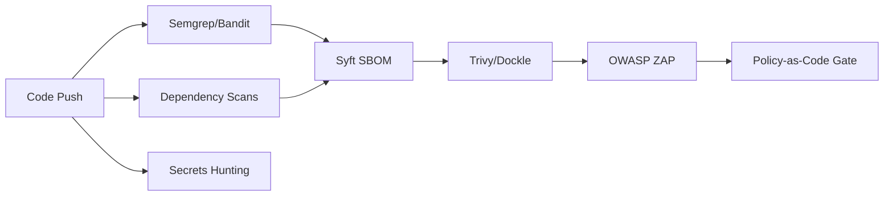

**Project 23: Advanced Monitoring & Observability**

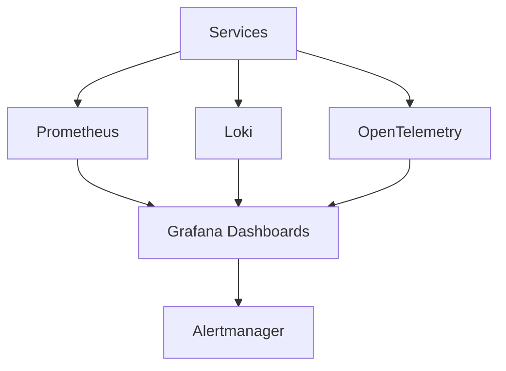

</details>

<details><summary><strong>🟠 In-Progress Blueprints</strong></summary>

**Project 6: Machine Learning Pipeline**

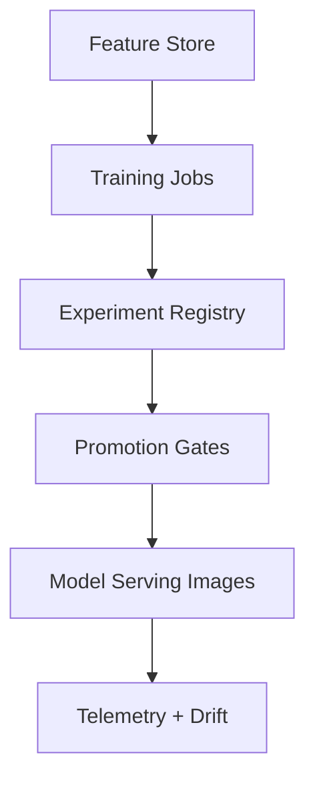

**Project 7: Serverless Data Processing**

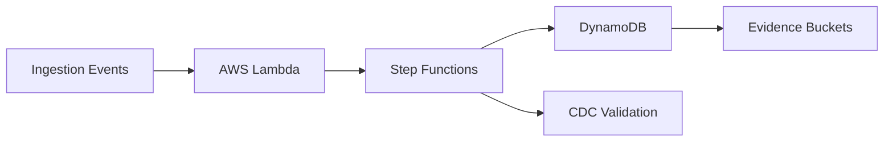

**Project 8: Advanced AI Chatbot**

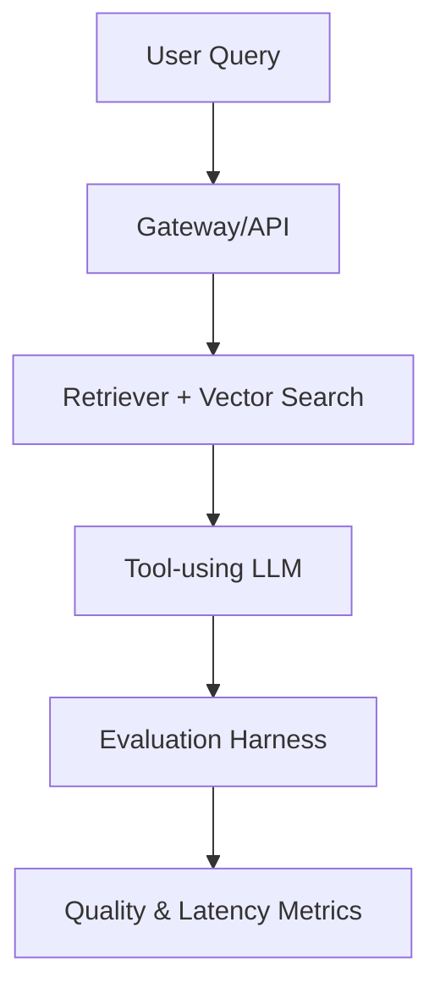

**Project 10: Blockchain Smart Contract Platform**

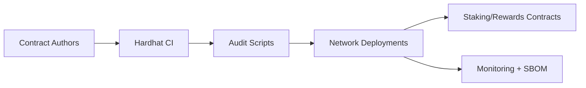

**Project 15: Real-time Collaborative Platform**

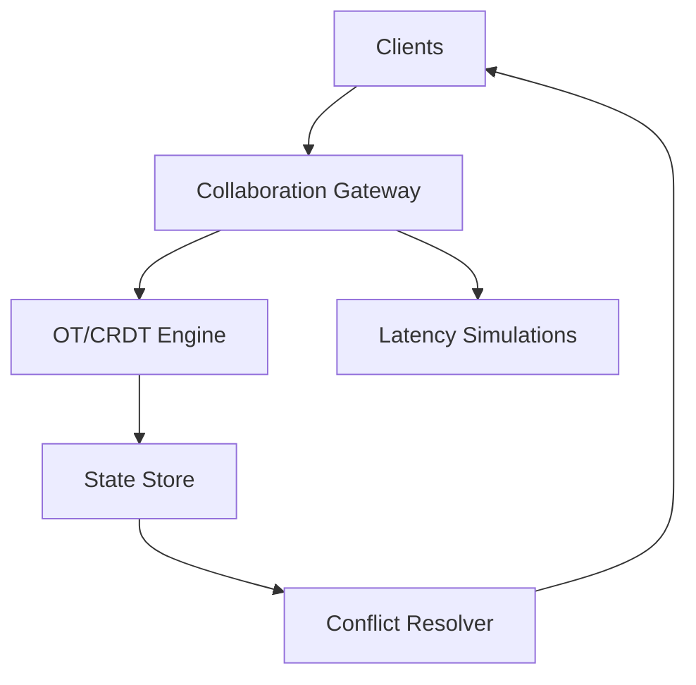

**Project 25: Portfolio Website & Documentation Hub**

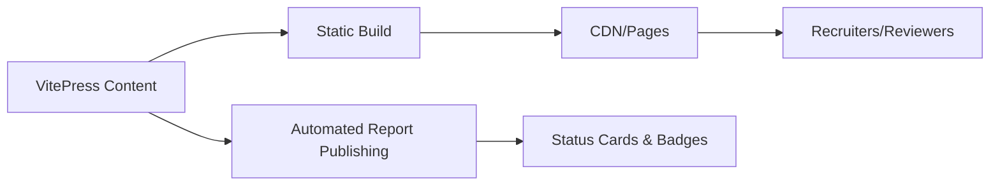

</details>

<details><summary><strong>🔵 Planned Blueprints</strong></summary>

**Project 5: Real-time Data Streaming**

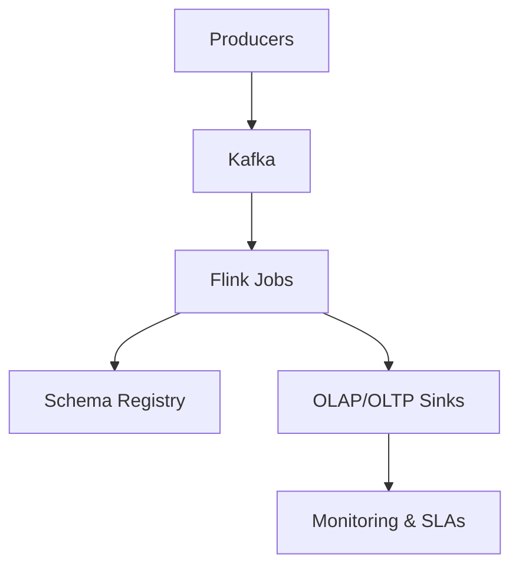

**Project 9: Multi-Region Disaster Recovery**

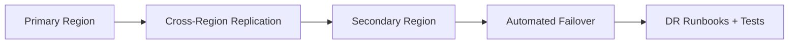

**Project 11: IoT Data Ingestion & Analytics**

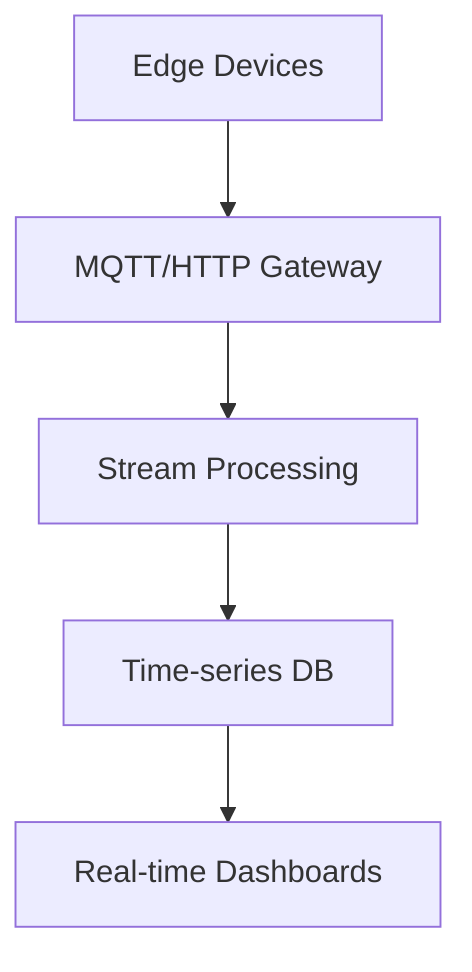

**Project 12: Quantum Computing Integration**

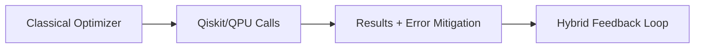

**Project 13: Advanced Cybersecurity Platform**

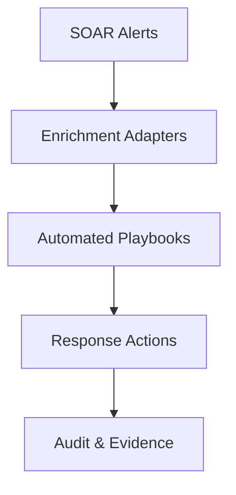

**Project 14: Edge AI Inference Platform**

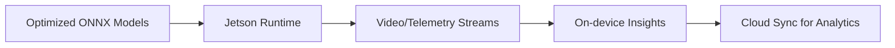

**Project 16: Advanced Data Lake & Analytics**

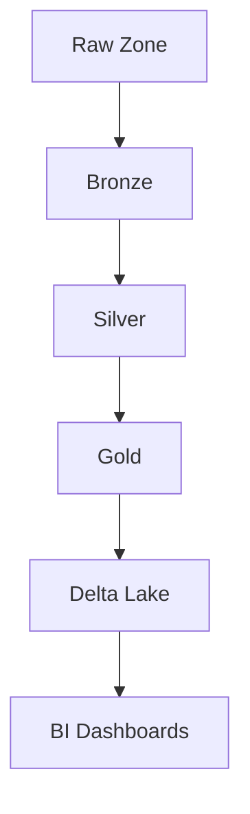

**Project 17: Multi-Cloud Service Mesh**

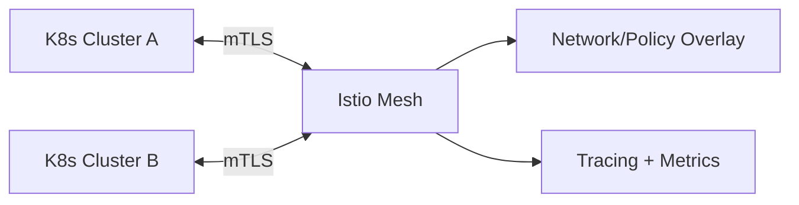

**Project 18: GPU-Accelerated Computing**

```mermaid
flowchart TD
  Jobs[Monte Carlo Jobs] --> Scheduler[GPU Scheduler]
  Scheduler --> GPU[CUDA Nodes]
  GPU --> Results[Results Store]
  Results --> Reports[Performance Reports]
```

**Project 19: Advanced Kubernetes Operators**

```mermaid
flowchart LR
  Events[K8s Events] --> Operator[Kopf Operator]
  Operator --> Recon[Reconciliation Logic]
  Recon --> CRDs[Lifecycle CRDs]
  Recon --> Evidence[Status/Telemetry]
```

**Project 20: Blockchain Oracle Service**

```mermaid
flowchart TD
  Sources[External Metrics] --> Adapter[Chainlink Adapter]
  Adapter --> Oracle[Oracle Node]
  Oracle --> Consumer[Consumer Contracts]
  Consumer --> Proofs[On-chain Proofs]
```

**Project 21: Quantum-Safe Cryptography**

```mermaid
flowchart LR
  Client[Client] --> Hybrid[Kyber + ECDH]
  Hybrid --> Handshake[Hybrid Handshake]
  Handshake --> Session[Secure Session Keys]
```

**Project 22: Autonomous DevOps Platform**

```mermaid
flowchart TD
  Alerts[Ops Signals] --> Events[Event Bus]
  Events --> Runbooks[Runbooks-as-Code]
  Runbooks --> Automation[Automated Remediation]
  Automation --> Approvals[Policy/Approval Gates]
```

**Project 24: Portfolio Report Generator**

```mermaid
flowchart LR
  Templates[Jinja2 Templates] --> CLI[Report CLI]
  CLI --> CI[CI Batch Publishing]
  CI --> Artifacts[PDF/Docs/XLSX Artifacts]
  Artifacts --> Recruiters[Packaging for Recruiters]
```

</details>

---
## 🛠️ Core Skills
- **Systems & Infra:** Linux/Windows, networking, VLANs, VPN, UniFi, NAS, Active Directory
- **Virtualization/Services:** Proxmox/TrueNAS, reverse proxy + TLS, RBAC/MFA, backup/restore drills
- **Automation & Scripting:** PowerShell, Bash, SQL (catalog ops, reporting), Git
- **Web & Data:** WordPress, e-commerce/booking systems, schema design, large-catalog data ops
- **Observability & Reliability:** Prometheus, Grafana, Loki, Alertmanager, golden signals, SLOs, PBS
- **Cloud & Tools:** AWS/Azure (baseline), GitHub, Docs/Sheets, Visio/diagramming
- **Quality & Process:** runbooks, acceptance criteria, regression checklists, change control

---
## 🟢 Completed Projects (📝 Documentation in Progress)

### Homelab & Secure Network Build
**Status:** 🟢 Complete · 📝 Docs pending  
**Description:** Designed and wired a home network from scratch: rack-mounted gear, VLAN segmentation, and secure Wi-Fi for isolated IoT, guest, and trusted networks.  
*Documentation:* [Portfolio-Project › Homelab & Secure Network Build](https://github.com/samueljackson-collab/Portfolio-Project/tree/main/homelab-secure-network-build)

**Architecture (logical)**
```mermaid
flowchart LR
  Internet --> UDM[UniFi Router/Firewall]
  UDM --> SW[UniFi Switch]
  SW --> AP1[UniFi AP 1]
  SW --> AP2[UniFi AP 2]
  SW --> NAS
  UDM -->|VPN| Admin[Remote Admin]
```

### Virtualization & Core Services
**Status:** 🟢 Complete · 📝 Docs pending
**Description** Proxmox/TrueNAS host running Wiki.js, Home Assistant, and Immich behind a reverse proxy with TLS.
*Documentation:* [Portfolio-Project › Virtualization & Core Services](https://github.com/samueljackson-collab/Portfolio-Project/tree/main/virtualization-core-services)

### Observability & Backups Stack
**Status:** 🟢 Complete · 📝 Docs pending  
**Description:** Monitoring/alerting stack using Prometheus, Grafana, Loki, and Alertmanager, integrated with Proxmox Backup Server.  
*Documentation:* [Portfolio-Project › Observability & Backups Stack](https://github.com/samueljackson-collab/Portfolio-Project/tree/main/observability-backups-stack)

---
## 🔄 Past Projects Requiring Recovery

Older commercial efforts live in cold storage while I recreate code, processes, and documentation that were lost when a retired workstation took the original knowledge base with it. Fresh assets will be published as they’re rebuilt.

### Commercial E-commerce & Booking Systems (Rebuild in Progress)
**Status:** 🔄 Recovery in progress  
**Description:** Previously built and managed: resort booking site; high-SKU flooring store; tours site with complex variations. Code and process docs are being rebuilt for publication.  
*Documentation:* [Portfolio-Project › Commercial E-commerce & Booking Systems](https://github.com/samueljackson-collab/Portfolio-Project/tree/main/commercial-ecommerce-booking-systems)

> **Recovery plan & timeline:** Catalog and restore SQL workflows and automation scripts (Week 1), re-document content management processes and deployment steps (Week 2), publish refreshed artifacts (Week 3+).

---
## 🟠 In-Progress Projects (Milestones)
- **Database Infrastructure Module (Terraform RDS)** · ✅ Module complete, expanding to full-stack
- **Resume Set (SDE/Cloud/QA/Net/Cyber)** · 📝 Structure created, content in progress

### 🔵 Planned Infrastructure Projects
- **GitOps Platform with IaC (Terraform + ArgoCD)** · *Roadmap defined*
- **AWS Landing Zone (Organizations + SSO)** · *Research phase*
- **Active Directory Design & Automation (DSC/Ansible)** · *Planning phase*

---
## 🔵 Planned Projects (Roadmaps)

### Cybersecurity Projects
- **SIEM Pipeline**: Sysmon → Ingest → Detections → Dashboards · *Blue team defense*
- **Adversary Emulation**: Validate detections via safe ATT&CK TTP emulation · *Purple team testing*
- **Incident Response Playbook**: Clear IR guidance for ransomware · *Operations readiness*

### QA & Testing Projects
- **Web App Login Test Plan**: Functional, security, and performance test design · *Test strategy*
- **Selenium + PyTest CI**: Automate UI sanity runs in GitHub Actions · *Test automation*

### Infrastructure Expansion
- **Multi-OS Lab**: Kali, Slacko Puppy, Ubuntu lab for comparative analysis · *Homelab expansion*

### Automation & Tooling
- **Document Packaging Pipeline**: One-click generation of Docs/PDFs/XLSX from prompts · *Documentation automation*

### Process Documentation
- **IT Playbook (E2E Lifecycle)**: Unifying playbook from intake to operations · *Operational excellence*
- **Engineer's Handbook (Standards/QA Gates)**: Practical standards and quality bars · *Quality framework*

---
## 🛡️ Delivery Pipeline (snapshot)

```mermaid
flowchart TD
  Intake[Business Intake]
  Plan[Architecture & QA Gates]
  IaC[Infra-as-Code]
  CI[CI: Lint/Test/SBOM]
  CD[CD: Progressive Delivery]
  Obs[Observability]
  Docs[Runbooks & Evidence]

  Intake --> Plan --> IaC --> CI --> CD --> Obs --> Docs
  Docs -->|feedback| Plan
```

---
## 💼 Experience
**Desktop Support Technician — 3DM (Redmond, WA) · Feb 2024–Present**  
**Freelance IT & Web Manager — Self-employed · 2015–2022**  
**Web Designer, Content & SEO — IPM Corp. (Cambodia) · 2013–2014**

---
## 🎓 Education & Certifications
**B.S., Information Systems** — Colorado State University (2016–2024)  

---
## 🤳 Connect
[GitHub](https://github.com/samueljackson-collab) · [LinkedIn](https://www.linkedin.com/in/sams-jackson)  
[](https://github.com/samueljackson-collab)
