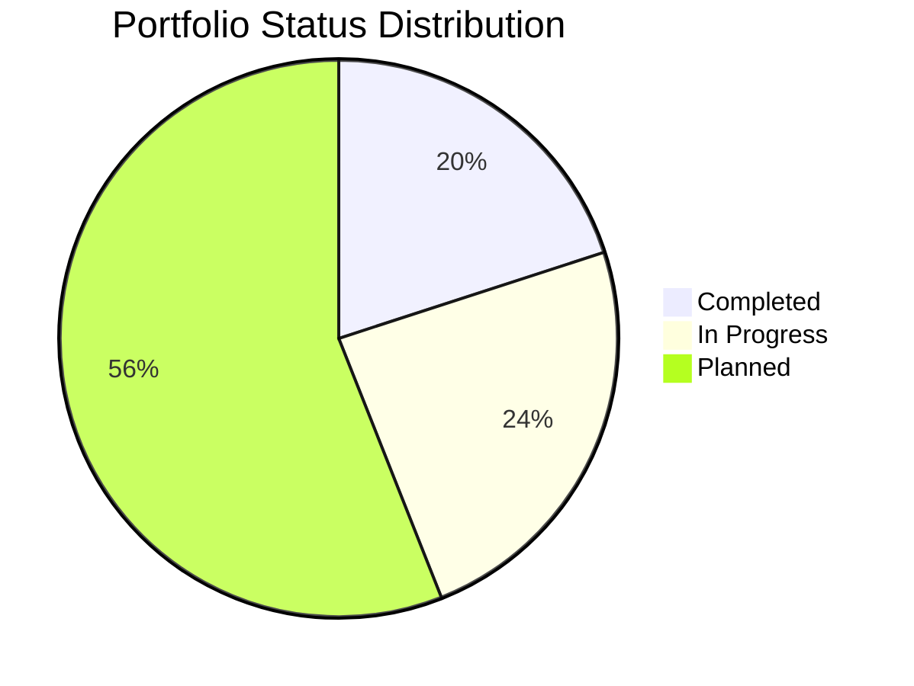
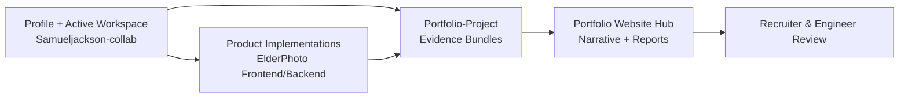
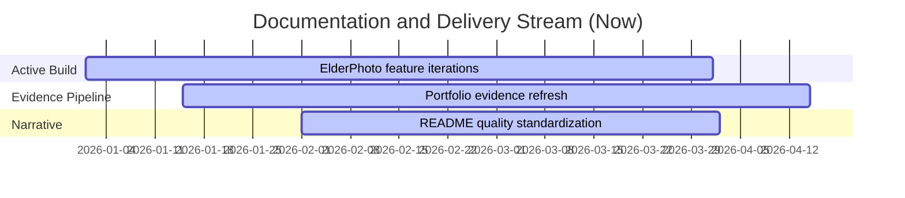
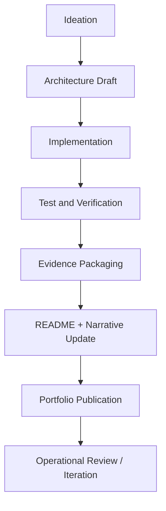
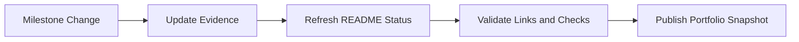

# Sam Jackson — Engineering Portfolio Command README

> A high-detail portfolio index designed as a **reference-grade README template**.  
> This document centralizes project status, architecture thinking, execution standards, and evidence routing across repositories.

## Table of Contents

- [1) Executive Overview](#1-executive-overview)
- [2) Status Legend](#2-status-legend)
- [3) Portfolio Operating Model](#3-portfolio-operating-model)
- [4) Repository and Workstream Map](#4-repository-and-workstream-map)
- [5) Current Focus and Recently Created Tracks](#5-current-focus-and-recently-created-tracks)
- [6) Master Project Registry](#6-master-project-registry)
- [7) Detailed Project Status Cards](#7-detailed-project-status-cards)
- [8) Delivery Lifecycle and Governance](#8-delivery-lifecycle-and-governance)
- [9) Standards for README Template Quality](#9-standards-for-readme-template-quality)
- [10) Technology Capability Matrix](#10-technology-capability-matrix)
- [11) Portfolio KPIs and Reporting](#11-portfolio-kpis-and-reporting)
- [12) Documentation Update Cadence](#12-documentation-update-cadence)
- [13) Contribution and Review Process](#13-contribution-and-review-process)
- [14) FAQ](#14-faq)
- [15) Quick Links](#15-quick-links)

---

## 1) Executive Overview

This repository is the **control plane README** for your engineering portfolio. It is intentionally structured to:

1. Provide a single authoritative view of all projects and their status.
2. Clarify where implementation code lives versus where evidence is published.
3. Standardize documentation depth so each project README can be generated from a high bar template.
4. Communicate credibility with consistent architecture, quality, and operational framing.

### Audience

| Audience | What they need quickly | How this README helps |
|---|---|---|
| Recruiters | Clear signal of breadth, ownership, and completion status | Consolidated status matrix + concise impact summaries |
| Hiring Managers | Confidence in engineering execution and communication | Delivery lifecycle, governance standards, KPI framing |
| Senior Engineers | Technical depth and architecture realism | Diagrams, capability matrix, platform patterns |
| Collaborators | Where to contribute and what is actively moving | Workstream map, cadence rules, and contribution flow |

---

## 2) Status Legend

- 🟢 **Done** — Implemented with evidence and validation.
- 🟠 **In Progress** — Active build with clear next milestones.
- 🔵 **Planned** — Designed and sequenced, implementation pending.
- 🔄 **Recovery/Rebuild** — Existing work being stabilized or refactored.
- 📝 **Documentation Pending** — Build exists; narrative and evidence being finalized.

### Portfolio Snapshot

| Metric | Value |
|---|---:|
| Total numbered projects | 25 |
| Completed (🟢) | 5 |
| In Progress (🟠) | 6 |
| Planned (🔵) | 14 |

---

## 3) Portfolio Operating Model

### Operating Rules

1. **Build where it makes operational sense** (feature repo/workspace).
2. **Publish evidence centrally** (runbooks, tests, CI logs, screenshots, IaC plans).
3. **Reflect status immediately in this README** after every milestone.
4. **Keep naming/versioning synchronized** across repos.

---

## 4) Repository and Workstream Map

| Repository / Area | Role in ecosystem | Current status | Notes |
|---|---|---|---|
| `Samueljackson-collab` | Profile README, roadmap diagrams, and active workspace for current builds | 🟠 Active | Contains ElderPhoto full-stack work and documentation assets |
| `Portfolio-Project` | Canonical evidence and per-project implementation bundles | 🟢 Active | Source of truth for project verification artifacts |
| `ElderPhoto` (inside this repo) | Accessibility-first family photo platform | 🟠 In Progress | React frontend + Python backend + backup workflows |

---

## 5) Current Focus and Recently Created Tracks

### Recently Expanded / Active Tracks

| Track | Why it matters now | Status |
|---|---|---|
| ElderPhoto frontend workflows | Accessibility-first photo management and family-sharing UX | 🟠 In Progress |
| ElderPhoto backend backup APIs | Backup orchestration and sync reliability under operational constraints | 🟠 In Progress |
| Portfolio Website & Documentation Hub (Project 25) | Unified publishing layer for all project evidence and narratives | 🟠 In Progress |
| Advanced Monitoring & Observability (Project 23) | Operational telemetry standards reusable across all future projects | 🟢 Done |

### Near-Term Priorities (Next 2–3 sprints)

1. Finalize active in-progress projects to completion-grade evidence quality.
2. Raise consistency across all README files using this document as template baseline.
3. Tighten cross-link integrity and status hygiene across repositories.

---

## 6) Master Project Registry

| # | Project | Status | Core Objective | Current Position |
|---:|---|---|---|---|
| 1 | AWS Infrastructure Automation | 🟢 Done | Terraform/CDK/Pulumi baseline with reusable deployment scripts and CI policy checks. | [Portfolio-Project/aws-infrastructure-automation](https://github.com/samueljackson-collab/Portfolio-Project/aws-infrastructure-automation) |
| 2 | Database Migration Platform | 🟢 Done | Debezium + DMS-style migration orchestrator with CDC controls and rollback-aware workflows. | [Portfolio-Project/database-migration-platform](https://github.com/samueljackson-collab/Portfolio-Project/database-migration-platform) |
| 3 | Kubernetes CI/CD Pipeline | 🟢 Done | GitOps-ready Kubernetes delivery pipeline with image scanning, promotion gates, and rollback paths. | [Portfolio-Project/kubernetes-cicd-pipeline](https://github.com/samueljackson-collab/Portfolio-Project/kubernetes-cicd-pipeline) |
| 4 | DevSecOps Pipeline | 🟢 Done | Security-first CI/CD pattern integrating SAST, SCA, SBOM, secrets scanning, and DAST checks. | [Portfolio-Project/devsecops-pipeline](https://github.com/samueljackson-collab/Portfolio-Project/devsecops-pipeline) |
| 5 | Real-time Data Streaming | 🔵 Planned | Kafka/Flink stream processing stack with schema governance and quality gates. | [Portfolio-Project/real-time-data-streaming](https://github.com/samueljackson-collab/Portfolio-Project/real-time-data-streaming) |
| 6 | Machine Learning Pipeline | 🟠 In Progress | MLOps training/serving workflow with experiment tracking and staged model promotion. | [Portfolio-Project/machine-learning-pipeline](https://github.com/samueljackson-collab/Portfolio-Project/machine-learning-pipeline) |
| 7 | Serverless Data Processing | 🟠 In Progress | Event-driven ETL workflows built around Lambda/Step Functions patterns. | [Portfolio-Project/serverless-data-processing](https://github.com/samueljackson-collab/Portfolio-Project/serverless-data-processing) |
| 8 | Advanced AI Chatbot | 🟠 In Progress | RAG + tool execution assistant design with retrieval quality and runtime telemetry. | [Portfolio-Project/advanced-ai-chatbot](https://github.com/samueljackson-collab/Portfolio-Project/advanced-ai-chatbot) |
| 9 | Multi-Region Disaster Recovery | 🔵 Planned | Replication validation, failover drills, and runbooks aligned to RPO/RTO goals. | [Portfolio-Project/multi-region-disaster-recovery](https://github.com/samueljackson-collab/Portfolio-Project/multi-region-disaster-recovery) |
| 10 | Blockchain Smart Contract Platform | 🟠 In Progress | Hardhat-based contract stack with security analysis and deployment automation. | [Portfolio-Project/blockchain-smart-contract-platform](https://github.com/samueljackson-collab/Portfolio-Project/blockchain-smart-contract-platform) |
| 11 | IoT Data Ingestion & Analytics | 🔵 Planned | Edge telemetry simulation and cloud ingestion with dashboarding. | [Portfolio-Project/iot-data-ingestion-analytics](https://github.com/samueljackson-collab/Portfolio-Project/iot-data-ingestion-analytics) |
| 12 | Quantum Computing Integration | 🔵 Planned | Hybrid quantum/classical optimization prototypes using Qiskit workflows. | [Portfolio-Project/quantum-computing-integration](https://github.com/samueljackson-collab/Portfolio-Project/quantum-computing-integration) |
| 13 | Advanced Cybersecurity Platform | 🔵 Planned | SOAR-driven detection and response pipeline with enrichment adapters. | [Portfolio-Project/advanced-cybersecurity-platform](https://github.com/samueljackson-collab/Portfolio-Project/advanced-cybersecurity-platform) |
| 14 | Edge AI Inference Platform | 🔵 Planned | ONNX runtime stack for resource-constrained edge inference deployments. | [Portfolio-Project/edge-ai-inference-platform](https://github.com/samueljackson-collab/Portfolio-Project/edge-ai-inference-platform) |
| 15 | Real-time Collaborative Platform | 🟠 In Progress | CRDT/OT collaboration system with conflict-resolution validation. | [Portfolio-Project/real-time-collaboration-platform](https://github.com/samueljackson-collab/Portfolio-Project/real-time-collaboration-platform) |
| 16 | Advanced Data Lake & Analytics | 🔵 Planned | Medallion data lake patterns with quality contracts and governance metadata. | [Portfolio-Project/advanced-data-lake-analytics](https://github.com/samueljackson-collab/Portfolio-Project/advanced-data-lake-analytics) |
| 17 | Multi-Cloud Service Mesh | 🔵 Planned | Cross-cluster service mesh architecture with mTLS and policy controls. | [Portfolio-Project/multi-cloud-service-mesh](https://github.com/samueljackson-collab/Portfolio-Project/multi-cloud-service-mesh) |
| 18 | GPU-Accelerated Computing | 🔵 Planned | CUDA/CuPy workload orchestration and performance benchmarking suite. | [Portfolio-Project/gpu-accelerated-computing](https://github.com/samueljackson-collab/Portfolio-Project/gpu-accelerated-computing) |
| 19 | Advanced Kubernetes Operators | 🔵 Planned | Custom operators for lifecycle automation and self-healing stack management. | [Portfolio-Project/advanced-kubernetes-operators](https://github.com/samueljackson-collab/Portfolio-Project/advanced-kubernetes-operators) |
| 20 | Blockchain Oracle Service | 🔵 Planned | Oracle adapter architecture connecting off-chain data to on-chain contracts. | [Portfolio-Project/blockchain-oracle-service](https://github.com/samueljackson-collab/Portfolio-Project/blockchain-oracle-service) |
| 21 | Quantum-Safe Cryptography | 🔵 Planned | Post-quantum hybrid key exchange prototypes with migration guidance. | [Portfolio-Project/quantum-safe-cryptography](https://github.com/samueljackson-collab/Portfolio-Project/quantum-safe-cryptography) |
| 22 | Autonomous DevOps Platform | 🔵 Planned | Event-driven remediation engine and runbooks-as-code operations model. | [Portfolio-Project/autonomous-devops-platform](https://github.com/samueljackson-collab/Portfolio-Project/autonomous-devops-platform) |
| 23 | Advanced Monitoring & Observability | 🟢 Done | Metrics, logs, and traces stack with dashboard linting and alert validation. | [Portfolio-Project/advanced-monitoring-observability](https://github.com/samueljackson-collab/Portfolio-Project/advanced-monitoring-observability) |
| 24 | Portfolio Report Generator | 🔵 Planned | Automated technical report generation using templates and artifact ingestion. | [Portfolio-Project/portfolio-report-generator](https://github.com/samueljackson-collab/Portfolio-Project/portfolio-report-generator) |
| 25 | Portfolio Website & Documentation Hub | 🟠 In Progress | VitePress-powered documentation portal unifying all project narratives. | [Portfolio-Project/portfolio-website-documentation-hub](https://github.com/samueljackson-collab/Portfolio-Project/portfolio-website-documentation-hub) |

---

## 7) Detailed Project Status Cards

### Project 1: AWS Infrastructure Automation

- **Status:** 🟢 Done
- **Objective:** Terraform/CDK/Pulumi baseline with reusable deployment scripts and CI policy checks.
- **Evidence Path:** <https://github.com/samueljackson-collab/Portfolio-Project/aws-infrastructure-automation>
- **Impact Statement:** Production-minded IaC foundation, security controls, and repeatable bootstrap process.

| Dimension | Detail |
|---|---|
| Delivery maturity | Validated with artifacts and checks |
| Next action | Maintain and evolve based on adjacent project needs |
| Documentation expectation | README + architecture + runbook + test evidence + release notes |

### Project 2: Database Migration Platform

- **Status:** 🟢 Done
- **Objective:** Debezium + DMS-style migration orchestrator with CDC controls and rollback-aware workflows.
- **Evidence Path:** <https://github.com/samueljackson-collab/Portfolio-Project/database-migration-platform>
- **Impact Statement:** Demonstrates safe migration sequencing, observability, and reliability engineering.

| Dimension | Detail |
|---|---|
| Delivery maturity | Validated with artifacts and checks |
| Next action | Maintain and evolve based on adjacent project needs |
| Documentation expectation | README + architecture + runbook + test evidence + release notes |

### Project 3: Kubernetes CI/CD Pipeline

- **Status:** 🟢 Done
- **Objective:** GitOps-ready Kubernetes delivery pipeline with image scanning, promotion gates, and rollback paths.
- **Evidence Path:** <https://github.com/samueljackson-collab/Portfolio-Project/kubernetes-cicd-pipeline>
- **Impact Statement:** Shows mature release hygiene for cloud-native platforms.

| Dimension | Detail |
|---|---|
| Delivery maturity | Validated with artifacts and checks |
| Next action | Maintain and evolve based on adjacent project needs |
| Documentation expectation | README + architecture + runbook + test evidence + release notes |

### Project 4: DevSecOps Pipeline

- **Status:** 🟢 Done
- **Objective:** Security-first CI/CD pattern integrating SAST, SCA, SBOM, secrets scanning, and DAST checks.
- **Evidence Path:** <https://github.com/samueljackson-collab/Portfolio-Project/devsecops-pipeline>
- **Impact Statement:** Provides policy-as-code baseline for secure engineering teams.

| Dimension | Detail |
|---|---|
| Delivery maturity | Validated with artifacts and checks |
| Next action | Maintain and evolve based on adjacent project needs |
| Documentation expectation | README + architecture + runbook + test evidence + release notes |

### Project 5: Real-time Data Streaming

- **Status:** 🔵 Planned
- **Objective:** Kafka/Flink stream processing stack with schema governance and quality gates.
- **Evidence Path:** <https://github.com/samueljackson-collab/Portfolio-Project/real-time-data-streaming>
- **Impact Statement:** Will provide low-latency analytics architecture with operational SLOs.

| Dimension | Detail |
|---|---|
| Delivery maturity | Designed and sequenced in roadmap backlog |
| Next action | Build foundational skeleton and CI baseline |
| Documentation expectation | README + architecture + runbook + test evidence + release notes |

### Project 6: Machine Learning Pipeline

- **Status:** 🟠 In Progress
- **Objective:** MLOps training/serving workflow with experiment tracking and staged model promotion.
- **Evidence Path:** <https://github.com/samueljackson-collab/Portfolio-Project/machine-learning-pipeline>
- **Impact Statement:** Builds end-to-end AI delivery lifecycle with reproducibility controls.

| Dimension | Detail |
|---|---|
| Delivery maturity | Actively iterating toward milestone completion |
| Next action | Close open milestones and publish final validation evidence |
| Documentation expectation | README + architecture + runbook + test evidence + release notes |

### Project 7: Serverless Data Processing

- **Status:** 🟠 In Progress
- **Objective:** Event-driven ETL workflows built around Lambda/Step Functions patterns.
- **Evidence Path:** <https://github.com/samueljackson-collab/Portfolio-Project/serverless-data-processing>
- **Impact Statement:** Highlights cost-aware processing and reliability in async orchestration.

| Dimension | Detail |
|---|---|
| Delivery maturity | Actively iterating toward milestone completion |
| Next action | Close open milestones and publish final validation evidence |
| Documentation expectation | README + architecture + runbook + test evidence + release notes |

### Project 8: Advanced AI Chatbot

- **Status:** 🟠 In Progress
- **Objective:** RAG + tool execution assistant design with retrieval quality and runtime telemetry.
- **Evidence Path:** <https://github.com/samueljackson-collab/Portfolio-Project/advanced-ai-chatbot>
- **Impact Statement:** Focuses on practical AI product patterns and governance.

| Dimension | Detail |
|---|---|
| Delivery maturity | Actively iterating toward milestone completion |
| Next action | Close open milestones and publish final validation evidence |
| Documentation expectation | README + architecture + runbook + test evidence + release notes |

### Project 9: Multi-Region Disaster Recovery

- **Status:** 🔵 Planned
- **Objective:** Replication validation, failover drills, and runbooks aligned to RPO/RTO goals.
- **Evidence Path:** <https://github.com/samueljackson-collab/Portfolio-Project/multi-region-disaster-recovery>
- **Impact Statement:** Adds resilience playbooks and business continuity evidence.

| Dimension | Detail |
|---|---|
| Delivery maturity | Designed and sequenced in roadmap backlog |
| Next action | Build foundational skeleton and CI baseline |
| Documentation expectation | README + architecture + runbook + test evidence + release notes |

### Project 10: Blockchain Smart Contract Platform

- **Status:** 🟠 In Progress
- **Objective:** Hardhat-based contract stack with security analysis and deployment automation.
- **Evidence Path:** <https://github.com/samueljackson-collab/Portfolio-Project/blockchain-smart-contract-platform>
- **Impact Statement:** Explores safe smart contract lifecycle from testing to deployment.

| Dimension | Detail |
|---|---|
| Delivery maturity | Actively iterating toward milestone completion |
| Next action | Close open milestones and publish final validation evidence |
| Documentation expectation | README + architecture + runbook + test evidence + release notes |

### Project 11: IoT Data Ingestion & Analytics

- **Status:** 🔵 Planned
- **Objective:** Edge telemetry simulation and cloud ingestion with dashboarding.
- **Evidence Path:** <https://github.com/samueljackson-collab/Portfolio-Project/iot-data-ingestion-analytics>
- **Impact Statement:** Targets industrial-style telemetry and real-time insights.

| Dimension | Detail |
|---|---|
| Delivery maturity | Designed and sequenced in roadmap backlog |
| Next action | Build foundational skeleton and CI baseline |
| Documentation expectation | README + architecture + runbook + test evidence + release notes |

### Project 12: Quantum Computing Integration

- **Status:** 🔵 Planned
- **Objective:** Hybrid quantum/classical optimization prototypes using Qiskit workflows.
- **Evidence Path:** <https://github.com/samueljackson-collab/Portfolio-Project/quantum-computing-integration>
- **Impact Statement:** Demonstrates research-to-engineering transition for advanced workloads.

| Dimension | Detail |
|---|---|
| Delivery maturity | Designed and sequenced in roadmap backlog |
| Next action | Build foundational skeleton and CI baseline |
| Documentation expectation | README + architecture + runbook + test evidence + release notes |

### Project 13: Advanced Cybersecurity Platform

- **Status:** 🔵 Planned
- **Objective:** SOAR-driven detection and response pipeline with enrichment adapters.
- **Evidence Path:** <https://github.com/samueljackson-collab/Portfolio-Project/advanced-cybersecurity-platform>
- **Impact Statement:** Adds operational security automation and incident response depth.

| Dimension | Detail |
|---|---|
| Delivery maturity | Designed and sequenced in roadmap backlog |
| Next action | Build foundational skeleton and CI baseline |
| Documentation expectation | README + architecture + runbook + test evidence + release notes |

### Project 14: Edge AI Inference Platform

- **Status:** 🔵 Planned
- **Objective:** ONNX runtime stack for resource-constrained edge inference deployments.
- **Evidence Path:** <https://github.com/samueljackson-collab/Portfolio-Project/edge-ai-inference-platform>
- **Impact Statement:** Covers optimization, observability, and field operations for edge ML.

| Dimension | Detail |
|---|---|
| Delivery maturity | Designed and sequenced in roadmap backlog |
| Next action | Build foundational skeleton and CI baseline |
| Documentation expectation | README + architecture + runbook + test evidence + release notes |

### Project 15: Real-time Collaborative Platform

- **Status:** 🟠 In Progress
- **Objective:** CRDT/OT collaboration system with conflict-resolution validation.
- **Evidence Path:** <https://github.com/samueljackson-collab/Portfolio-Project/real-time-collaboration-platform>
- **Impact Statement:** Shows distributed system correctness and UX-sensitive architecture.

| Dimension | Detail |
|---|---|
| Delivery maturity | Actively iterating toward milestone completion |
| Next action | Close open milestones and publish final validation evidence |
| Documentation expectation | README + architecture + runbook + test evidence + release notes |

### Project 16: Advanced Data Lake & Analytics

- **Status:** 🔵 Planned
- **Objective:** Medallion data lake patterns with quality contracts and governance metadata.
- **Evidence Path:** <https://github.com/samueljackson-collab/Portfolio-Project/advanced-data-lake-analytics>
- **Impact Statement:** Builds analytics-ready platform with traceable lineage.

| Dimension | Detail |
|---|---|
| Delivery maturity | Designed and sequenced in roadmap backlog |
| Next action | Build foundational skeleton and CI baseline |
| Documentation expectation | README + architecture + runbook + test evidence + release notes |

### Project 17: Multi-Cloud Service Mesh

- **Status:** 🔵 Planned
- **Objective:** Cross-cluster service mesh architecture with mTLS and policy controls.
- **Evidence Path:** <https://github.com/samueljackson-collab/Portfolio-Project/multi-cloud-service-mesh>
- **Impact Statement:** Enables secure east-west traffic and platform portability.

| Dimension | Detail |
|---|---|
| Delivery maturity | Designed and sequenced in roadmap backlog |
| Next action | Build foundational skeleton and CI baseline |
| Documentation expectation | README + architecture + runbook + test evidence + release notes |

### Project 18: GPU-Accelerated Computing

- **Status:** 🔵 Planned
- **Objective:** CUDA/CuPy workload orchestration and performance benchmarking suite.
- **Evidence Path:** <https://github.com/samueljackson-collab/Portfolio-Project/gpu-accelerated-computing>
- **Impact Statement:** Demonstrates accelerated compute delivery and optimization discipline.

| Dimension | Detail |
|---|---|
| Delivery maturity | Designed and sequenced in roadmap backlog |
| Next action | Build foundational skeleton and CI baseline |
| Documentation expectation | README + architecture + runbook + test evidence + release notes |

### Project 19: Advanced Kubernetes Operators

- **Status:** 🔵 Planned
- **Objective:** Custom operators for lifecycle automation and self-healing stack management.
- **Evidence Path:** <https://github.com/samueljackson-collab/Portfolio-Project/advanced-kubernetes-operators>
- **Impact Statement:** Brings platform automation beyond static manifests.

| Dimension | Detail |
|---|---|
| Delivery maturity | Designed and sequenced in roadmap backlog |
| Next action | Build foundational skeleton and CI baseline |
| Documentation expectation | README + architecture + runbook + test evidence + release notes |

### Project 20: Blockchain Oracle Service

- **Status:** 🔵 Planned
- **Objective:** Oracle adapter architecture connecting off-chain data to on-chain contracts.
- **Evidence Path:** <https://github.com/samueljackson-collab/Portfolio-Project/blockchain-oracle-service>
- **Impact Statement:** Focuses on trusted data delivery and deterministic updates.

| Dimension | Detail |
|---|---|
| Delivery maturity | Designed and sequenced in roadmap backlog |
| Next action | Build foundational skeleton and CI baseline |
| Documentation expectation | README + architecture + runbook + test evidence + release notes |

### Project 21: Quantum-Safe Cryptography

- **Status:** 🔵 Planned
- **Objective:** Post-quantum hybrid key exchange prototypes with migration guidance.
- **Evidence Path:** <https://github.com/samueljackson-collab/Portfolio-Project/quantum-safe-cryptography>
- **Impact Statement:** Prepares systems for long-horizon cryptographic resilience.

| Dimension | Detail |
|---|---|
| Delivery maturity | Designed and sequenced in roadmap backlog |
| Next action | Build foundational skeleton and CI baseline |
| Documentation expectation | README + architecture + runbook + test evidence + release notes |

### Project 22: Autonomous DevOps Platform

- **Status:** 🔵 Planned
- **Objective:** Event-driven remediation engine and runbooks-as-code operations model.
- **Evidence Path:** <https://github.com/samueljackson-collab/Portfolio-Project/autonomous-devops-platform>
- **Impact Statement:** Explores closed-loop operations and safe automation boundaries.

| Dimension | Detail |
|---|---|
| Delivery maturity | Designed and sequenced in roadmap backlog |
| Next action | Build foundational skeleton and CI baseline |
| Documentation expectation | README + architecture + runbook + test evidence + release notes |

### Project 23: Advanced Monitoring & Observability

- **Status:** 🟢 Done
- **Objective:** Metrics, logs, and traces stack with dashboard linting and alert validation.
- **Evidence Path:** <https://github.com/samueljackson-collab/Portfolio-Project/advanced-monitoring-observability>
- **Impact Statement:** Strengthens production readiness and SLO-centered operations.

| Dimension | Detail |
|---|---|
| Delivery maturity | Validated with artifacts and checks |
| Next action | Maintain and evolve based on adjacent project needs |
| Documentation expectation | README + architecture + runbook + test evidence + release notes |

### Project 24: Portfolio Report Generator

- **Status:** 🔵 Planned
- **Objective:** Automated technical report generation using templates and artifact ingestion.
- **Evidence Path:** <https://github.com/samueljackson-collab/Portfolio-Project/portfolio-report-generator>
- **Impact Statement:** Improves communication quality and repeatable evidence packaging.

| Dimension | Detail |
|---|---|
| Delivery maturity | Designed and sequenced in roadmap backlog |
| Next action | Build foundational skeleton and CI baseline |
| Documentation expectation | README + architecture + runbook + test evidence + release notes |

### Project 25: Portfolio Website & Documentation Hub

- **Status:** 🟠 In Progress
- **Objective:** VitePress-powered documentation portal unifying all project narratives.
- **Evidence Path:** <https://github.com/samueljackson-collab/Portfolio-Project/portfolio-website-documentation-hub>
- **Impact Statement:** Creates discoverable, consistent, and recruiter-friendly project storytelling.

| Dimension | Detail |
|---|---|
| Delivery maturity | Actively iterating toward milestone completion |
| Next action | Close open milestones and publish final validation evidence |
| Documentation expectation | README + architecture + runbook + test evidence + release notes |

---

## 8) Delivery Lifecycle and Governance

### End-to-End Lifecycle

### Governance Checklist

| Gate | Required output | Pass criteria |
|---|---|---|
| Design gate | Architecture notes + assumptions | Scope and risks are explicit |
| Build gate | Working implementation | Core workflow demonstrable end-to-end |
| Quality gate | Automated checks + targeted tests | Reproducible results and no critical regressions |
| Documentation gate | README + runbook + status updates | New contributor can execute without tribal knowledge |
| Publication gate | Evidence linked in portfolio | External reviewer can verify claims quickly |

---

## 9) Standards for README Template Quality

This README is the benchmark template. Every major project README should include:

1. **Executive intent** (what and why).
2. **Status and roadmap transparency**.
3. **Architecture visuals** (flowchart + state/process diagrams).
4. **Operational runbook** (how to run, test, recover).
5. **Data contracts and configuration references**.
6. **Testing and validation evidence**.
7. **Risk and security notes**.
8. **Troubleshooting and FAQ**.
9. **Contribution guidance**.
10. **Clear, stable links to evidence**.

### README Section Blueprint

| Section | Required depth | Visualization requirement |
|---|---|---|
| Overview | Problem framing + user outcomes | At least one context diagram |
| Architecture | Components, boundaries, interfaces | Flowchart + sequence/state style diagram |
| Usage/Runbook | Install, run, verify, recover | Tables for commands and expected outcomes |
| Quality | Test strategy and quality gates | Matrix of checks by environment |
| Roadmap | Milestones and dependencies | Timeline/gantt or phased table |
| FAQ/Troubleshooting | Real failure modes | Decision table for diagnosis |

---

## 10) Technology Capability Matrix

| Capability Area | Demonstrated in portfolio | Primary tooling examples |
|---|---|---|
| Cloud & IaC | Projects 1, 7, 9, 17 | Terraform, CDK, Pulumi, AWS services |
| Platform Engineering | Projects 3, 17, 19, 23 | Kubernetes, ArgoCD, operators, observability stacks |
| Security Engineering | Projects 4, 13, 21 | Semgrep, CodeQL, policy-as-code, post-quantum prototypes |
| Data Engineering | Projects 2, 5, 11, 16 | CDC, Kafka/Flink, data lake patterns |
| AI/ML Systems | Projects 6, 8, 14 | Training/serving pipelines, RAG, ONNX runtime |
| Developer Experience | Projects 24, 25 | Report templating, docs hub, publication workflows |

---

## 11) Portfolio KPIs and Reporting

| KPI | Formula | Why it matters |
|---|---|---|
| Completion ratio | `completed / total` | Shows portfolio execution throughput |
| Active delivery load | `in-progress / total` | Ensures focus is realistic and manageable |
| Documentation freshness | `% projects updated in last 30 days` | Prevents stale or misleading status information |
| Verification coverage | `% projects with reproducible checks` | Raises trust in project claims |
| Cross-link integrity | `% links passing validation` | Keeps navigation reliable for reviewers |

### Suggested Monthly Review Output

- Status delta by project (up/down/no change)
- New artifacts published
- Risks or blockers requiring prioritization changes
- README quality compliance score

---

## 12) Documentation Update Cadence

| Cadence | Action | Owner |
|---|---|---|
| Per merge / milestone | Update affected project status card(s) | Project owner |
| Weekly | Validate links, badges, and evidence references | Repo maintainer |
| Bi-weekly | Refresh roadmap priority ordering | Portfolio lead |
| Monthly | Perform comprehensive README quality review | Portfolio lead + reviewer |

### Definition of "Documentation Done"

A project update is considered complete only when all items below are true:

- Status is updated in the master registry.
- Evidence link is present and functioning.
- README has architecture, runbook, and testing sections.
- Open risks and next actions are clearly stated.

---

## 13) Contribution and Review Process

1. Fork/branch with clear naming (`docs/readme-<scope>` or `feat/project-<id>-<topic>`).
2. Make changes with explicit status impact.
3. Run quality checks and link validation.
4. Update this README if any project status, scope, or evidence path changes.
5. Submit PR with summary, rationale, and before/after verification notes.

### Review Heuristics

| Review focus | Questions to answer |
|---|---|
| Accuracy | Does status match real implementation maturity? |
| Completeness | Is enough information present for a new reviewer to understand the project? |
| Verifiability | Can every claim be traced to a concrete artifact? |
| Readability | Is structure skimmable while retaining technical depth? |

---

## 14) FAQ

### Why keep this README so detailed?
Because it is both a **portfolio index** and a **documentation quality template** for every major project README.

### Why separate active workspace from evidence repository?
To keep implementation velocity high while preserving a stable, reviewer-friendly evidence source.

### What should change first when a project moves status?
Update the **Master Project Registry** and corresponding **Detailed Status Card** in the same commit.

### How do I add a newly created project?
Add it to the registry table, create a detailed card, assign status/next action, and include evidence path.

---

## 15) Quick Links

- Profile workspace: <https://github.com/samueljackson-collab/Samueljackson-collab>
- Evidence repository: <https://github.com/samueljackson-collab/Portfolio-Project>
- ElderPhoto implementation context: [ELDERPHOTO_README.md](./ELDERPHOTO_README.md)
- Implementation notes: [IMPLEMENTATION_SUMMARY.md](./IMPLEMENTATION_SUMMARY.md)

---

## Closing Note

This README is intentionally high-detail and maintained as a **gold-standard template**.  
As the portfolio grows, this file should continue to prioritize clarity, traceability, and reviewer confidence over brevity.
