# README

## Summary
This is the existing summary of the README file.

## Ansible Playbook Generator
A tool to generate Ansible playbooks based on user inputs. It aims to simplify the creation of playbooks and make automation easier for everyone. This project includes features such as customizable templates and guided prompts to help users get started with Ansible quickly.

**Documentation:** Evidence for every project is now centralized in the [Portfolio-Project repository](https://github.com/samueljackson-collab/Portfolio-Project). Each project entry below links directly to its evidence bundle (design docs, runbooks, IaC, tests, and screenshots).

> **Portfolio Note:** This repository is actively being built. Projects marked 🟢 are technically complete but documentation/evidence is being prepared (📝). Projects marked 🔵 are planned roadmap items, and 🔄 indicates recovery/rebuild efforts are underway.
>
> **Note:** Project directories and documentation are currently being structured and will be added progressively.

---
## 🎯 Summary
System-minded engineer specializing in building, securing, and operating infrastructure and data-heavy web systems. Hands-on with homelab → production-like setups (wired rack, UniFi network, VPN, backup/restore drills), and pragmatic DevOps/QA practices.

<details><summary><strong>Alternate summaries for tailoring</strong></summary>

**DevOps-forward** DevOps-leaning systems engineer who builds and operates reliable services end-to-end: homelab→production patterns (networking, virtualization, reverse proxy + TLS, backups), monitoring (golden signals), and CI/CD automation.

**QA-forward** Quality-driven systems engineer turning ambiguous requirements into testable runbooks, acceptance criteria, and regression checklists. Builds monitoring dashboards for golden signals and SLOs.
</details>

---
## 🧩 Repository Coverage Update (Current GitHub + Local Portfolio)

To keep this profile aligned with the latest build activity, this section maps active repositories/projects to their current purpose and evidence location.

> **Scope note:** The portfolio implementation evidence lives in `Portfolio-Project`, while this profile repository tracks roadmap context, diagrams, and project indexing. The ElderPhoto full-stack implementation currently lives in this repository under `frontend/` and `backend/`.

### Repository Index

| Repository / Project | Status | Purpose | Evidence / Source |
|---|---|---|---|
| `Samueljackson-collab` (this repository) | 🟠 Active | Profile README, roadmap/status views, architecture diagrams, and active product implementation scaffolding. | [README.md](./README.md), [ELDERPHOTO_README.md](./ELDERPHOTO_README.md), [IMPLEMENTATION_SUMMARY.md](./IMPLEMENTATION_SUMMARY.md) |
| `Portfolio-Project` | 🟢 Active | Centralized technical evidence bundles for all numbered portfolio projects (IaC, runbooks, tests, CI, screenshots). | <https://github.com/samueljackson-collab/Portfolio-Project> |
| `ElderPhoto` (project workspace in this repo) | 🟠 In Progress | Accessibility-first family photo platform with React frontend + Python backend services + backup synchronization tooling. | [`frontend/src/pages/Photos/PhotosPage.tsx`](./frontend/src/pages/Photos/PhotosPage.tsx), [`backend/app/routers/backup.py`](./backend/app/routers/backup.py), [`backend/scripts/backup_sync.py`](./backend/scripts/backup_sync.py) |

### Cross-Repository Delivery Flow

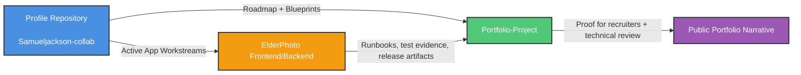
```mermaid
flowchart LR
  A[Profile Repository<br/>
Samueljackson-collab] -->|Roadmap + Blueprints| B[Portfolio-Project]
  A -->|Active App Workstreams| C[ElderPhoto Frontend/Backend]
  C -->|Runbooks, test evidence, release artifacts| B
  B -->|Proof for recruiters + technical review| D[Public Portfolio Narrative]

  style A fill:#4a90e2,stroke:#333,stroke-width:2px,color:#fff
  style B fill:#50C878,stroke:#333,stroke-width:2px,color:#fff
  style C fill:#f39c12,stroke:#333,stroke-width:2px,color:#fff
  style D fill:#9b59b6,stroke:#333,stroke-width:2px,color:#fff
```

### Newly Reflected Build Tracks

- **ElderPhoto product track (newly reflected):**
  - Frontend photo experience and upload/calendar components.
  - Backend backup APIs and synchronization script coverage.
  - Accessibility/color-contrast documentation and implementation summary.
- **Portfolio alignment track:**
  - Maintains explicit connection between profile roadmap content and evidence hosted in `Portfolio-Project`.
  - Preserves deep-dive architecture content while adding a clearer "where each project lives" index.

## 🔐 Local Environment Setup

1. Copy the environment template:

```bash
cp .env.local.example .env.local
```

2. Add your API key to `.env.local`:

```dotenv
GEMINI_API_KEY=your_api_key_here
```

If you prefer, you can create `.env.local` manually and include the same variable.

---
## 📦 Portfolio Projects (Planned)

The following projects represent planned portfolio work demonstrating various technical skills:

- **Project 1: AWS Infrastructure Automation** — Multi-tool infrastructure-as-code implementation covering Terraform, AWS CDK, and Pulumi with reusable deploy scripts.
- **Project 2: Database Migration Platform** — Change data capture pipelines and automation for zero-downtime migrations.
- **Project 3: Kubernetes CI/CD Pipeline** — GitOps, progressive delivery, and environment promotion policies.
- **Project 4: DevSecOps Pipeline** — Security scanning, SBOM publishing, and policy-as-code enforcement.
- **Project 5: Real-time Data Streaming** — Kafka, Flink, and schema registry patterns for resilient stream processing.
- **Project 6: Machine Learning Pipeline** — End-to-end MLOps workflows with experiment tracking and automated promotion.
- **Project 7: Serverless Data Processing** — Event-driven analytics built on AWS Lambda, Step Functions, and DynamoDB.
- **Project 8: Advanced AI Chatbot** — Retrieval-augmented assistant with vector search, tool execution, and streaming responses.
- **Project 9: Multi-Region Disaster Recovery** — Automated failover, replication validation, and DR runbooks.
- **Project 10: Blockchain Smart Contract Platform** — Hardhat-based DeFi stack with staking contracts and security tooling.
- **Project 11: IoT Data Ingestion & Analytics** — Edge telemetry simulation, ingestion, and real-time dashboards.
- **Project 12: Quantum Computing Integration** — Hybrid quantum/classical optimization workflows using Qiskit.
- **Project 13: Advanced Cybersecurity Platform** — SOAR engine with enrichment adapters and automated response playbooks.
- **Project 14: Edge AI Inference Platform** — ONNX Runtime service optimized for Jetson-class devices.
- **Project 15: Real-time Collaborative Platform** — Operational transform collaboration server with CRDT reconciliation.
- **Project 16: Advanced Data Lake & Analytics** — Medallion architecture transformations and Delta Lake patterns.
- **Project 17: Multi-Cloud Service Mesh** — Istio multi-cluster configuration with mTLS and network overlays.
- **Project 18: GPU-Accelerated Computing** — CuPy-powered Monte Carlo simulations and GPU workload orchestration.
- **Project 19: Advanced Kubernetes Operators** — Kopf-based operator managing portfolio stack lifecycles.
- **Project 20: Blockchain Oracle Service** — Chainlink adapter and consumer contracts for on-chain metrics.
- **Project 21: Quantum-Safe Cryptography** — Hybrid Kyber + ECDH key exchange prototype.
- **Project 22: Autonomous DevOps Platform** — Event-driven remediation workflows and runbooks-as-code.
- **Project 23: Advanced Monitoring & Observability** — Grafana dashboards, alerting rules, and distributed tracing config.
- **Project 24: Portfolio Report Generator** — Automated report templating with Jinja2.
- **Project 25: Portfolio Website & Documentation Hub** — VitePress-powered portal aggregating all documentation and guides.
- **Project 26: Homelab & Secure Network Build** — Rack-based segmented network with VLAN isolation, secure Wi-Fi zones, and remote admin VPN.
- **Project 27: Virtualization & Core Services** — Proxmox/TrueNAS platform hosting Wiki.js, Home Assistant, and Immich with TLS reverse proxy.
- **Project 28: Observability & Backups Stack** — Prometheus/Grafana/Loki/Alertmanager integrated with Proxmox backup workflows.
- **Project 29: Commercial E-commerce & Booking Systems Recovery** — Rebuild effort for prior production systems and operational documentation.
- **Project 30: Database Infrastructure Module (Terraform RDS)** — Modular Terraform baseline for resilient relational database provisioning.
- **Project 31: Resume Set (SDE/Cloud/QA/Net/Cyber)** — Role-targeted resume suite and supporting content automation workflow.
- **Project 32: GitOps Platform with IaC (Terraform + ArgoCD)** — End-to-end GitOps control plane with declarative environment promotion.
- **Project 33: AWS Landing Zone (Organizations + SSO)** — Multi-account security baseline using AWS Organizations and centralized identity.
- **Project 34: Active Directory Design & Automation (DSC/Ansible)** — Domain architecture templates and repeatable configuration automation.
- **Project 35: SIEM Pipeline** — Security telemetry ingest and detection pipeline with dashboarded blue-team workflows.
- **Project 36: Adversary Emulation** — Safe ATT&CK-aligned emulation suite for validating detection and response quality.
- **Project 37: Incident Response Playbook** — Structured ransomware-focused IR runbook and escalation framework.
- **Project 38: Web App Login Test Plan** — Functional, security, and performance testing blueprint for authentication systems.
- **Project 39: Selenium + PyTest CI** — Automated UI validation pipeline integrated with GitHub Actions.
- **Project 40: Multi-OS Lab** — Comparative lab environment spanning Kali, Slacko Puppy, and Ubuntu.
- **Project 41: Document Packaging Pipeline** — Prompt-to-document automation for Docs/PDF/XLSX publication.
- **Project 42: IT Playbook (E2E Lifecycle)** — Cross-functional service lifecycle playbook from intake through operations.
- **Project 43: Engineer's Handbook (Standards/QA Gates)** — Practical engineering standards and quality gate reference.

---
## 📊 Portfolio Status Board

> **Note:** This Status Board tracks the actual implementation and delivery progress of portfolio projects. The [Portfolio Blueprints](#-portfolio-blueprints) section provides the corresponding architectural references and planned structures.

🟢 Done · 🟠 In Progress · 🔵 Planned

### Full Portfolio Project Status Matrix (All 43 Projects)

This matrix gives a single, at-a-glance update for every project and its current delivery phase.

| # | Project | Current Status | Current Phase | Next Milestone |
|---|---|---|---|---|
| 1 | AWS Infrastructure Automation | 🟢 Done | Evidence hardening | Publish final runbook index + release tag |
| 2 | Database Migration Platform | 🟢 Done | Stabilization complete | Add migration playbook examples |
| 3 | Kubernetes CI/CD Pipeline | 🟢 Done | Production-pattern validation | Expand rollback game-day report |
| 4 | DevSecOps Pipeline | 🟢 Done | Security controls complete | Add compliance mapping appendix |
| 5 | Real-time Data Streaming | 🔵 Planned | P0 foundation planning | Producer/consumer harness baseline |
| 6 | Machine Learning Pipeline | 🟠 In Progress | Phase 2 expansion | Experiment registry + promotion gates |
| 7 | Serverless Data Processing | 🟠 In Progress | IaC + orchestration build | Failure-path unit tests + validation harness |
| 8 | Advanced AI Chatbot | 🟠 In Progress | RAG/tooling integration | Retrieval eval suite + telemetry wiring |
| 9 | Multi-Region Disaster Recovery | 🔵 Planned | RPO/RTO definition | Replication validation automation |
| 10 | Blockchain Smart Contract Platform | 🟠 In Progress | Contract + CI hardening | Audit scripts + release automation |
| 11 | IoT Data Ingestion & Analytics | 🔵 Planned | Simulator architecture | Gateway + ingestion baseline |
| 12 | Quantum Computing Integration | 🔵 Planned | Optimization target design | Hybrid classical/quantum loop prototype |
| 13 | Advanced Cybersecurity Platform | 🔵 Planned | SOAR pipeline design | Enrichment adapters + response playbooks |
| 14 | Edge AI Inference Platform | 🔵 Planned | Edge runtime planning | ONNX service baseline on Jetson-class profile |
| 15 | Real-time Collaborative Platform | 🟠 In Progress | Conflict handling build | CRDT/OT resolution and latency testing |
| 16 | Advanced Data Lake & Analytics | 🔵 Planned | Medallion architecture planning | Bronze/Silver/Gold transformation skeleton |
| 17 | Multi-Cloud Service Mesh | 🔵 Planned | Multi-cluster design | Istio mTLS + policy baseline |
| 18 | GPU-Accelerated Computing | 🔵 Planned | Runner and scheduler planning | GPU job orchestration proof-of-concept |
| 19 | Advanced Kubernetes Operators | 🔵 Planned | CRD + reconciliation design | Operator lifecycle automation v1 |
| 20 | Blockchain Oracle Service | 🔵 Planned | Adapter design | Chainlink adapter + consumer contract tests |
| 21 | Quantum-Safe Cryptography | 🔵 Planned | Handshake architecture | Kyber + ECDH interoperability harness |
| 22 | Autonomous DevOps Platform | 🔵 Planned | Event taxonomy design | Runbooks-as-code automation MVP |
| 23 | Advanced Monitoring & Observability | 🟢 Done | Monitoring baseline operational | Dashboard pack + alert verification report |
| 24 | Portfolio Report Generator | 🔵 Planned | Template/CLI design | Batch report publishing pipeline |
| 25 | Portfolio Website & Documentation Hub | 🟠 In Progress | Docs platform refinement | Automated publishing + status cards |
| 26 | Homelab & Secure Network Build | 🟢 Done | Implementation complete (docs pending) | Publish full topology and operations runbook |
| 27 | Virtualization & Core Services | 🟢 Done | Platform operational (docs pending) | Publish deployment architecture and service runbooks |
| 28 | Observability & Backups Stack | 🟢 Done | Monitoring + backup stack operational | Publish validation evidence and restore drills |
| 29 | Commercial E-commerce & Booking Systems Recovery | 🟠 In Progress | Artifact recovery and publication rebuild | Restore SQL/process docs and republish core assets |
| 30 | Database Infrastructure Module (Terraform RDS) | 🟠 In Progress | Module baseline complete, stack expansion active | Integrate module into full-stack deployment pipeline |
| 31 | Resume Set (SDE/Cloud/QA/Net/Cyber) | 🟠 In Progress | Portfolio-aligned resume content drafting | Finalize role packs and publishing automation |
| 32 | GitOps Platform with IaC (Terraform + ArgoCD) | 🔵 Planned | Roadmap defined | Build platform bootstrap and environment promotion flow |
| 33 | AWS Landing Zone (Organizations + SSO) | 🔵 Planned | Research phase | Deliver baseline account architecture and identity guardrails |
| 34 | Active Directory Design & Automation (DSC/Ansible) | 🔵 Planned | Planning phase | Publish AD topology templates and automation baseline |
| 35 | SIEM Pipeline | 🔵 Planned | Detection architecture planning | Implement ingest-to-detection baseline with dashboards |
| 36 | Adversary Emulation | 🔵 Planned | ATT&CK scenario planning | Build safe emulation scenarios tied to detection controls |
| 37 | Incident Response Playbook | 🔵 Planned | Operational readiness planning | Publish ransomware-focused IR playbook v1 |
| 38 | Web App Login Test Plan | 🔵 Planned | Test strategy definition | Produce executable test matrix and acceptance criteria |
| 39 | Selenium + PyTest CI | 🔵 Planned | Automation framework planning | Ship CI-integrated UI sanity suite |
| 40 | Multi-OS Lab | 🔵 Planned | Homelab expansion design | Stand up comparative environment and baseline checks |
| 41 | Document Packaging Pipeline | 🔵 Planned | Documentation automation design | Build one-click Docs/PDF/XLSX packaging workflow |
| 42 | IT Playbook (E2E Lifecycle) | 🔵 Planned | Process framework design | Publish intake-to-operations playbook draft |
| 43 | Engineer's Handbook (Standards/QA Gates) | 🔵 Planned | Standards framework planning | Publish engineering standards and QA gate definitions |

**Status totals:** 🟢 Done = 8 · 🟠 In Progress = 9 · 🔵 Planned = 26

**🟢 Done**
- **Project 1: AWS Infrastructure Automation**
  - What it is: Terraform/CDK/Pulumi baseline for AWS with reusable deploy scripts.
  - What’s done: CI for fmt/validate/tfsec/plan/apply; 250+ lines of pytest coverage validating variables, outputs, and security controls.
  - Evidence: [Portfolio-Project › AWS Infrastructure Automation](https://github.com/samueljackson-collab/Portfolio-Project/tree/main/aws-infrastructure-automation)

- **Project 2: Database Migration Platform**
  - What it is: Debezium + AWS DMS–driven zero-downtime migration orchestrator.
  - What’s done: 680-line orchestrator, Dockerized runtime, 300+ lines of unit tests, CI for lint/test/build/publish, Debezium connector config.
  - Evidence: [Portfolio-Project › Database Migration Platform](https://github.com/samueljackson-collab/Portfolio-Project/tree/main/database-migration-platform)

- **Project 3: Kubernetes CI/CD Pipeline**
  - What it is: GitOps-ready CI/CD for Kubernetes with progressive delivery.
  - What’s done: GitHub Actions with YAML/K8s validation, image builds, Trivy scans, ArgoCD sync, blue-green deploys, automated rollbacks.
  - Evidence: [Portfolio-Project › Kubernetes CI/CD Pipeline](https://github.com/samueljackson-collab/Portfolio-Project/tree/main/kubernetes-cicd-pipeline)

- **Project 4: DevSecOps Pipeline**
  - What it is: Security-first pipeline covering SAST, SCA, secrets, SBOM, and DAST.
  - What’s done: Semgrep, Bandit, CodeQL, Gitleaks/TruffleHog, Syft SBOM, Trivy/Dockle, OWASP ZAP, and compliance policy validation.
  - Evidence: [Portfolio-Project › DevSecOps Pipeline](https://github.com/samueljackson-collab/Portfolio-Project/tree/main/devsecops-pipeline)

- **Project 23: Advanced Monitoring & Observability**
  - What it is: Monitoring stack for metrics, logs, and tracing across services.
  - What’s done: Automated Prometheus/Grafana/Loki/Otel deployment, dashboard linting, alert rule checks, health verification.
  - Evidence: [Portfolio-Project › Advanced Monitoring & Observability](https://github.com/samueljackson-collab/Portfolio-Project/tree/main/advanced-monitoring-observability)


**🟠 In Progress**
- **Project 6: Machine Learning Pipeline**
  - Focus: Phase 2 expansion—experiment tracking, model promotion gates, Docker images for training/serving.
  - Next: Integrate experiment registry and CI hooks for promotion approvals.
  - Evidence: [Portfolio-Project › Machine Learning Pipeline](https://github.com/samueljackson-collab/Portfolio-Project/tree/main/machine-learning-pipeline)

- **Project 7: Serverless Data Processing**
  - Focus: Lambda/Step Functions pipelines with IaC and CDC ingestion.
  - Next: Add unit tests and failure-handling paths; wire to validation harness.
  - Evidence: [Portfolio-Project › Serverless Data Processing](https://github.com/samueljackson-collab/Portfolio-Project/tree/main/serverless-data-processing)

- **Project 8: Advanced AI Chatbot**
  - Focus: RAG pipeline and tool-execution flow with evaluation harness.
  - Next: Containerize services, add retrieval evals, and wire telemetry.
  - Evidence: [Portfolio-Project › Advanced AI Chatbot](https://github.com/samueljackson-collab/Portfolio-Project/tree/main/advanced-ai-chatbot)

- **Project 10: Blockchain Smart Contract Platform**
  - Focus: Hardhat-based contracts with audits and deployment automation.
  - Next: Expand CI coverage, add audit scripts, and release pipelines.
  - Evidence: [Portfolio-Project › Blockchain Smart Contract Platform](https://github.com/samueljackson-collab/Portfolio-Project/tree/main/blockchain-smart-contract-platform)

- **Project 15: Real-time Collaborative Platform**
  - Focus: CRDT/OT engine for collaborative editing.
  - Next: Conflict resolution tests, latency simulations, and deploy automation.
  - Evidence: [Portfolio-Project › Real-time Collaborative Platform](https://github.com/samueljackson-collab/Portfolio-Project/tree/main/real-time-collaboration-platform)

- **Project 25: Portfolio Website & Documentation Hub**
  - Focus: VitePress site hosting portfolio docs and reports.
  - Next: Improve navigation/badges, automate report publishing, and add status cards.
  - Evidence: [Portfolio-Project › Portfolio Website & Documentation Hub](https://github.com/samueljackson-collab/Portfolio-Project/tree/main/portfolio-website-documentation-hub)


**🔵 Planned**
- **Project 5: Real-time Data Streaming**
  - Plan: Kafka/Flink data plane with schema registry, CDC ingestion, and stream quality checks.
  - Roadmap: P0 build producer/consumer harness → P1 add Flink jobs + schema registry → P2 integrate quality gates + latency SLOs.
  - Timeline: Sprint 1 (foundation) · Sprint 2 (jobs + registry) · Sprint 3 (quality/SLO evidence)

- **Project 9: Multi-Region Disaster Recovery**
  - Plan: DR drills, replication validation, automated failover tests, and runbooks.
  - Roadmap: P0 document RPO/RTO targets → P1 automate replication checks → P2 run failover game days with evidence capture.
  - Timeline: Sprint 1 (RPO/RTO + replication) · Sprint 2 (failover automation) · Sprint 3 (runbook + reporting)

- **Project 11: IoT Data Ingestion & Analytics**
  - Plan: Edge telemetry simulators feeding stream processing and dashboards.
  - Roadmap: P0 device simulators + gateway → P1 stream processors + storage → P2 dashboarding + anomaly alerts.
  - Timeline: Sprint 1 (sim + gateway) · Sprint 2 (processing/storage) · Sprint 3 (dashboards/alerts)

- **Project 12: Quantum Computing Integration**
  - Plan: Qiskit hybrid workflows for optimization experiments.
  - Roadmap: P0 define optimization targets → P1 wire classical optimizer → P2 hybrid loop + error mitigation evidence.
  - Timeline: Sprint 1 (problem framing) · Sprint 2 (hybrid loops) · Sprint 3 (mitigation + results)

- **Project 13: Advanced Cybersecurity Platform**
  - Plan: SOAR pipeline with enrichment adapters, detections, and response playbooks.
  - Roadmap: P0 detection catalog + SOAR skeleton → P1 enrichment adapters → P2 response playbooks + audit trails.
  - Timeline: Sprint 1 (detections) · Sprint 2 (enrichment) · Sprint 3 (response + evidence)

- **Project 14: Edge AI Inference Platform**
  - Plan: ONNX Runtime service for Jetson-class deployments with perf tuning and telemetry.
  - Roadmap: P0 model selection/quantization → P1 runtime packaging + perf tests → P2 telemetry/export + OTA updates.
  - Timeline: Sprint 1 (models) · Sprint 2 (runtime/perf) · Sprint 3 (telemetry/OTA)

- **Project 16: Advanced Data Lake & Analytics**
  - Plan: Medallion architecture, Delta Lake transformations, and data quality checks.
  - Roadmap: P0 raw/bronze ingestion → P1 silver/gold transformations → P2 data quality + BI dashboards.
  - Timeline: Sprint 1 (raw/bronze) · Sprint 2 (silver/gold) · Sprint 3 (DQ + BI)

- **Project 17: Multi-Cloud Service Mesh**
  - Plan: Istio multi-cluster blueprint with mTLS, policy controls, and failover scenarios.
  - Roadmap: P0 base Istio install + mTLS → P1 multi-cluster linking + policy overlay → P2 failover drills + tracing dashboards.
  - Timeline: Sprint 1 (install/mTLS) · Sprint 2 (multi-cluster/policy) · Sprint 3 (failover + obs)

- **Project 18: GPU-Accelerated Computing**
  - Plan: CuPy-powered Monte Carlo workloads and orchestration patterns.
  - Roadmap: P0 GPU runners + job scheduler → P1 Monte Carlo kernels + profiling → P2 scaling + cost/perf reports.
  - Timeline: Sprint 1 (runners) · Sprint 2 (kernels/profiles) · Sprint 3 (scaling/reports)

- **Project 19: Advanced Kubernetes Operators**
  - Plan: Kopf-based operator managing portfolio lifecycle automation.
  - Roadmap: P0 CRD design + reconciliation loop → P1 lifecycle automation flows → P2 status/telemetry exports + chaos tests.
  - Timeline: Sprint 1 (CRDs) · Sprint 2 (automation flows) · Sprint 3 (telemetry/chaos)

- **Project 20: Blockchain Oracle Service**
  - Plan: Chainlink adapters plus consumer contracts with monitoring hooks.
  - Roadmap: P0 adapter scaffold + mock feeds → P1 consumer contracts + tests → P2 monitoring hooks + on-chain proof reports.
  - Timeline: Sprint 1 (adapter) · Sprint 2 (consumers/tests) · Sprint 3 (monitoring/proofs)

- **Project 21: Quantum-Safe Cryptography**
  - Plan: Hybrid Kyber + ECDH key exchange prototype with interoperability tests.
  - Roadmap: P0 hybrid handshake design → P1 interoperability harness + perf tests → P2 docs + compatibility matrix.
  - Timeline: Sprint 1 (design) · Sprint 2 (interop/perf) · Sprint 3 (docs/matrix)

- **Project 22: Autonomous DevOps Platform**
  - Plan: Event-driven remediation flows, runbooks-as-code, and policy-driven automation.
  - Roadmap: P0 event taxonomy + bus → P1 runbooks-as-code automation → P2 policy/approval gates + evidence export.
  - Timeline: Sprint 1 (taxonomy/bus) · Sprint 2 (runbooks) · Sprint 3 (policy/evidence)

- **Project 24: Portfolio Report Generator**
  - Plan: Jinja2-driven document factory with CLI/CI hooks for batch publishing and evidence packaging.
  - Roadmap: P0 template library + CLI scaffold → P1 CI batch publishing + packaging → P2 recruiter-ready bundles + change log.
  - Timeline: Sprint 1 (templates/CLI) · Sprint 2 (CI publishing) · Sprint 3 (bundles/changelog)

### Planned Project Timeline Snapshot

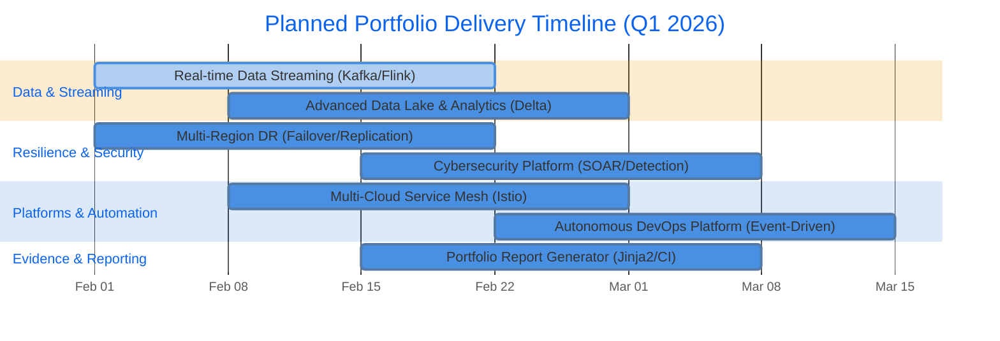
```mermaid
%%{init: {'theme':'base', 'themeVariables': { 'primaryColor':'#4a90e2','secondaryColor':'#50C878','tertiaryColor':'#f39c12'}}}%%
gantt
    title Planned Portfolio Delivery Timeline (Q1 2026)
    dateFormat  YYYY-MM-DD
    axisFormat  %b %d

    section Data & Streaming
    Real-time Data Streaming (Kafka/Flink)       :active, stream_p0, 2026-02-01, 21d
    Advanced Data Lake & Analytics (Delta)       :datalake_p0, 2026-02-08, 21d

    section Resilience & Security
    Multi-Region DR (Failover/Replication)       :dr_p0, 2026-02-01, 21d
    Cybersecurity Platform (SOAR/Detection)      :detection_p0, 2026-02-15, 21d

    section Platforms & Automation
    Multi-Cloud Service Mesh (Istio)             :mesh_p0, 2026-02-08, 21d
    Autonomous DevOps Platform (Event-Driven)    :auto_p0, 2026-02-22, 21d

    section Evidence & Reporting
    Portfolio Report Generator (Jinja2/CI)       :report_p0, 2026-02-15, 21d
```


---
## 🧭 Portfolio Blueprints & Evidence

> High-level diagrams synthesized from the [Portfolio-Project](https://github.com/samueljackson-collab/Portfolio-Project) repository to show architecture and delivery patterns. Each blueprint is intentionally concise for quick recruiter review and will be accompanied by deeper runbooks and artifacts as they are published.

> **📊 Viewing Diagrams:** This README contains 28 interactive Mermaid diagrams. If diagrams don't appear, try viewing this page on [GitHub's website](https://github.com/samueljackson-collab/Samueljackson-collab/blob/main/README.md) rather than in edit mode, and ensure JavaScript is enabled in your browser. Diagrams may take a moment to render on first load.

<details><summary><strong>🟢 Completed Blueprints</strong></summary>

**Project 1: AWS Infrastructure Automation**

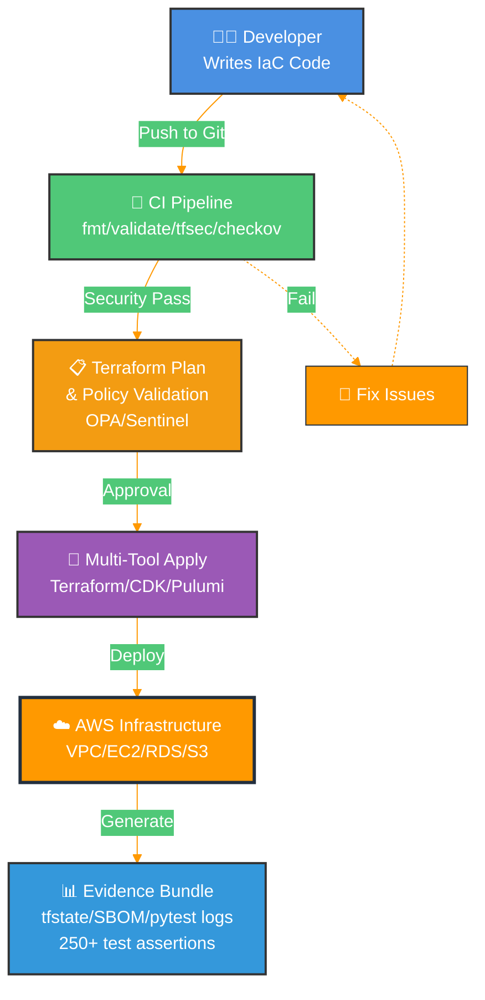
```mermaid
%%{init: {'theme':'base', 'themeVariables': { 'primaryColor':'#FF9900','primaryTextColor':'#fff','primaryBorderColor':'#232F3E','lineColor':'#FF9900','secondaryColor':'#50C878','tertiaryColor':'#f39c12'}}}%%
flowchart TD
  Dev[👨‍💻 Developer<br/>Writes IaC Code] --> |Push to Git| CI[🔄 CI Pipeline<br/>fmt/validate/tfsec/checkov]
  CI --> |Security Pass| Plan[📋 Terraform Plan<br/>& Policy Validation<br/>OPA/Sentinel]
  Plan --> |Approval| Apply[🚀 Multi-Tool Apply<br/>Terraform/CDK/Pulumi]
  Apply --> |Deploy| AWS[☁️ AWS Infrastructure<br/>VPC/EC2/RDS/S3]
  AWS --> |Generate| Reports[📊 Evidence Bundle<br/>tfstate/SBOM/pytest logs<br/>250+ test assertions]
  
  CI -.->|Fail| Fix[🔧 Fix Issues]
  Fix -.-> Dev
  
  style Dev fill:#4a90e2,stroke:#333,stroke-width:2px,color:#fff
  style CI fill:#50C878,stroke:#333,stroke-width:2px,color:#fff
  style Plan fill:#f39c12,stroke:#333,stroke-width:2px,color:#fff
  style Apply fill:#9b59b6,stroke:#333,stroke-width:2px,color:#fff
  style AWS fill:#FF9900,stroke:#232F3E,stroke-width:3px,color:#fff
  style Reports fill:#3498db,stroke:#333,stroke-width:2px,color:#fff
```

**Project 2: Database Migration Platform**

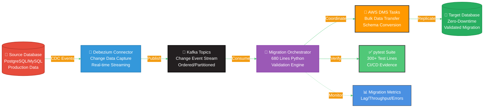
```mermaid
%%{init: {'theme':'base', 'themeVariables': { 'primaryColor':'#4a90e2','primaryTextColor':'#fff','primaryBorderColor':'#333','lineColor':'#50C878','secondaryColor':'#f39c12','tertiaryColor':'#9b59b6'}}}%%
flowchart LR
  SrcDB[(💾 Source Database<br/>PostgreSQL/MySQL<br/>Production Data)] --> |CDC Events| Debezium[📡 Debezium Connector<br/>Change Data Capture<br/>Real-time Streaming]
  Debezium --> |Publish| Kafka[📨 Kafka Topics<br/>Change Event Stream<br/>Ordered/Partitioned]
  Kafka --> |Consume| Orchestrator[🎯 Migration Orchestrator<br/>680 Lines Python<br/>Validation Engine]
  Orchestrator --> |Coordinate| DMS[🔄 AWS DMS Tasks<br/>Bulk Data Transfer<br/>Schema Conversion]
  DMS --> |Replicate| Target[(💾 Target Database<br/>Zero-Downtime<br/>Validated Migration)]
  Orchestrator --> |Verify| Tests[✅ pytest Suite<br/>300+ Test Lines<br/>CI/CD Evidence]
  
  Orchestrator -.->|Monitor| Metrics[📊 Migration Metrics<br/>Lag/Throughput/Errors]
  
  style SrcDB fill:#e74c3c,stroke:#c0392b,stroke-width:2px,color:#fff
  style Debezium fill:#3498db,stroke:#2980b9,stroke-width:2px,color:#fff
  style Kafka fill:#231F20,stroke:#000,stroke-width:2px,color:#fff
  style Orchestrator fill:#9b59b6,stroke:#8e44ad,stroke-width:2px,color:#fff
  style DMS fill:#FF9900,stroke:#232F3E,stroke-width:2px,color:#fff
  style Target fill:#27ae60,stroke:#229954,stroke-width:2px,color:#fff
  style Tests fill:#50C878,stroke:#333,stroke-width:2px,color:#fff
```

**Project 3: Kubernetes CI/CD Pipeline**

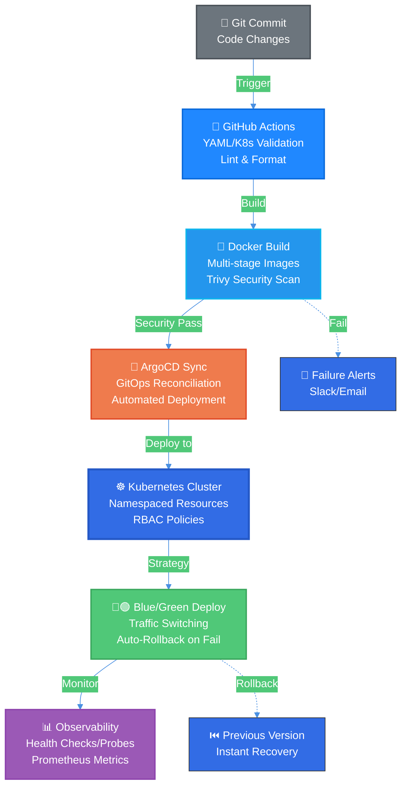
```mermaid
%%{init: {'theme':'base', 'themeVariables': { 'primaryColor':'#326CE5','primaryTextColor':'#fff','primaryBorderColor':'#333','lineColor':'#4a90e2','secondaryColor':'#50C878','tertiaryColor':'#f39c12'}}}%%
flowchart TD
  Commit[📝 Git Commit<br/>Code Changes] --> |Trigger| GH[🔄 GitHub Actions<br/>YAML/K8s Validation<br/>Lint & Format]
  GH --> |Build| Build[🐳 Docker Build<br/>Multi-stage Images<br/>Trivy Security Scan]
  Build --> |Security Pass| Argo[🔁 ArgoCD Sync<br/>GitOps Reconciliation<br/>Automated Deployment]
  Argo --> |Deploy to| Cluster[☸️ Kubernetes Cluster<br/>Namespaced Resources<br/>RBAC Policies]
  Cluster --> |Strategy| Deploy[🔵🟢 Blue/Green Deploy<br/>Traffic Switching<br/>Auto-Rollback on Fail]
  Deploy --> |Monitor| Telemetry[📊 Observability<br/>Health Checks/Probes<br/>Prometheus Metrics]
  
  Build -.->|Fail| Notify[🚨 Failure Alerts<br/>Slack/Email]
  Deploy -.->|Rollback| Previous[⏮️ Previous Version<br/>Instant Recovery]
  
  style Commit fill:#6c757d,stroke:#495057,stroke-width:2px,color:#fff
  style GH fill:#2088FF,stroke:#0969da,stroke-width:2px,color:#fff
  style Build fill:#2496ED,stroke:#0db7ed,stroke-width:2px,color:#fff
  style Argo fill:#EF7B4D,stroke:#e14c29,stroke-width:2px,color:#fff
  style Cluster fill:#326CE5,stroke:#2559c7,stroke-width:3px,color:#fff
  style Deploy fill:#50C878,stroke:#3aa65d,stroke-width:2px,color:#fff
  style Telemetry fill:#9b59b6,stroke:#8e44ad,stroke-width:2px,color:#fff
```

**Project 4: DevSecOps Pipeline**

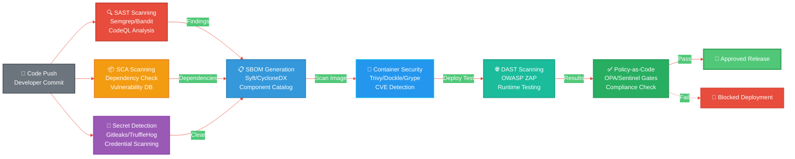
```mermaid
%%{init: {'theme':'base', 'themeVariables': { 'primaryColor':'#e74c3c','primaryTextColor':'#fff','primaryBorderColor':'#c0392b','lineColor':'#e74c3c','secondaryColor':'#50C878','tertiaryColor':'#f39c12'}}}%%
flowchart LR
  Code[📝 Code Push<br/>Developer Commit] --> SAST[🔍 SAST Scanning<br/>Semgrep/Bandit<br/>CodeQL Analysis]
  Code --> SCA[📦 SCA Scanning<br/>Dependency Check<br/>Vulnerability DB]
  Code --> Secrets[🔐 Secret Detection<br/>Gitleaks/TruffleHog<br/>Credential Scanning]
  
  SAST --> |Findings| SBOM[📋 SBOM Generation<br/>Syft/CycloneDX<br/>Component Catalog]
  SCA --> |Dependencies| SBOM
  Secrets --> |Clear| SBOM
  
  SBOM --> |Scan Image| Container[🐳 Container Security<br/>Trivy/Dockle/Grype<br/>CVE Detection]
  Container --> |Deploy Test| DAST[🌐 DAST Scanning<br/>OWASP ZAP<br/>Runtime Testing]
  DAST --> |Results| Policy[✅ Policy-as-Code<br/>OPA/Sentinel Gates<br/>Compliance Check]
  
  Policy --> |Pass| Release[🚀 Approved Release]
  Policy -.->|Fail| Block[🚫 Blocked Deployment]
  
  style Code fill:#6c757d,stroke:#495057,stroke-width:2px,color:#fff
  style SAST fill:#e74c3c,stroke:#c0392b,stroke-width:2px,color:#fff
  style SCA fill:#f39c12,stroke:#e67e22,stroke-width:2px,color:#fff
  style Secrets fill:#9b59b6,stroke:#8e44ad,stroke-width:2px,color:#fff
  style SBOM fill:#3498db,stroke:#2980b9,stroke-width:2px,color:#fff
  style Container fill:#2496ED,stroke:#0db7ed,stroke-width:2px,color:#fff
  style DAST fill:#1abc9c,stroke:#16a085,stroke-width:2px,color:#fff
  style Policy fill:#27ae60,stroke:#229954,stroke-width:2px,color:#fff
  style Release fill:#50C878,stroke:#3aa65d,stroke-width:3px,color:#fff
```

**Project 23: Advanced Monitoring & Observability**

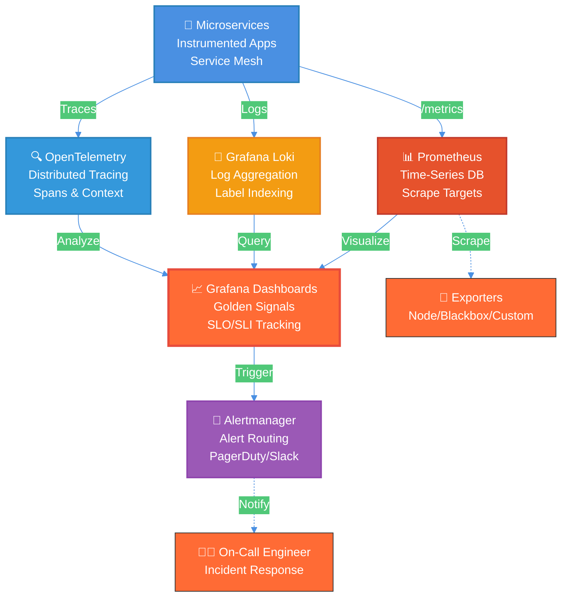
```mermaid
%%{init: {'theme':'base', 'themeVariables': { 'primaryColor':'#FF6B35','primaryTextColor':'#fff','primaryBorderColor':'#333','lineColor':'#4a90e2','secondaryColor':'#50C878','tertiaryColor':'#9b59b6'}}}%%
flowchart TD
  Apps[🎯 Microservices<br/>Instrumented Apps<br/>Service Mesh] --> |/metrics| Metrics[📊 Prometheus<br/>Time-Series DB<br/>Scrape Targets]
  Apps --> |Logs| Logs[📝 Grafana Loki<br/>Log Aggregation<br/>Label Indexing]
  Apps --> |Traces| Traces[🔍 OpenTelemetry<br/>Distributed Tracing<br/>Spans & Context]
  
  Metrics --> |Visualize| Grafana[📈 Grafana Dashboards<br/>Golden Signals<br/>SLO/SLI Tracking]
  Logs --> |Query| Grafana
  Traces --> |Analyze| Grafana
  
  Grafana --> |Trigger| Alerts[🚨 Alertmanager<br/>Alert Routing<br/>PagerDuty/Slack]
  
  Metrics -.->|Scrape| Exporters[📡 Exporters<br/>Node/Blackbox/Custom]
  Alerts -.->|Notify| OnCall[👨‍💻 On-Call Engineer<br/>Incident Response]
  
  style Apps fill:#4a90e2,stroke:#2980b9,stroke-width:2px,color:#fff
  style Metrics fill:#E6522C,stroke:#c0392b,stroke-width:2px,color:#fff
  style Logs fill:#f39c12,stroke:#e67e22,stroke-width:2px,color:#fff
  style Traces fill:#3498db,stroke:#2980b9,stroke-width:2px,color:#fff
  style Grafana fill:#FF6B35,stroke:#e74c3c,stroke-width:3px,color:#fff
  style Alerts fill:#9b59b6,stroke:#8e44ad,stroke-width:2px,color:#fff
```

</details>

<details><summary><strong>🟠 In-Progress Blueprints</strong></summary>

**Project 6: Machine Learning Pipeline**

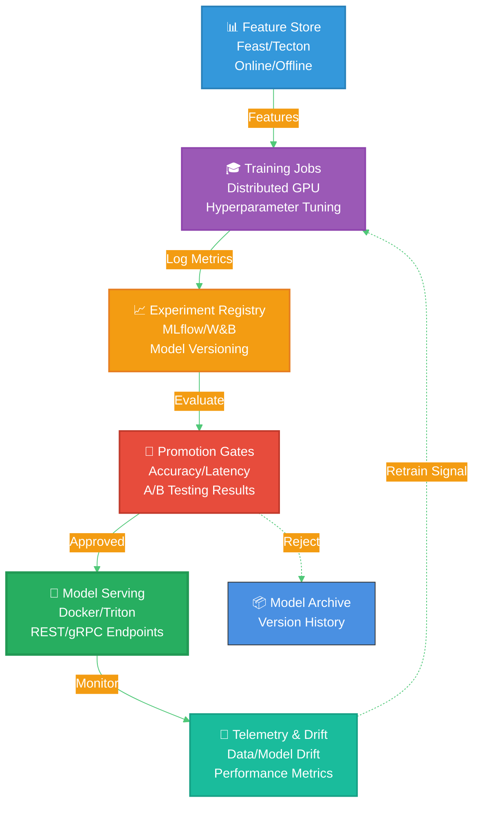
```mermaid
%%{init: {'theme':'base', 'themeVariables': { 'primaryColor':'#4a90e2','primaryTextColor':'#fff','primaryBorderColor':'#333','lineColor':'#50C878','secondaryColor':'#f39c12','tertiaryColor':'#9b59b6'}}}%%
flowchart TD
  Data[📊 Feature Store<br/>Feast/Tecton<br/>Online/Offline] --> |Features| Train[🎓 Training Jobs<br/>Distributed GPU<br/>Hyperparameter Tuning]
  Train --> |Log Metrics| Track[📈 Experiment Registry<br/>MLflow/W&B<br/>Model Versioning]
  Track --> |Evaluate| Gate[🚦 Promotion Gates<br/>Accuracy/Latency<br/>A/B Testing Results]
  Gate --> |Approved| Serve[🚀 Model Serving<br/>Docker/Triton<br/>REST/gRPC Endpoints]
  Serve --> |Monitor| Telemetry[📡 Telemetry & Drift<br/>Data/Model Drift<br/>Performance Metrics]
  
  Telemetry -.->|Retrain Signal| Train
  Gate -.->|Reject| Archive[📦 Model Archive<br/>Version History]
  
  style Data fill:#3498db,stroke:#2980b9,stroke-width:2px,color:#fff
  style Train fill:#9b59b6,stroke:#8e44ad,stroke-width:2px,color:#fff
  style Track fill:#f39c12,stroke:#e67e22,stroke-width:2px,color:#fff
  style Gate fill:#e74c3c,stroke:#c0392b,stroke-width:2px,color:#fff
  style Serve fill:#27ae60,stroke:#229954,stroke-width:3px,color:#fff
  style Telemetry fill:#1abc9c,stroke:#16a085,stroke-width:2px,color:#fff
```

**Project 7: Serverless Data Processing**

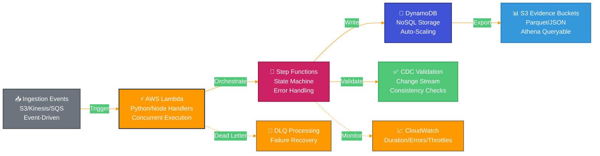
```mermaid
%%{init: {'theme':'base', 'themeVariables': { 'primaryColor':'#FF9900','primaryTextColor':'#fff','primaryBorderColor':'#232F3E','lineColor':'#FF9900','secondaryColor':'#50C878','tertiaryColor':'#4a90e2'}}}%%
flowchart LR
  Events[📥 Ingestion Events<br/>S3/Kinesis/SQS<br/>Event-Driven] --> |Trigger| Lambda[⚡ AWS Lambda<br/>Python/Node Handlers<br/>Concurrent Execution]
  Lambda --> |Orchestrate| Steps[🔄 Step Functions<br/>State Machine<br/>Error Handling]
  Steps --> |Write| Dynamo[💾 DynamoDB<br/>NoSQL Storage<br/>Auto-Scaling]
  Steps --> |Validate| CDC[✅ CDC Validation<br/>Change Stream<br/>Consistency Checks]
  Dynamo --> |Export| Reports[📊 S3 Evidence Buckets<br/>Parquet/JSON<br/>Athena Queryable]
  
  Lambda -.->|Dead Letter| DLQ[📮 DLQ Processing<br/>Failure Recovery]
  Steps -.->|Monitor| Metrics[📈 CloudWatch<br/>Duration/Errors/Throttles]
  
  style Events fill:#6c757d,stroke:#495057,stroke-width:2px,color:#fff
  style Lambda fill:#FF9900,stroke:#232F3E,stroke-width:2px,color:#fff
  style Steps fill:#CC2264,stroke:#991b4d,stroke-width:2px,color:#fff
  style Dynamo fill:#4053D6,stroke:#2a3889,stroke-width:2px,color:#fff
  style CDC fill:#50C878,stroke:#3aa65d,stroke-width:2px,color:#fff
  style Reports fill:#3498db,stroke:#2980b9,stroke-width:2px,color:#fff
```

**Project 8: Advanced AI Chatbot**

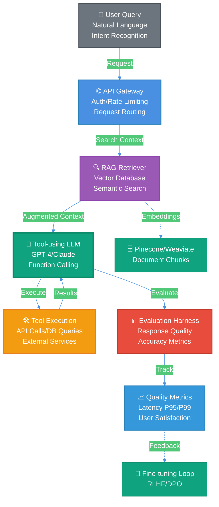
```mermaid
%%{init: {'theme':'base', 'themeVariables': { 'primaryColor':'#10a37f','primaryTextColor':'#fff','primaryBorderColor':'#0d8a6a','lineColor':'#4a90e2','secondaryColor':'#50C878','tertiaryColor':'#9b59b6'}}}%%
flowchart TD
  User[👤 User Query<br/>Natural Language<br/>Intent Recognition] --> |Request| API[🌐 API Gateway<br/>Auth/Rate Limiting<br/>Request Routing]
  API --> |Search Context| RAG[🔍 RAG Retriever<br/>Vector Database<br/>Semantic Search]
  RAG --> |Augmented Context| LLM[🤖 Tool-using LLM<br/>GPT-4/Claude<br/>Function Calling]
  LLM --> |Execute| Tools[🛠️ Tool Execution<br/>API Calls/DB Queries<br/>External Services]
  Tools --> |Results| LLM
  LLM --> |Evaluate| Eval[📊 Evaluation Harness<br/>Response Quality<br/>Accuracy Metrics]
  Eval --> |Track| Metrics[📈 Quality Metrics<br/>Latency P95/P99<br/>User Satisfaction]
  
  RAG -.->|Embeddings| VectorDB[🗄️ Pinecone/Weaviate<br/>Document Chunks]
  Metrics -.->|Feedback| Training[🎯 Fine-tuning Loop<br/>RLHF/DPO]
  
  style User fill:#6c757d,stroke:#495057,stroke-width:2px,color:#fff
  style API fill:#4a90e2,stroke:#2980b9,stroke-width:2px,color:#fff
  style RAG fill:#9b59b6,stroke:#8e44ad,stroke-width:2px,color:#fff
  style LLM fill:#10a37f,stroke:#0d8a6a,stroke-width:3px,color:#fff
  style Tools fill:#f39c12,stroke:#e67e22,stroke-width:2px,color:#fff
  style Eval fill:#e74c3c,stroke:#c0392b,stroke-width:2px,color:#fff
  style Metrics fill:#3498db,stroke:#2980b9,stroke-width:2px,color:#fff
```

**Project 10: Blockchain Smart Contract Platform**

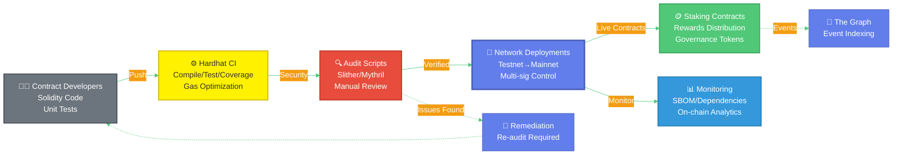
```mermaid
%%{init: {'theme':'base', 'themeVariables': { 'primaryColor':'#627EEA','primaryTextColor':'#fff','primaryBorderColor':'#4a5fb8','lineColor':'#50C878','secondaryColor':'#f39c12','tertiaryColor':'#9b59b6'}}}%%
flowchart LR
  Devs[👨‍💻 Contract Developers<br/>Solidity Code<br/>Unit Tests] --> |Push| Hardhat[⚙️ Hardhat CI<br/>Compile/Test/Coverage<br/>Gas Optimization]
  Hardhat --> |Security| Audits[🔍 Audit Scripts<br/>Slither/Mythril<br/>Manual Review]
  Audits --> |Verified| Deploys[🚀 Network Deployments<br/>Testnet→Mainnet<br/>Multi-sig Control]
  Deploys --> |Live Contracts| Staking[🪙 Staking Contracts<br/>Rewards Distribution<br/>Governance Tokens]
  Deploys --> |Monitor| Dashboards[📊 Monitoring<br/>SBOM/Dependencies<br/>On-chain Analytics]
  
  Audits -.->|Issues Found| Fix[🔧 Remediation<br/>Re-audit Required]
  Fix -.-> Devs
  Staking -.->|Events| Indexer[🔎 The Graph<br/>Event Indexing]
  
  style Devs fill:#6c757d,stroke:#495057,stroke-width:2px,color:#fff
  style Hardhat fill:#FFF100,stroke:#d4b500,stroke-width:2px,color:#333
  style Audits fill:#e74c3c,stroke:#c0392b,stroke-width:2px,color:#fff
  style Deploys fill:#627EEA,stroke:#4a5fb8,stroke-width:3px,color:#fff
  style Staking fill:#50C878,stroke:#3aa65d,stroke-width:2px,color:#fff
  style Dashboards fill:#3498db,stroke:#2980b9,stroke-width:2px,color:#fff
```

**Project 15: Real-time Collaborative Platform**

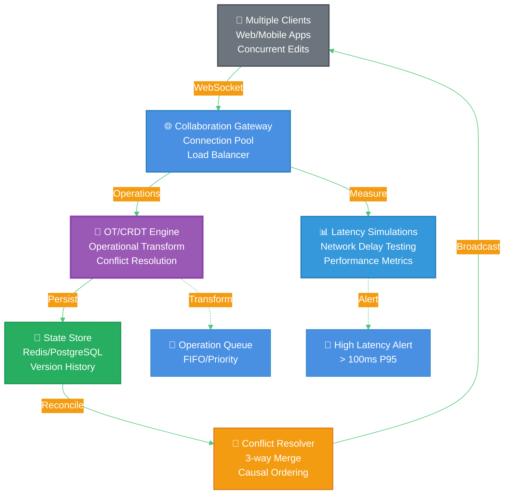
```mermaid
%%{init: {'theme':'base', 'themeVariables': { 'primaryColor':'#4a90e2','primaryTextColor':'#fff','primaryBorderColor':'#2980b9','lineColor':'#50C878','secondaryColor':'#f39c12','tertiaryColor':'#9b59b6'}}}%%
flowchart TD
  Clients[👥 Multiple Clients<br/>Web/Mobile Apps<br/>Concurrent Edits] --> |WebSocket| Gateway[🌐 Collaboration Gateway<br/>Connection Pool<br/>Load Balancer]
  Gateway --> |Operations| OT[🔄 OT/CRDT Engine<br/>Operational Transform<br/>Conflict Resolution]
  OT --> |Persist| Storage[💾 State Store<br/>Redis/PostgreSQL<br/>Version History]
  Storage --> |Reconcile| Sync[🔀 Conflict Resolver<br/>3-way Merge<br/>Causal Ordering]
  Sync --> |Broadcast| Clients
  Gateway --> |Measure| Telemetry[📊 Latency Simulations<br/>Network Delay Testing<br/>Performance Metrics]
  
  OT -.->|Transform| Queue[📮 Operation Queue<br/>FIFO/Priority]
  Telemetry -.->|Alert| Monitor[🚨 High Latency Alert<br/>> 100ms P95]
  
  style Clients fill:#6c757d,stroke:#495057,stroke-width:2px,color:#fff
  style Gateway fill:#4a90e2,stroke:#2980b9,stroke-width:2px,color:#fff
  style OT fill:#9b59b6,stroke:#8e44ad,stroke-width:3px,color:#fff
  style Storage fill:#27ae60,stroke:#229954,stroke-width:2px,color:#fff
  style Sync fill:#f39c12,stroke:#e67e22,stroke-width:2px,color:#fff
  style Telemetry fill:#3498db,stroke:#2980b9,stroke-width:2px,color:#fff
```

**Project 25: Portfolio Website & Documentation Hub**

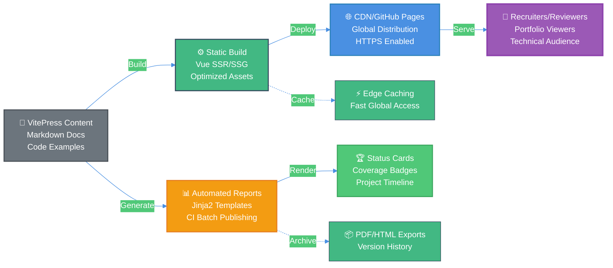
```mermaid
%%{init: {'theme':'base', 'themeVariables': { 'primaryColor':'#42b883','primaryTextColor':'#fff','primaryBorderColor':'#35495e','lineColor':'#4a90e2','secondaryColor':'#50C878','tertiaryColor':'#f39c12'}}}%%
flowchart LR
  Docs[📝 VitePress Content<br/>Markdown Docs<br/>Code Examples] --> |Build| Build[⚙️ Static Build<br/>Vue SSR/SSG<br/>Optimized Assets]
  Build --> |Deploy| CDN[🌐 CDN/GitHub Pages<br/>Global Distribution<br/>HTTPS Enabled]
  Docs --> |Generate| Reports[📊 Automated Reports<br/>Jinja2 Templates<br/>CI Batch Publishing]
  Reports --> |Render| Badges[🏆 Status Cards<br/>Coverage Badges<br/>Project Timeline]
  CDN --> |Serve| Readers[👔 Recruiters/Reviewers<br/>Portfolio Viewers<br/>Technical Audience]
  
  Build -.->|Cache| Cache[⚡ Edge Caching<br/>Fast Global Access]
  Reports -.->|Archive| Artifacts[📦 PDF/HTML Exports<br/>Version History]
  
  style Docs fill:#6c757d,stroke:#495057,stroke-width:2px,color:#fff
  style Build fill:#42b883,stroke:#35495e,stroke-width:2px,color:#fff
  style CDN fill:#4a90e2,stroke:#2980b9,stroke-width:2px,color:#fff
  style Reports fill:#f39c12,stroke:#e67e22,stroke-width:2px,color:#fff
  style Badges fill:#50C878,stroke:#3aa65d,stroke-width:2px,color:#fff
  style Readers fill:#9b59b6,stroke:#8e44ad,stroke-width:3px,color:#fff
```

</details>

<details><summary><strong>🔵 Planned Blueprints</strong></summary>

**Project 5: Real-time Data Streaming**

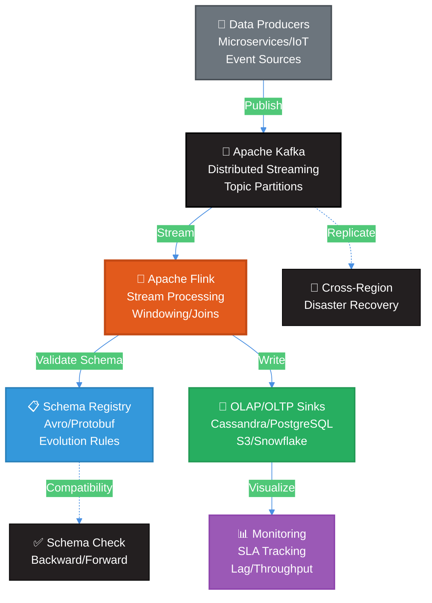
```mermaid
%%{init: {'theme':'base', 'themeVariables': { 'primaryColor':'#231F20','primaryTextColor':'#fff','primaryBorderColor':'#000','lineColor':'#4a90e2','secondaryColor':'#50C878','tertiaryColor':'#e25a1c'}}}%%
flowchart TD
  Producers[📡 Data Producers<br/>Microservices/IoT<br/>Event Sources] --> |Publish| Kafka[📨 Apache Kafka<br/>Distributed Streaming<br/>Topic Partitions]
  Kafka --> |Stream| Flink[🌊 Apache Flink<br/>Stream Processing<br/>Windowing/Joins]
  Flink --> |Validate Schema| Registry[📋 Schema Registry<br/>Avro/Protobuf<br/>Evolution Rules]
  Flink --> |Write| Sinks[💾 OLAP/OLTP Sinks<br/>Cassandra/PostgreSQL<br/>S3/Snowflake]
  Sinks --> |Visualize| Dashboards[📊 Monitoring<br/>SLA Tracking<br/>Lag/Throughput]
  
  Kafka -.->|Replicate| Backup[🔄 Cross-Region<br/>Disaster Recovery]
  Registry -.->|Compatibility| Check[✅ Schema Check<br/>Backward/Forward]
  
  style Producers fill:#6c757d,stroke:#495057,stroke-width:2px,color:#fff
  style Kafka fill:#231F20,stroke:#000,stroke-width:2px,color:#fff
  style Flink fill:#e25a1c,stroke:#c44a15,stroke-width:3px,color:#fff
  style Registry fill:#3498db,stroke:#2980b9,stroke-width:2px,color:#fff
  style Sinks fill:#27ae60,stroke:#229954,stroke-width:2px,color:#fff
  style Dashboards fill:#9b59b6,stroke:#8e44ad,stroke-width:2px,color:#fff
```

**Project 9: Multi-Region Disaster Recovery**

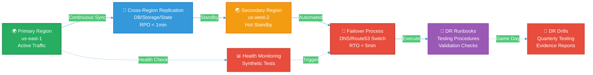
```mermaid
%%{init: {'theme':'base', 'themeVariables': { 'primaryColor':'#e74c3c','primaryTextColor':'#fff','primaryBorderColor':'#c0392b','lineColor':'#3498db','secondaryColor':'#50C878','tertiaryColor':'#f39c12'}}}%%
flowchart LR
  RegionA[🌍 Primary Region<br/>us-east-1<br/>Active Traffic] --> |Continuous Sync| Replication[🔄 Cross-Region Replication<br/>DB/Storage/State<br/>RPO < 1min]
  Replication --> |Standby| RegionB[🌏 Secondary Region<br/>us-west-2<br/>Hot Standby]
  RegionB --> |Automated| Failover[🚨 Failover Process<br/>DNS/Route53 Switch<br/>RTO < 5min]
  Failover --> |Execute| Runbooks[📖 DR Runbooks<br/>Testing Procedures<br/>Validation Checks]
  
  RegionA -.->|Health Check| Monitor[📊 Health Monitoring<br/>Synthetic Tests]
  Monitor -.->|Trigger| Failover
  Runbooks -.->|Game Day| Drills[🎯 DR Drills<br/>Quarterly Testing<br/>Evidence Reports]
  
  style RegionA fill:#27ae60,stroke:#229954,stroke-width:3px,color:#fff
  style Replication fill:#3498db,stroke:#2980b9,stroke-width:2px,color:#fff
  style RegionB fill:#f39c12,stroke:#e67e22,stroke-width:2px,color:#fff
  style Failover fill:#e74c3c,stroke:#c0392b,stroke-width:2px,color:#fff
  style Runbooks fill:#9b59b6,stroke:#8e44ad,stroke-width:2px,color:#fff
```

**Project 11: IoT Data Ingestion & Analytics**

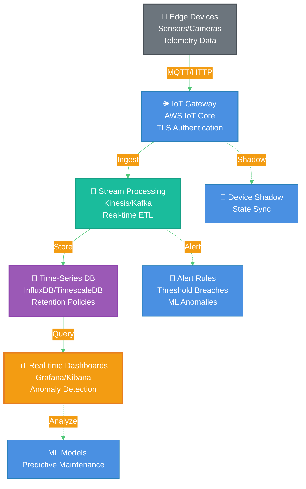
```mermaid
%%{init: {'theme':'base', 'themeVariables': { 'primaryColor':'#4a90e2','primaryTextColor':'#fff','primaryBorderColor':'#2980b9','lineColor':'#50C878','secondaryColor':'#f39c12','tertiaryColor':'#9b59b6'}}}%%
flowchart TD
  Devices[📱 Edge Devices<br/>Sensors/Cameras<br/>Telemetry Data] --> |MQTT/HTTP| Gateway[🌐 IoT Gateway<br/>AWS IoT Core<br/>TLS Authentication]
  Gateway --> |Ingest| Stream[🌊 Stream Processing<br/>Kinesis/Kafka<br/>Real-time ETL]
  Stream --> |Store| Storage[💾 Time-Series DB<br/>InfluxDB/TimescaleDB<br/>Retention Policies]
  Storage --> |Query| Dashboards[📊 Real-time Dashboards<br/>Grafana/Kibana<br/>Anomaly Detection]
  
  Stream -.->|Alert| Rules[🚨 Alert Rules<br/>Threshold Breaches<br/>ML Anomalies]
  Dashboards -.->|Analyze| ML[🤖 ML Models<br/>Predictive Maintenance]
  Gateway -.->|Shadow| Shadow[👥 Device Shadow<br/>State Sync]
  
  style Devices fill:#6c757d,stroke:#495057,stroke-width:2px,color:#fff
  style Gateway fill:#4a90e2,stroke:#2980b9,stroke-width:2px,color:#fff
  style Stream fill:#1abc9c,stroke:#16a085,stroke-width:2px,color:#fff
  style Storage fill:#9b59b6,stroke:#8e44ad,stroke-width:2px,color:#fff
  style Dashboards fill:#f39c12,stroke:#e67e22,stroke-width:3px,color:#fff
```

**Project 12: Quantum Computing Integration**

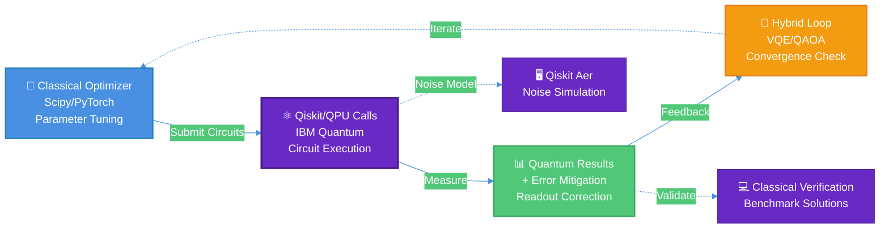
```mermaid
%%{init: {'theme':'base', 'themeVariables': { 'primaryColor':'#6929C4','primaryTextColor':'#fff','primaryBorderColor':'#4a1f8f','lineColor':'#4a90e2','secondaryColor':'#50C878','tertiaryColor':'#f39c12'}}}%%
flowchart LR
  Optimizer[🎯 Classical Optimizer<br/>Scipy/PyTorch<br/>Parameter Tuning] --> |Submit Circuits| QPU[⚛️ Qiskit/QPU Calls<br/>IBM Quantum<br/>Circuit Execution]
  QPU --> |Measure| Results[📊 Quantum Results<br/>+ Error Mitigation<br/>Readout Correction]
  Results --> |Feedback| Loop[🔄 Hybrid Loop<br/>VQE/QAOA<br/>Convergence Check]
  
  Loop -.->|Iterate| Optimizer
  Results -.->|Validate| Classical[💻 Classical Verification<br/>Benchmark Solutions]
  QPU -.->|Noise Model| Simulator[🖥️ Qiskit Aer<br/>Noise Simulation]
  
  style Optimizer fill:#4a90e2,stroke:#2980b9,stroke-width:2px,color:#fff
  style QPU fill:#6929C4,stroke:#4a1f8f,stroke-width:3px,color:#fff
  style Results fill:#50C878,stroke:#3aa65d,stroke-width:2px,color:#fff
  style Loop fill:#f39c12,stroke:#e67e22,stroke-width:2px,color:#fff
```

**Project 13: Advanced Cybersecurity Platform**

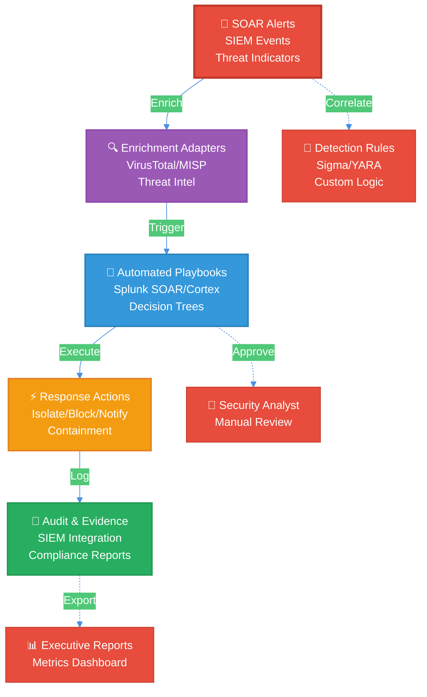
```mermaid
%%{init: {'theme':'base', 'themeVariables': { 'primaryColor':'#e74c3c','primaryTextColor':'#fff','primaryBorderColor':'#c0392b','lineColor':'#4a90e2','secondaryColor':'#50C878','tertiaryColor':'#f39c12'}}}%%
flowchart TD
  Alerts[🚨 SOAR Alerts<br/>SIEM Events<br/>Threat Indicators] --> |Enrich| Enrich[🔍 Enrichment Adapters<br/>VirusTotal/MISP<br/>Threat Intel]
  Enrich --> |Trigger| Playbooks[📖 Automated Playbooks<br/>Splunk SOAR/Cortex<br/>Decision Trees]
  Playbooks --> |Execute| Response[⚡ Response Actions<br/>Isolate/Block/Notify<br/>Containment]
  Response --> |Log| Audit[📝 Audit & Evidence<br/>SIEM Integration<br/>Compliance Reports]
  
  Alerts -.->|Correlate| Rules[🎯 Detection Rules<br/>Sigma/YARA<br/>Custom Logic]
  Playbooks -.->|Approve| Human[👤 Security Analyst<br/>Manual Review]
  Audit -.->|Export| Report[📊 Executive Reports<br/>Metrics Dashboard]
  
  style Alerts fill:#e74c3c,stroke:#c0392b,stroke-width:3px,color:#fff
  style Enrich fill:#9b59b6,stroke:#8e44ad,stroke-width:2px,color:#fff
  style Playbooks fill:#3498db,stroke:#2980b9,stroke-width:2px,color:#fff
  style Response fill:#f39c12,stroke:#e67e22,stroke-width:2px,color:#fff
  style Audit fill:#27ae60,stroke:#229954,stroke-width:2px,color:#fff
```

**Project 14: Edge AI Inference Platform**

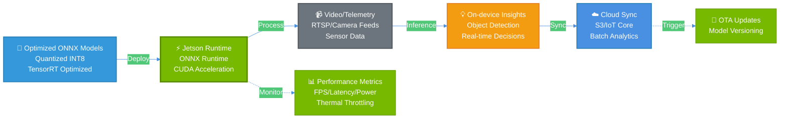
```mermaid
%%{init: {'theme':'base', 'themeVariables': { 'primaryColor':'#76B900','primaryTextColor':'#fff','primaryBorderColor':'#5a8c00','lineColor':'#4a90e2','secondaryColor':'#50C878','tertiaryColor':'#f39c12'}}}%%
flowchart LR
  Models[🤖 Optimized ONNX Models<br/>Quantized INT8<br/>TensorRT Optimized] --> |Deploy| Runtime[⚡ Jetson Runtime<br/>ONNX Runtime<br/>CUDA Acceleration]
  Runtime --> |Process| Stream[📹 Video/Telemetry<br/>RTSP/Camera Feeds<br/>Sensor Data]
  Stream --> |Inference| Insights[💡 On-device Insights<br/>Object Detection<br/>Real-time Decisions]
  Insights --> |Sync| CloudSync[☁️ Cloud Sync<br/>S3/IoT Core<br/>Batch Analytics]
  
  Runtime -.->|Monitor| Perf[📊 Performance Metrics<br/>FPS/Latency/Power<br/>Thermal Throttling]
  CloudSync -.->|Trigger| OTA[🔄 OTA Updates<br/>Model Versioning]
  
  style Models fill:#3498db,stroke:#2980b9,stroke-width:2px,color:#fff
  style Runtime fill:#76B900,stroke:#5a8c00,stroke-width:3px,color:#fff
  style Stream fill:#6c757d,stroke:#495057,stroke-width:2px,color:#fff
  style Insights fill:#f39c12,stroke:#e67e22,stroke-width:2px,color:#fff
  style CloudSync fill:#4a90e2,stroke:#2980b9,stroke-width:2px,color:#fff
```

**Project 16: Advanced Data Lake & Analytics**

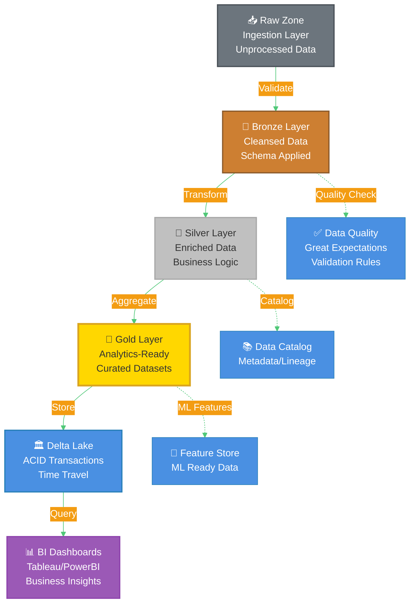
```mermaid
%%{init: {'theme':'base', 'themeVariables': { 'primaryColor':'#4a90e2','primaryTextColor':'#fff','primaryBorderColor':'#2980b9','lineColor':'#50C878','secondaryColor':'#f39c12','tertiaryColor':'#9b59b6'}}}%%
flowchart TD
  Raw[📥 Raw Zone<br/>Ingestion Layer<br/>Unprocessed Data] --> |Validate| Bronze[🥉 Bronze Layer<br/>Cleansed Data<br/>Schema Applied]
  Bronze --> |Transform| Silver[🥈 Silver Layer<br/>Enriched Data<br/>Business Logic]
  Silver --> |Aggregate| Gold[🥇 Gold Layer<br/>Analytics-Ready<br/>Curated Datasets]
  Gold --> |Store| Lakehouse[🏛️ Delta Lake<br/>ACID Transactions<br/>Time Travel]
  Lakehouse --> |Query| BI[📊 BI Dashboards<br/>Tableau/PowerBI<br/>Business Insights]
  
  Bronze -.->|Quality Check| DQ[✅ Data Quality<br/>Great Expectations<br/>Validation Rules]
  Silver -.->|Catalog| Catalog[📚 Data Catalog<br/>Metadata/Lineage]
  Gold -.->|ML Features| Features[🎯 Feature Store<br/>ML Ready Data]
  
  style Raw fill:#6c757d,stroke:#495057,stroke-width:2px,color:#fff
  style Bronze fill:#CD7F32,stroke:#8B5A2B,stroke-width:2px,color:#fff
  style Silver fill:#C0C0C0,stroke:#A8A8A8,stroke-width:2px,color:#333
  style Gold fill:#FFD700,stroke:#DAA520,stroke-width:3px,color:#333
  style Lakehouse fill:#4a90e2,stroke:#2980b9,stroke-width:2px,color:#fff
  style BI fill:#9b59b6,stroke:#8e44ad,stroke-width:2px,color:#fff
```

**Project 17: Multi-Cloud Service Mesh**

```mermaid
%%{init: {'theme':'base', 'themeVariables': { 'primaryColor':'#326CE5','primaryTextColor':'#fff','primaryBorderColor':'#2559c7','lineColor':'#4a90e2','secondaryColor':'#50C878','tertiaryColor':'#466BB0'}}}%%
flowchart LR
  ClusterA[☸️ K8s Cluster A<br/>AWS EKS<br/>Production Services] <-->|mTLS Encrypted| Mesh[🕸️ Istio Service Mesh<br/>Envoy Proxies<br/>Traffic Management]
  ClusterB[☸️ K8s Cluster B<br/>GCP GKE<br/>DR Services] <-->|mTLS Encrypted| Mesh
  Mesh --> |Apply| Policy[🛡️ Network Policies<br/>AuthZ/AuthN<br/>Rate Limiting]
  Mesh --> |Collect| Observability[📊 Tracing + Metrics<br/>Jaeger/Prometheus<br/>Service Graph]
  
  Mesh -.->|Gateway| Ingress[🌐 Istio Gateway<br/>External Traffic<br/>TLS Termination]
  Policy -.->|Enforce| Security[🔒 mTLS Certificates<br/>Automatic Rotation]
  Observability -.->|Visualize| Kiali[📈 Kiali Dashboard<br/>Topology View]
  
  style ClusterA fill:#326CE5,stroke:#2559c7,stroke-width:2px,color:#fff
  style ClusterB fill:#4285F4,stroke:#3367d6,stroke-width:2px,color:#fff
  style Mesh fill:#466BB0,stroke:#344d80,stroke-width:3px,color:#fff
  style Policy fill:#e74c3c,stroke:#c0392b,stroke-width:2px,color:#fff
  style Observability fill:#9b59b6,stroke:#8e44ad,stroke-width:2px,color:#fff
```

**Project 18: GPU-Accelerated Computing**

```mermaid
%%{init: {'theme':'base', 'themeVariables': { 'primaryColor':'#76B900','primaryTextColor':'#fff','primaryBorderColor':'#5a8c00','lineColor':'#4a90e2','secondaryColor':'#50C878','tertiaryColor':'#f39c12'}}}%%
flowchart TD
  Jobs[🎲 Monte Carlo Jobs<br/>Risk Simulations<br/>10M+ Samples] --> |Submit| Scheduler[📅 GPU Job Scheduler<br/>SLURM/K8s<br/>Resource Allocation]
  Scheduler --> |Execute| GPU[⚡ CUDA GPU Nodes<br/>NVIDIA A100/V100<br/>CuPy Kernels]
  GPU --> |Store| Results[💾 Results Store<br/>Distributed FS<br/>HDF5/Parquet]
  Results --> |Analyze| Reports[📊 Performance Reports<br/>Cost/Performance<br/>Optimization Insights]
  
  GPU -.->|Profile| Profiler[🔍 NVIDIA Profiler<br/>nsys/nvprof<br/>Kernel Analysis]
  Scheduler -.->|Monitor| Metrics[📈 Utilization Metrics<br/>GPU Memory/Compute<br/>Queue Depth]
  Results -.->|Compare| Baseline[📉 CPU Baseline<br/>Speedup Factor]
  
  style Jobs fill:#6c757d,stroke:#495057,stroke-width:2px,color:#fff
  style Scheduler fill:#4a90e2,stroke:#2980b9,stroke-width:2px,color:#fff
  style GPU fill:#76B900,stroke:#5a8c00,stroke-width:3px,color:#fff
  style Results fill:#3498db,stroke:#2980b9,stroke-width:2px,color:#fff
  style Reports fill:#f39c12,stroke:#e67e22,stroke-width:2px,color:#fff
```

**Project 19: Advanced Kubernetes Operators**

```mermaid
%%{init: {'theme':'base', 'themeVariables': { 'primaryColor':'#326CE5','primaryTextColor':'#fff','primaryBorderColor':'#2559c7','lineColor':'#4a90e2','secondaryColor':'#50C878','tertiaryColor':'#f39c12'}}}%%
flowchart LR
  Events[⚡ K8s Events<br/>Resource Changes<br/>API Server Watch] --> |Trigger| Operator[🤖 Kopf Operator<br/>Python Framework<br/>Event Handlers]
  Operator --> |Execute| Recon[🔄 Reconciliation Logic<br/>Desired vs Actual<br/>Healing Actions]
  Recon --> |Manage| CRDs[📋 Lifecycle CRDs<br/>Custom Resources<br/>Portfolio Stack]
  Recon --> |Report| Evidence[📊 Status/Telemetry<br/>Conditions/Events<br/>Metrics Export]
  
  Operator -.->|Validate| Admission[✅ Admission Webhook<br/>Resource Validation]
  CRDs -.->|Status| Conditions[🏷️ Status Conditions<br/>Ready/Degraded/Failed]
  Evidence -.->|Alert| Prometheus[📈 Prometheus Metrics<br/>Operator Health]
  
  style Events fill:#6c757d,stroke:#495057,stroke-width:2px,color:#fff
  style Operator fill:#326CE5,stroke:#2559c7,stroke-width:3px,color:#fff
  style Recon fill:#9b59b6,stroke:#8e44ad,stroke-width:2px,color:#fff
  style CRDs fill:#50C878,stroke:#3aa65d,stroke-width:2px,color:#fff
  style Evidence fill:#3498db,stroke:#2980b9,stroke-width:2px,color:#fff
```

**Project 20: Blockchain Oracle Service**

```mermaid
%%{init: {'theme':'base', 'themeVariables': { 'primaryColor':'#375BD2','primaryTextColor':'#fff','primaryBorderColor':'#2a4aa8','lineColor':'#4a90e2','secondaryColor':'#50C878','tertiaryColor':'#627EEA'}}}%%
flowchart TD
  Sources[🌐 External Metrics<br/>APIs/Sensors<br/>Market Data] --> |Fetch| Adapter[🔌 Chainlink Adapter<br/>External Initiator<br/>Data Bridge]
  Adapter --> |Submit| Oracle[🔮 Oracle Node<br/>Chainlink Core<br/>Job Spec Runner]
  Oracle --> |Invoke| Consumer[📜 Consumer Contracts<br/>Solidity Smart Contracts<br/>Data Requests]
  Consumer --> |Generate| Proofs[✅ On-chain Proofs<br/>Cryptographic Signatures<br/>Audit Trail]
  
  Oracle -.->|Aggregate| MultiNode[🔗 Multi-Node Consensus<br/>Decentralized Oracle<br/>Median Calculation]
  Consumer -.->|Event| Listener[👂 Event Listener<br/>RequestCreated<br/>Fulfillment Tracking]
  Proofs -.->|Verify| Blockchain[⛓️ Ethereum/Polygon<br/>Transaction Logs]
  
  style Sources fill:#6c757d,stroke:#495057,stroke-width:2px,color:#fff
  style Adapter fill:#4a90e2,stroke:#2980b9,stroke-width:2px,color:#fff
  style Oracle fill:#375BD2,stroke:#2a4aa8,stroke-width:3px,color:#fff
  style Consumer fill:#627EEA,stroke:#4a5fb8,stroke-width:2px,color:#fff
  style Proofs fill:#50C878,stroke:#3aa65d,stroke-width:2px,color:#fff
```

**Project 21: Quantum-Safe Cryptography**

```mermaid
%%{init: {'theme':'base', 'themeVariables': { 'primaryColor':'#6929C4','primaryTextColor':'#fff','primaryBorderColor':'#4a1f8f','lineColor':'#4a90e2','secondaryColor':'#50C878','tertiaryColor':'#f39c12'}}}%%
flowchart LR
  Client[👤 Client Application<br/>TLS 1.3 Support<br/>Post-Quantum Ready] --> |Initiate| Hybrid[🔐 Hybrid Key Exchange<br/>Kyber-768 + ECDH<br/>Dual Protection]
  Hybrid --> |Establish| Handshake[🤝 Hybrid Handshake<br/>PQ + Classical<br/>Forward Secrecy]
  Handshake --> |Derive| Session[🔑 Secure Session Keys<br/>AES-256-GCM<br/>Quantum-Resistant]
  
  Hybrid -.->|Fallback| Classical[🔙 Classical Only<br/>Backward Compatible<br/>ECDH P-256]
  Session -.->|Test| Interop[✅ Interoperability<br/>Cross-Platform Tests<br/>Compatibility Matrix]
  Handshake -.->|Benchmark| Perf[📊 Performance<br/>Handshake Latency<br/>vs Classical]
  
  style Client fill:#6c757d,stroke:#495057,stroke-width:2px,color:#fff
  style Hybrid fill:#6929C4,stroke:#4a1f8f,stroke-width:3px,color:#fff
  style Handshake fill:#9b59b6,stroke:#8e44ad,stroke-width:2px,color:#fff
  style Session fill:#50C878,stroke:#3aa65d,stroke-width:2px,color:#fff
```

**Project 22: Autonomous DevOps Platform**

```mermaid
%%{init: {'theme':'base', 'themeVariables': { 'primaryColor':'#4a90e2','primaryTextColor':'#fff','primaryBorderColor':'#2980b9','lineColor':'#50C878','secondaryColor':'#f39c12','tertiaryColor':'#9b59b6'}}}%%
flowchart TD
  Alerts[🚨 Ops Signals<br/>Monitoring Alerts<br/>Incident Detection] --> |Publish| Events[📨 Event Bus<br/>Kafka/NATS<br/>Event Routing]
  Events --> |Trigger| Runbooks[📖 Runbooks-as-Code<br/>YAML/Python DSL<br/>Versioned Procedures]
  Runbooks --> |Execute| Automation[🤖 Automated Remediation<br/>Ansible/Terraform<br/>Self-Healing]
  Automation --> |Check| Approvals[✅ Policy/Approval Gates<br/>Risk Assessment<br/>Human-in-Loop]
  
  Approvals -.->|Reject| Manual[👤 Manual Intervention<br/>On-Call Review]
  Approvals -.->|Approve| Execute[⚡ Execute Action<br/>Automated Fix]
  Automation -.->|Audit| Trail[📝 Audit Trail<br/>Action Log<br/>Compliance]
  
  style Alerts fill:#e74c3c,stroke:#c0392b,stroke-width:2px,color:#fff
  style Events fill:#3498db,stroke:#2980b9,stroke-width:2px,color:#fff
  style Runbooks fill:#9b59b6,stroke:#8e44ad,stroke-width:2px,color:#fff
  style Automation fill:#50C878,stroke:#3aa65d,stroke-width:3px,color:#fff
  style Approvals fill:#f39c12,stroke:#e67e22,stroke-width:2px,color:#fff
```

**Project 24: Portfolio Report Generator**

```mermaid
%%{init: {'theme':'base', 'themeVariables': { 'primaryColor':'#4a90e2','primaryTextColor':'#fff','primaryBorderColor':'#2980b9','lineColor':'#50C878','secondaryColor':'#f39c12','tertiaryColor':'#9b59b6'}}}%%
flowchart LR
  Templates[📄 Jinja2 Templates<br/>Resume/Reports<br/>Parameterized] --> |Render| CLI[⚙️ Report CLI<br/>Python Click<br/>Config-Driven]
  CLI --> |Automate| CI[🔄 CI Batch Publishing<br/>GitHub Actions<br/>Scheduled Runs]
  CI --> |Generate| Artifacts[📦 Output Artifacts<br/>PDF/DOCX/XLSX<br/>Multi-Format]
  Artifacts --> |Package| Recruiters[🎁 Recruiter Packages<br/>Evidence Bundles<br/>Portfolio Exports]
  
  Templates -.->|Data Source| Data[📊 Portfolio Data<br/>JSON/YAML<br/>Metrics/Stats]
  CI -.->|Upload| Storage[☁️ S3/GitHub Releases<br/>Versioned Artifacts]
  Artifacts -.->|Preview| HTML[🌐 HTML Preview<br/>Interactive Reports]
  
  style Templates fill:#6c757d,stroke:#495057,stroke-width:2px,color:#fff
  style CLI fill:#4a90e2,stroke:#2980b9,stroke-width:2px,color:#fff
  style CI fill:#2088FF,stroke:#0969da,stroke-width:2px,color:#fff
  style Artifacts fill:#50C878,stroke:#3aa65d,stroke-width:2px,color:#fff
  style Recruiters fill:#9b59b6,stroke:#8e44ad,stroke-width:3px,color:#fff
```

</details>

---
## 🛠️ Core Skills
- **Systems & Infra:** Linux/Windows, networking, VLANs, VPN, UniFi, NAS, Active Directory
- **Virtualization/Services:** Proxmox/TrueNAS, reverse proxy + TLS, RBAC/MFA, backup/restore drills
- **Automation & Scripting:** PowerShell, Bash, SQL (catalog ops, reporting), Git
- **Web & Data:** WordPress, e-commerce/booking systems, schema design, large-catalog data ops
- **Observability & Reliability:** Prometheus, Grafana, Loki, Alertmanager, golden signals, SLOs, PBS
- **Cloud & Tools:** AWS/Azure (baseline), GitHub, Docs/Sheets, Visio/diagramming
- **Quality & Process:** runbooks, acceptance criteria, regression checklists, change control

---
## 🟢 Completed Projects (📝 Documentation in Progress)

### Homelab & Secure Network Build
**Status:** 🟢 Complete · 📝 Docs pending  
**Description:** Designed and wired a home network from scratch: rack-mounted gear, VLAN segmentation, and secure Wi-Fi for isolated IoT, guest, and trusted networks.  
*Documentation:* [Portfolio-Project › Homelab & Secure Network Build](https://github.com/samueljackson-collab/Portfolio-Project/tree/main/homelab-secure-network-build)

**Architecture (logical)**

```mermaid
%%{init: {'theme':'base', 'themeVariables': { 'primaryColor':'#0559C9','primaryTextColor':'#fff','primaryBorderColor':'#003d8f','lineColor':'#4a90e2','secondaryColor':'#50C878','tertiaryColor':'#f39c12'}}}%%
flowchart LR
  Internet[🌐 Internet<br/>WAN Connection<br/>Fiber/Cable] --> |Incoming| UDM[🛡️ UniFi Dream Machine<br/>Router/Firewall<br/>DPI/IDS]
  UDM --> |Switched| SW[🔀 UniFi Switch<br/>24-Port PoE<br/>VLAN Trunking]
  SW --> |Wireless| AP1[📡 UniFi AP 1<br/>WiFi 6<br/>Trusted VLAN]
  SW --> |Wireless| AP2[📡 UniFi AP 2<br/>WiFi 6<br/>Guest/IoT VLANs]
  SW --> |Wired| NAS[💾 TrueNAS<br/>Storage Pool<br/>SMB/NFS Shares]
  UDM --> |Encrypted| Admin[👨‍💻 Remote Admin<br/>WireGuard VPN<br/>Secure Access]
  
  UDM -.->|Firewall Rules| Segmentation[🔒 VLAN Segmentation<br/>IoT/Guest/Trusted<br/>Inter-VLAN Policies]
  SW -.->|Monitor| Controller[📊 UniFi Controller<br/>Network Analytics]
  
  style Internet fill:#6c757d,stroke:#495057,stroke-width:2px,color:#fff
  style UDM fill:#0559C9,stroke:#003d8f,stroke-width:3px,color:#fff
  style SW fill:#0559C9,stroke:#003d8f,stroke-width:2px,color:#fff
  style AP1 fill:#0559C9,stroke:#003d8f,stroke-width:2px,color:#fff
  style AP2 fill:#0559C9,stroke:#003d8f,stroke-width:2px,color:#fff
  style NAS fill:#3498db,stroke:#2980b9,stroke-width:2px,color:#fff
  style Admin fill:#50C878,stroke:#3aa65d,stroke-width:2px,color:#fff
```

### Virtualization & Core Services
**Status:** 🟢 Complete · 📝 Docs pending
**Description** Proxmox/TrueNAS host running Wiki.js, Home Assistant, and Immich behind a reverse proxy with TLS.
*Documentation:* [Portfolio-Project › Virtualization & Core Services](https://github.com/samueljackson-collab/Portfolio-Project/tree/main/virtualization-core-services)

### Observability & Backups Stack
**Status:** 🟢 Complete · 📝 Docs pending  
**Description:** Monitoring/alerting stack using Prometheus, Grafana, Loki, and Alertmanager, integrated with Proxmox Backup Server.  
*Documentation:* [Portfolio-Project › Observability & Backups Stack](https://github.com/samueljackson-collab/Portfolio-Project/tree/main/observability-backups-stack)

---
## 🔄 Past Projects Requiring Recovery

Older commercial efforts live in cold storage while I recreate code, processes, and documentation that were lost when a retired workstation took the original knowledge base with it. Fresh assets will be published as they’re rebuilt.

### Commercial E-commerce & Booking Systems (Rebuild in Progress)
**Status:** 🔄 Recovery in progress  
**Description:** Previously built and managed: resort booking site; high-SKU flooring store; tours site with complex variations. Code and process docs are being rebuilt for publication.  
*Documentation:* [Portfolio-Project › Commercial E-commerce & Booking Systems](https://github.com/samueljackson-collab/Portfolio-Project/tree/main/commercial-ecommerce-booking-systems)

> **Recovery plan & timeline:** Catalog and restore SQL workflows and automation scripts (Week 1), re-document content management processes and deployment steps (Week 2), publish refreshed artifacts (Week 3+).

---
## 🟠 In-Progress Projects (Milestones)
- **Database Infrastructure Module (Terraform RDS)** · ✅ Module complete, expanding to full-stack
- **Resume Set (SDE/Cloud/QA/Net/Cyber)** · 📝 Structure created, content in progress

### 🔵 Planned Infrastructure Projects
- **GitOps Platform with IaC (Terraform + ArgoCD)** · *Roadmap defined*
- **AWS Landing Zone (Organizations + SSO)** · *Research phase*
- **Active Directory Design & Automation (DSC/Ansible)** · *Planning phase*

---
## 🔵 Planned Projects (Roadmaps)

### Cybersecurity Projects
- **SIEM Pipeline**: Sysmon → Ingest → Detections → Dashboards · *Blue team defense*
- **Adversary Emulation**: Validate detections via safe ATT&CK TTP emulation · *Purple team testing*
- **Incident Response Playbook**: Clear IR guidance for ransomware · *Operations readiness*

### QA & Testing Projects
- **Web App Login Test Plan**: Functional, security, and performance test design · *Test strategy*
- **Selenium + PyTest CI**: Automate UI sanity runs in GitHub Actions · *Test automation*

### Infrastructure Expansion
- **Multi-OS Lab**: Kali, Slacko Puppy, Ubuntu lab for comparative analysis · *Homelab expansion*

### Automation & Tooling
- **Document Packaging Pipeline**: One-click generation of Docs/PDFs/XLSX from prompts · *Documentation automation*

### Process Documentation
- **IT Playbook (E2E Lifecycle)**: Unifying playbook from intake to operations · *Operational excellence*
- **Engineer's Handbook (Standards/QA Gates)**: Practical standards and quality bars · *Quality framework*

---
## 🛡️ Delivery Pipeline (snapshot)

```mermaid
%%{init: {'theme':'base', 'themeVariables': { 'primaryColor':'#4a90e2','primaryTextColor':'#fff','primaryBorderColor':'#2980b9','lineColor':'#50C878','secondaryColor':'#f39c12','tertiaryColor':'#9b59b6'}}}%%
flowchart TD
  Intake[📋 Business Intake<br/>Requirements Gathering<br/>Stakeholder Alignment]
  Plan[🎯 Architecture & QA Gates<br/>Design Reviews<br/>Acceptance Criteria]
  IaC[🏗️ Infrastructure-as-Code<br/>Terraform/Pulumi<br/>Immutable Infrastructure]
  CI[🔄 CI Pipeline<br/>Lint/Test/SBOM<br/>Security Scanning]
  CD[🚀 CD: Progressive Delivery<br/>Canary/Blue-Green<br/>Automated Rollbacks]
  Obs[📊 Observability<br/>Metrics/Logs/Traces<br/>SLO Monitoring]
  Docs[📖 Runbooks & Evidence<br/>Documentation<br/>Post-Mortems]

  Intake --> Plan
  Plan --> IaC
  IaC --> CI
  CI --> CD
  CD --> Obs
  Obs --> Docs
  Docs -.->|Continuous Improvement| Plan
  
  CI -.->|Gate Failed| Fix[🔧 Fix Issues]
  Fix -.-> IaC
  CD -.->|Deploy Failed| Rollback[⏮️ Automatic Rollback]
  Rollback -.-> Obs
  
  style Intake fill:#6c757d,stroke:#495057,stroke-width:2px,color:#fff
  style Plan fill:#3498db,stroke:#2980b9,stroke-width:2px,color:#fff
  style IaC fill:#9b59b6,stroke:#8e44ad,stroke-width:2px,color:#fff
  style CI fill:#f39c12,stroke:#e67e22,stroke-width:2px,color:#fff
  style CD fill:#50C878,stroke:#3aa65d,stroke-width:2px,color:#fff
  style Obs fill:#e74c3c,stroke:#c0392b,stroke-width:2px,color:#fff
  style Docs fill:#1abc9c,stroke:#16a085,stroke-width:2px,color:#fff
```

---
## 💼 Experience
**Desktop Support Technician — 3DM (Redmond, WA) · Feb 2024–Present**  
**Freelance IT & Web Manager — Self-employed · 2015–2022**  
**Web Designer, Content & SEO — IPM Corp. (Cambodia) · 2013–2014**

---
## 🎓 Education & Certifications
**B.S., Information Systems** — Colorado State University (2016–2024)  

---
## 🤳 Connect
[GitHub](https://github.com/samueljackson-collab) · [LinkedIn](https://www.linkedin.com/in/sams-jackson)  
[](https://github.com/samueljackson-collab)

---
## 🧠 README Governance + 2026 Progress Refresh (Merged, Expanded, No Content Removed)

This merged addendum combines the **README standardization governance** content with the **2026 progress refresh** into one additive section. It preserves legacy structure, iconography, color coding, diagrams, and project context while improving readability and reducing duplicated headings.

### What this merged section improves

| Area | Improvement | Why it helps |
|---|---|---|
| README quality standard | Adds explicit minimum structure/checklist for all project READMEs | Keeps documentation depth consistent across repos |
| Status traceability | Adds status governance plus current delivery snapshot and milestones | Prevents drift between implementation and docs |
| Diagram quality | Keeps color-styled Mermaid diagrams and adds rendering guidance | Reduces broken diagram issues in GitHub markdown viewers |
| Project management signal | Defines transitions, quality gates, and active track health | Makes progression criteria and priorities explicit |

### Current Portfolio Delivery Snapshot (2026)

| Metric | Count | Notes |
|---|---:|---|
| Total numbered projects | 43 | Portfolio-wide roadmap baseline expanded with newly tracked workstreams |
| 🟢 Done | 8 | Delivery complete with active maintenance/evidence hardening plus recently documented completed tracks |
| 🟠 In Progress | 9 | Active build tracks including recovery and publication workstreams |
| 🔵 Planned | 26 | Sequenced backlog tracks queued for implementation across infrastructure, security, QA, and process domains |
| 🔄 Recovery/Rebuild | Contextual | Legacy commercial rebuild stream retained in this README |

### Status Transition Rules (Portfolio Governance)

| From | To | Required evidence before change |
|---|---|---|
| 🔵 Planned | 🟠 In Progress | Initial architecture note + backlog issue breakdown + scaffold commit |
| 🟠 In Progress | 🟢 Done | Test evidence, runbook/update notes, and linkable artifacts |
| 🟢 Done | 🔄 Recovery/Rebuild | Incident/root-cause summary and rebuild plan |
| Any | 📝 Documentation Pending | Working implementation exists; docs queued with ETA |

### In-Progress Projects — Immediate Next Milestones

| Project | Status | Current Focus | Next Milestone |
|---|---|---|---|
| Project 6: Machine Learning Pipeline | 🟠 In Progress | Experiment tracking + promotion readiness | Integrate promotion gates into CI |
| Project 7: Serverless Data Processing | 🟠 In Progress | Lambda/Step Functions orchestration hardening | Add failure-path validation tests |
| Project 8: Advanced AI Chatbot | 🟠 In Progress | RAG + tool execution quality | Add retrieval eval + telemetry scorecard |
| Project 10: Blockchain Smart Contract Platform | 🟠 In Progress | Contract hardening + deployment automation | Expand audit automation + release workflow |
| Project 15: Real-time Collaborative Platform | 🟠 In Progress | CRDT/OT conflict handling | Complete latency + reconciliation test suite |
| Project 25: Portfolio Website & Documentation Hub | 🟠 In Progress | Docs hub structure and publishing | Auto-publish status cards/reports |

### Additional Table: Current Active Track Health

| Track | Status | Momentum | Immediate next checkpoint |
|---|---|---|---|
| ElderPhoto frontend and UX | 🟠 In Progress | High | Complete accessibility + upload workflow validation |
| ElderPhoto backend backup/sync | 🟠 In Progress | Medium-High | Add broader reliability and failure-path verification |
| Project 6: ML pipeline | 🟠 In Progress | Medium | Finalize promotion gates and experiment traceability |
| Project 25: Portfolio docs hub | 🟠 In Progress | High | Automate publishing and status card generation |
| Project 23: Observability | 🟢 Done | Stable | Keep dashboards and alerts current with future projects |

### Recently Reflected Build Context (Expanded)

| Workstream | Source Location | Why it matters |
|---|---|---|
| ElderPhoto frontend progress | [`frontend/src/pages/Photos/PhotosPage.tsx`](./frontend/src/pages/Photos/PhotosPage.tsx) and related components | Demonstrates active product UX implementation in this repo |
| ElderPhoto backup capabilities | [`backend/app/routers/backup.py`](./backend/app/routers/backup.py), [`backend/scripts/backup_sync.py`](./backend/scripts/backup_sync.py) | Shows backend reliability and operational tooling work |
| Accessibility and contrast updates | [`ELDERPHOTO_README.md`](./ELDERPHOTO_README.md), [`IMPLEMENTATION_SUMMARY.md`](./IMPLEMENTATION_SUMMARY.md) | Provides inclusive UX evidence and implementation notes |

### README Quality Gate (Template to reuse per project)

| Section | Minimum requirement | Preferred visualization |
|---|---|---|
| Overview | Problem statement, users, outcomes | Context flowchart |
| Architecture | Components, interfaces, dependencies | System diagram + state/sequence view |
| Runbook | Setup, execute, validate, recover | Command/result table |
| Security & risk | Threats, controls, boundaries | Risk matrix |
| Testing | Unit/integration/e2e strategy + current evidence | Test coverage/status table |
| Roadmap | Current milestone and next 2 phases | Gantt or phase table |
| FAQ/Troubleshooting | Top failure modes and resolution paths | Decision table |

### README Template Reuse Checklist (For Other Repositories)

| Checklist Item | Minimum Bar | Recommended Bar |
|---|---|---|
| Status legend | Include icon-coded legend | Include legend + totals table + monthly snapshot |
| Repository context | Include repo purpose and scope | Include cross-repo map with evidence links |
| Project board | Include status table | Include status table + milestone/next-action columns |
| Architecture diagrams | At least 1 mermaid diagram | 3+ diagrams (system, lifecycle, delivery pipeline) |
| Evidence links | Link one proof artifact per project | Link runbook, tests, CI evidence, and screenshots |
| Troubleshooting | Include top 3 issues | Include failure matrix + recovery playbook |

### Documentation Freshness SLA

| Cadence | Action | Owner |
|---|---|---|
| Per major merge | Update project status + milestone notes in README | Project owner |
| Weekly | Validate links + status board alignment | Repo maintainer |
| Monthly | README quality audit against template gate | Portfolio owner |

### Diagram Reliability Checklist

1. Keep Mermaid node labels concise (< 80 chars preferred).
2. Use consistent `flowchart LR/TD` direction by section purpose.
3. Avoid nested markdown/HTML inside Mermaid labels when possible.
4. Keep style definitions grouped at bottom of each diagram block.
5. Test rendering directly in GitHub markdown preview before merge.

### Diagram Rendering Safety Notes

- Use GitHub markdown preview to validate Mermaid rendering before merge.
- Keep labels compact and avoid over-nested HTML when possible.
- Preserve color-coded node styles to maintain visual consistency across diagrams.
- Prefer deterministic flow names and stable section anchors to avoid broken TOC links.

### Portfolio Status Flow (Expanded Visualization)

```mermaid
flowchart TD
  A[📥 Project Backlog Entry] --> B[🧭 Architecture + Scope Definition]
  B --> C[🛠️ Implementation Sprint]
  C --> D[✅ Validation + Evidence Capture]
  D --> E[📚 README + Portfolio Update]
  E --> F{Status Decision}
  F -->|All gates met| G[🟢 Done]
  F -->|More work needed| H[🟠 In Progress]
  F -->|Future sequencing| I[🔵 Planned]
  G --> J[🔁 Maintenance / Iteration]
  H --> C
  I --> B

  style A fill:#6c757d,stroke:#495057,stroke-width:2px,color:#fff
  style B fill:#3498db,stroke:#2980b9,stroke-width:2px,color:#fff
  style C fill:#f39c12,stroke:#e67e22,stroke-width:2px,color:#fff
  style D fill:#50C878,stroke:#3aa65d,stroke-width:2px,color:#fff
  style E fill:#9b59b6,stroke:#8e44ad,stroke-width:2px,color:#fff
  style F fill:#1abc9c,stroke:#16a085,stroke-width:2px,color:#fff
  style G fill:#27ae60,stroke:#229954,stroke-width:3px,color:#fff
  style H fill:#f39c12,stroke:#e67e22,stroke-width:3px,color:#fff
  style I fill:#3498db,stroke:#2980b9,stroke-width:3px,color:#fff
  style J fill:#6c757d,stroke:#495057,stroke-width:2px,color:#fff
```

### Additional Visualization: Portfolio Delivery Control Loop

```mermaid
flowchart TD
  A[Project Work Completed] --> B[Evidence Pack Updated]
  B --> C[README Status + Tables Refreshed]
  C --> D[Diagram and Link Validation]
  D --> E[Publish/Share Snapshot]
  E --> F[Feedback from Reviewers]
  F --> G[Roadmap Reprioritization]
  G --> A

  style A fill:#4a90e2,stroke:#333,stroke-width:2px,color:#fff
  style B fill:#50C878,stroke:#333,stroke-width:2px,color:#fff
  style C fill:#f39c12,stroke:#333,stroke-width:2px,color:#fff
  style D fill:#9b59b6,stroke:#333,stroke-width:2px,color:#fff
  style E fill:#3498db,stroke:#333,stroke-width:2px,color:#fff
  style F fill:#e74c3c,stroke:#333,stroke-width:2px,color:#fff
  style G fill:#1abc9c,stroke:#333,stroke-width:2px,color:#fff
```

### Documentation Integrity Commitment

This merged refresh intentionally **extends** the original README without deleting sections, preserving all prior context, diagrams, links, iconography, and color-coded status conventions while improving clarity, governance, and portfolio progress visibility.


---
## 📊 Portfolio-Wide Current Progress Snapshot (All Projects)

This section adds a single at-a-glance tracker for **all 43 projects** with a normalized progress band and immediate action focus. It is additive and preserves all previously documented sections.

| # | Project | Status | Progress Band | Current Focus | Next Checkpoint |
|---|---|---|---|---|---|
| 1 | AWS Infrastructure Automation | 🟢 Done | 100% | Evidence hardening | Publish final runbook index + release tag |
| 2 | Database Migration Platform | 🟢 Done | 100% | Stabilization complete | Add migration playbook examples |
| 3 | Kubernetes CI/CD Pipeline | 🟢 Done | 100% | Production-pattern validation | Expand rollback game-day report |
| 4 | DevSecOps Pipeline | 🟢 Done | 100% | Security controls complete | Add compliance mapping appendix |
| 5 | Real-time Data Streaming | 🔵 Planned | 0-25% | P0 foundation planning | Producer/consumer harness baseline |
| 6 | Machine Learning Pipeline | 🟠 In Progress | 60-85% | Phase 2 expansion | Experiment registry + promotion gates |
| 7 | Serverless Data Processing | 🟠 In Progress | 60-85% | IaC + orchestration build | Failure-path unit tests + validation harness |
| 8 | Advanced AI Chatbot | 🟠 In Progress | 60-85% | RAG/tooling integration | Retrieval eval suite + telemetry wiring |
| 9 | Multi-Region Disaster Recovery | 🔵 Planned | 0-25% | RPO/RTO definition | Replication validation automation |
| 10 | Blockchain Smart Contract Platform | 🟠 In Progress | 60-85% | Contract + CI hardening | Audit scripts + release automation |
| 11 | IoT Data Ingestion & Analytics | 🔵 Planned | 0-25% | Simulator architecture | Gateway + ingestion baseline |
| 12 | Quantum Computing Integration | 🔵 Planned | 0-25% | Optimization target design | Hybrid classical/quantum loop prototype |
| 13 | Advanced Cybersecurity Platform | 🔵 Planned | 0-25% | SOAR pipeline design | Enrichment adapters + response playbooks |
| 14 | Edge AI Inference Platform | 🔵 Planned | 0-25% | Edge runtime planning | ONNX service baseline on Jetson-class profile |
| 15 | Real-time Collaborative Platform | 🟠 In Progress | 60-85% | Conflict handling build | CRDT/OT resolution and latency testing |
| 16 | Advanced Data Lake & Analytics | 🔵 Planned | 0-25% | Medallion architecture planning | Bronze/Silver/Gold transformation skeleton |
| 17 | Multi-Cloud Service Mesh | 🔵 Planned | 0-25% | Multi-cluster design | Istio mTLS + policy baseline |
| 18 | GPU-Accelerated Computing | 🔵 Planned | 0-25% | Runner and scheduler planning | GPU job orchestration proof-of-concept |
| 19 | Advanced Kubernetes Operators | 🔵 Planned | 0-25% | CRD + reconciliation design | Operator lifecycle automation v1 |
| 20 | Blockchain Oracle Service | 🔵 Planned | 0-25% | Adapter design | Chainlink adapter + consumer contract tests |
| 21 | Quantum-Safe Cryptography | 🔵 Planned | 0-25% | Handshake architecture | Kyber + ECDH interoperability harness |
| 22 | Autonomous DevOps Platform | 🔵 Planned | 0-25% | Event taxonomy design | Runbooks-as-code automation MVP |
| 23 | Advanced Monitoring & Observability | 🟢 Done | 100% | Monitoring baseline operational | Dashboard pack + alert verification report |
| 24 | Portfolio Report Generator | 🔵 Planned | 0-25% | Template/CLI design | Batch report publishing pipeline |
| 25 | Portfolio Website & Documentation Hub | 🟠 In Progress | 60-85% | Docs platform refinement | Automated publishing + status cards |
| 26 | Homelab & Secure Network Build | 🟢 Done | 100% | Implementation complete (docs pending) | Publish full topology and operations runbook |
| 27 | Virtualization & Core Services | 🟢 Done | 100% | Platform operational (docs pending) | Publish deployment architecture and service runbooks |
| 28 | Observability & Backups Stack | 🟢 Done | 100% | Monitoring + backup stack operational | Publish validation evidence and restore drills |
| 29 | Commercial E-commerce & Booking Systems Recovery | 🟠 In Progress | 60-85% | Artifact recovery and publication rebuild | Restore SQL/process docs and republish core assets |
| 30 | Database Infrastructure Module (Terraform RDS) | 🟠 In Progress | 60-85% | Module baseline complete, stack expansion active | Integrate module into full-stack deployment pipeline |
| 31 | Resume Set (SDE/Cloud/QA/Net/Cyber) | 🟠 In Progress | 60-85% | Portfolio-aligned resume content drafting | Finalize role packs and publishing automation |
| 32 | GitOps Platform with IaC (Terraform + ArgoCD) | 🔵 Planned | 0-25% | Roadmap defined | Build platform bootstrap and environment promotion flow |
| 33 | AWS Landing Zone (Organizations + SSO) | 🔵 Planned | 0-25% | Research phase | Deliver baseline account architecture and identity guardrails |
| 34 | Active Directory Design & Automation (DSC/Ansible) | 🔵 Planned | 0-25% | Planning phase | Publish AD topology templates and automation baseline |
| 35 | SIEM Pipeline | 🔵 Planned | 0-25% | Detection architecture planning | Implement ingest-to-detection baseline with dashboards |
| 36 | Adversary Emulation | 🔵 Planned | 0-25% | ATT&CK scenario planning | Build safe emulation scenarios tied to detection controls |
| 37 | Incident Response Playbook | 🔵 Planned | 0-25% | Operational readiness planning | Publish ransomware-focused IR playbook v1 |
| 38 | Web App Login Test Plan | 🔵 Planned | 0-25% | Test strategy definition | Produce executable test matrix and acceptance criteria |
| 39 | Selenium + PyTest CI | 🔵 Planned | 0-25% | Automation framework planning | Ship CI-integrated UI sanity suite |
| 40 | Multi-OS Lab | 🔵 Planned | 0-25% | Homelab expansion design | Stand up comparative environment and baseline checks |
| 41 | Document Packaging Pipeline | 🔵 Planned | 0-25% | Documentation automation design | Build one-click Docs/PDF/XLSX packaging workflow |
| 42 | IT Playbook (E2E Lifecycle) | 🔵 Planned | 0-25% | Process framework design | Publish intake-to-operations playbook draft |
| 43 | Engineer's Handbook (Standards/QA Gates) | 🔵 Planned | 0-25% | Standards framework planning | Publish engineering standards and QA gate definitions |

### Progress Band Legend (Normalization)

- **100%** = Core implementation complete; only maintenance/documentation optimization remains.
- **60–85%** = Active implementation underway with core paths built and hardening/testing in progress.
- **0–25%** = Planned/research phase with architecture, scope, and sequencing being finalized.

### Current Portfolio Mix (All Projects)

- **🟢 Done: 8/43 (18.6%)**
- **🟠 In Progress: 9/43 (20.9%)**
- **🔵 Planned: 26/43 (60.5%)**

> Snapshot intent: provide recruiters/collaborators a single progress lens while maintaining the existing per-project deep-dive sections and evidence links already present above.
