# Hi, I'm Sam Jackson!
**[System Development Engineer](https://github.com/samueljackson-collab)** · **[DevOps & QA Enthusiast](https://www.linkedin.com/in/sams-jackson)** · **Homelab Builder**

***Building reliable systems, documenting clearly, and sharing what I learn. I turn ambiguous requirements into runbooks, dashboards, and repeatable processes.***

**Status key:** 🟢 Done · 🟠 In Progress · 🔵 Planned · 🔄 Recovery/Rebuild · 📝 Documentation Pending

**Documentation:** Evidence for every project is now centralized in the [Portfolio-Project repository](https://github.com/samueljackson-collab/Portfolio-Project). Each project entry below links directly to its evidence bundle (design docs, runbooks, IaC, tests, and screenshots).

> **Portfolio Note:** This repository is actively being built. Projects marked 🟢 are technically complete but documentation/evidence is being prepared (📝). Projects marked 🔵 are planned roadmap items, and 🔄 indicates recovery/rebuild efforts are underway.
>
> **Note:** Project directories and documentation are currently being structured and will be added progressively.

---
## 🎯 Summary
System-minded engineer specializing in building, securing, and operating infrastructure and data-heavy web systems. Hands-on with homelab → production-like setups (wired rack, UniFi network, VPN, backup/restore drills), and pragmatic DevOps/QA practices.

<details><summary><strong>Alternate summaries for tailoring</strong></summary>

**DevOps-forward** DevOps-leaning systems engineer who builds and operates reliable services end-to-end: homelab→production patterns (networking, virtualization, reverse proxy + TLS, backups), monitoring (golden signals), and CI/CD automation.

**QA-forward** Quality-driven systems engineer turning ambiguous requirements into testable runbooks, acceptance criteria, and regression checklists. Builds monitoring dashboards for golden signals and SLOs.
</details>

---
## 📦 Portfolio Projects (Planned)

The following projects represent planned portfolio work demonstrating various technical skills:

- **Project 1: AWS Infrastructure Automation** — Multi-tool infrastructure-as-code implementation covering Terraform, AWS CDK, and Pulumi with reusable deploy scripts.
- **Project 2: Database Migration Platform** — Change data capture pipelines and automation for zero-downtime migrations.
- **Project 3: Kubernetes CI/CD Pipeline** — GitOps, progressive delivery, and environment promotion policies.
- **Project 4: DevSecOps Pipeline** — Security scanning, SBOM publishing, and policy-as-code enforcement.
- **Project 5: Real-time Data Streaming** — Kafka, Flink, and schema registry patterns for resilient stream processing.
- **Project 6: Machine Learning Pipeline** — End-to-end MLOps workflows with experiment tracking and automated promotion.
- **Project 7: Serverless Data Processing** — Event-driven analytics built on AWS Lambda, Step Functions, and DynamoDB.
- **Project 8: Advanced AI Chatbot** — Retrieval-augmented assistant with vector search, tool execution, and streaming responses.
- **Project 9: Multi-Region Disaster Recovery** — Automated failover, replication validation, and DR runbooks.
- **Project 10: Blockchain Smart Contract Platform** — Hardhat-based DeFi stack with staking contracts and security tooling.
- **Project 11: IoT Data Ingestion & Analytics** — Edge telemetry simulation, ingestion, and real-time dashboards.
- **Project 12: Quantum Computing Integration** — Hybrid quantum/classical optimization workflows using Qiskit.
- **Project 13: Advanced Cybersecurity Platform** — SOAR engine with enrichment adapters and automated response playbooks.
- **Project 14: Edge AI Inference Platform** — ONNX Runtime service optimized for Jetson-class devices.
- **Project 15: Real-time Collaborative Platform** — Operational transform collaboration server with CRDT reconciliation.
- **Project 16: Advanced Data Lake & Analytics** — Medallion architecture transformations and Delta Lake patterns.
- **Project 17: Multi-Cloud Service Mesh** — Istio multi-cluster configuration with mTLS and network overlays.
- **Project 18: GPU-Accelerated Computing** — CuPy-powered Monte Carlo simulations and GPU workload orchestration.
- **Project 19: Advanced Kubernetes Operators** — Kopf-based operator managing portfolio stack lifecycles.
- **Project 20: Blockchain Oracle Service** — Chainlink adapter and consumer contracts for on-chain metrics.
- **Project 21: Quantum-Safe Cryptography** — Hybrid Kyber + ECDH key exchange prototype.
- **Project 22: Autonomous DevOps Platform** — Event-driven remediation workflows and runbooks-as-code.
- **Project 23: Advanced Monitoring & Observability** — Grafana dashboards, alerting rules, and distributed tracing config.
- **Project 24: Portfolio Report Generator** — Automated report templating with Jinja2.
- **Project 25: Portfolio Website & Documentation Hub** — VitePress-powered portal aggregating all documentation and guides.

---
## 📊 Portfolio Status Board

> **Note:** This Status Board tracks the actual implementation and delivery progress of portfolio projects. The [Portfolio Blueprints](#-portfolio-blueprints) section provides the corresponding architectural references and planned structures.

🟢 Done · 🟠 In Progress · 🔵 Planned

**🟢 Done**
- **Project 1: AWS Infrastructure Automation**
  - What it is: Terraform/CDK/Pulumi baseline for AWS with reusable deploy scripts.
  - What’s done: CI for fmt/validate/tfsec/plan/apply; 250+ lines of pytest coverage validating variables, outputs, and security controls.
  - Evidence: [Portfolio-Project › AWS Infrastructure Automation](https://github.com/samueljackson-collab/Portfolio-Project/tree/main/aws-infrastructure-automation)

- **Project 2: Database Migration Platform**
  - What it is: Debezium + AWS DMS–driven zero-downtime migration orchestrator.
  - What’s done: 680-line orchestrator, Dockerized runtime, 300+ lines of unit tests, CI for lint/test/build/publish, Debezium connector config.
  - Evidence: [Portfolio-Project › Database Migration Platform](https://github.com/samueljackson-collab/Portfolio-Project/tree/main/database-migration-platform)

- **Project 3: Kubernetes CI/CD Pipeline**
  - What it is: GitOps-ready CI/CD for Kubernetes with progressive delivery.
  - What’s done: GitHub Actions with YAML/K8s validation, image builds, Trivy scans, ArgoCD sync, blue-green deploys, automated rollbacks.
  - Evidence: [Portfolio-Project › Kubernetes CI/CD Pipeline](https://github.com/samueljackson-collab/Portfolio-Project/tree/main/kubernetes-cicd-pipeline)

- **Project 4: DevSecOps Pipeline**
  - What it is: Security-first pipeline covering SAST, SCA, secrets, SBOM, and DAST.
  - What’s done: Semgrep, Bandit, CodeQL, Gitleaks/TruffleHog, Syft SBOM, Trivy/Dockle, OWASP ZAP, and compliance policy validation.
  - Evidence: [Portfolio-Project › DevSecOps Pipeline](https://github.com/samueljackson-collab/Portfolio-Project/tree/main/devsecops-pipeline)

- **Project 23: Advanced Monitoring & Observability**
  - What it is: Monitoring stack for metrics, logs, and tracing across services.
  - What’s done: Automated Prometheus/Grafana/Loki/Otel deployment, dashboard linting, alert rule checks, health verification.
  - Evidence: [Portfolio-Project › Advanced Monitoring & Observability](https://github.com/samueljackson-collab/Portfolio-Project/tree/main/advanced-monitoring-observability)


**🟠 In Progress**
- **Project 6: Machine Learning Pipeline**
  - Focus: Phase 2 expansion—experiment tracking, model promotion gates, Docker images for training/serving.
  - Next: Integrate experiment registry and CI hooks for promotion approvals.
  - Evidence: [Portfolio-Project › Machine Learning Pipeline](https://github.com/samueljackson-collab/Portfolio-Project/tree/main/machine-learning-pipeline)

- **Project 7: Serverless Data Processing**
  - Focus: Lambda/Step Functions pipelines with IaC and CDC ingestion.
  - Next: Add unit tests and failure-handling paths; wire to validation harness.
  - Evidence: [Portfolio-Project › Serverless Data Processing](https://github.com/samueljackson-collab/Portfolio-Project/tree/main/serverless-data-processing)

- **Project 8: Advanced AI Chatbot**
  - Focus: RAG pipeline and tool-execution flow with evaluation harness.
  - Next: Containerize services, add retrieval evals, and wire telemetry.
  - Evidence: [Portfolio-Project › Advanced AI Chatbot](https://github.com/samueljackson-collab/Portfolio-Project/tree/main/advanced-ai-chatbot)

- **Project 10: Blockchain Smart Contract Platform**
  - Focus: Hardhat-based contracts with audits and deployment automation.
  - Next: Expand CI coverage, add audit scripts, and release pipelines.
  - Evidence: [Portfolio-Project › Blockchain Smart Contract Platform](https://github.com/samueljackson-collab/Portfolio-Project/tree/main/blockchain-smart-contract-platform)

- **Project 15: Real-time Collaborative Platform**
  - Focus: CRDT/OT engine for collaborative editing.
  - Next: Conflict resolution tests, latency simulations, and deploy automation.
  - Evidence: [Portfolio-Project › Real-time Collaborative Platform](https://github.com/samueljackson-collab/Portfolio-Project/tree/main/real-time-collaboration-platform)

- **Project 25: Portfolio Website & Documentation Hub**
  - Focus: VitePress site hosting portfolio docs and reports.
  - Next: Improve navigation/badges, automate report publishing, and add status cards.
  - Evidence: [Portfolio-Project › Portfolio Website & Documentation Hub](https://github.com/samueljackson-collab/Portfolio-Project/tree/main/portfolio-website-documentation-hub)


**🔵 Planned**
- **Project 5: Real-time Data Streaming**
  - Plan: Kafka/Flink data plane with schema registry, CDC ingestion, and stream quality checks.
  - Roadmap: P0 build producer/consumer harness → P1 add Flink jobs + schema registry → P2 integrate quality gates + latency SLOs.
  - Timeline: Sprint 1 (foundation) · Sprint 2 (jobs + registry) · Sprint 3 (quality/SLO evidence)

- **Project 9: Multi-Region Disaster Recovery**
  - Plan: DR drills, replication validation, automated failover tests, and runbooks.
  - Roadmap: P0 document RPO/RTO targets → P1 automate replication checks → P2 run failover game days with evidence capture.
  - Timeline: Sprint 1 (RPO/RTO + replication) · Sprint 2 (failover automation) · Sprint 3 (runbook + reporting)

- **Project 11: IoT Data Ingestion & Analytics**
  - Plan: Edge telemetry simulators feeding stream processing and dashboards.
  - Roadmap: P0 device simulators + gateway → P1 stream processors + storage → P2 dashboarding + anomaly alerts.
  - Timeline: Sprint 1 (sim + gateway) · Sprint 2 (processing/storage) · Sprint 3 (dashboards/alerts)

- **Project 12: Quantum Computing Integration**
  - Plan: Qiskit hybrid workflows for optimization experiments.
  - Roadmap: P0 define optimization targets → P1 wire classical optimizer → P2 hybrid loop + error mitigation evidence.
  - Timeline: Sprint 1 (problem framing) · Sprint 2 (hybrid loops) · Sprint 3 (mitigation + results)

- **Project 13: Advanced Cybersecurity Platform**
  - Plan: SOAR pipeline with enrichment adapters, detections, and response playbooks.
  - Roadmap: P0 detection catalog + SOAR skeleton → P1 enrichment adapters → P2 response playbooks + audit trails.
  - Timeline: Sprint 1 (detections) · Sprint 2 (enrichment) · Sprint 3 (response + evidence)

- **Project 14: Edge AI Inference Platform**
  - Plan: ONNX Runtime service for Jetson-class deployments with perf tuning and telemetry.
  - Roadmap: P0 model selection/quantization → P1 runtime packaging + perf tests → P2 telemetry/export + OTA updates.
  - Timeline: Sprint 1 (models) · Sprint 2 (runtime/perf) · Sprint 3 (telemetry/OTA)

- **Project 16: Advanced Data Lake & Analytics**
  - Plan: Medallion architecture, Delta Lake transformations, and data quality checks.
  - Roadmap: P0 raw/bronze ingestion → P1 silver/gold transformations → P2 data quality + BI dashboards.
  - Timeline: Sprint 1 (raw/bronze) · Sprint 2 (silver/gold) · Sprint 3 (DQ + BI)

- **Project 17: Multi-Cloud Service Mesh**
  - Plan: Istio multi-cluster blueprint with mTLS, policy controls, and failover scenarios.
  - Roadmap: P0 base Istio install + mTLS → P1 multi-cluster linking + policy overlay → P2 failover drills + tracing dashboards.
  - Timeline: Sprint 1 (install/mTLS) · Sprint 2 (multi-cluster/policy) · Sprint 3 (failover + obs)

- **Project 18: GPU-Accelerated Computing**
  - Plan: CuPy-powered Monte Carlo workloads and orchestration patterns.
  - Roadmap: P0 GPU runners + job scheduler → P1 Monte Carlo kernels + profiling → P2 scaling + cost/perf reports.
  - Timeline: Sprint 1 (runners) · Sprint 2 (kernels/profiles) · Sprint 3 (scaling/reports)

- **Project 19: Advanced Kubernetes Operators**
  - Plan: Kopf-based operator managing portfolio lifecycle automation.
  - Roadmap: P0 CRD design + reconciliation loop → P1 lifecycle automation flows → P2 status/telemetry exports + chaos tests.
  - Timeline: Sprint 1 (CRDs) · Sprint 2 (automation flows) · Sprint 3 (telemetry/chaos)

- **Project 20: Blockchain Oracle Service**
  - Plan: Chainlink adapters plus consumer contracts with monitoring hooks.
  - Roadmap: P0 adapter scaffold + mock feeds → P1 consumer contracts + tests → P2 monitoring hooks + on-chain proof reports.
  - Timeline: Sprint 1 (adapter) · Sprint 2 (consumers/tests) · Sprint 3 (monitoring/proofs)

- **Project 21: Quantum-Safe Cryptography**
  - Plan: Hybrid Kyber + ECDH key exchange prototype with interoperability tests.
  - Roadmap: P0 hybrid handshake design → P1 interoperability harness + perf tests → P2 docs + compatibility matrix.
  - Timeline: Sprint 1 (design) · Sprint 2 (interop/perf) · Sprint 3 (docs/matrix)

- **Project 22: Autonomous DevOps Platform**
  - Plan: Event-driven remediation flows, runbooks-as-code, and policy-driven automation.
  - Roadmap: P0 event taxonomy + bus → P1 runbooks-as-code automation → P2 policy/approval gates + evidence export.
  - Timeline: Sprint 1 (taxonomy/bus) · Sprint 2 (runbooks) · Sprint 3 (policy/evidence)

- **Project 24: Portfolio Report Generator**
  - Plan: Jinja2-driven document factory with CLI/CI hooks for batch publishing and evidence packaging.
  - Roadmap: P0 template library + CLI scaffold → P1 CI batch publishing + packaging → P2 recruiter-ready bundles + change log.
  - Timeline: Sprint 1 (templates/CLI) · Sprint 2 (CI publishing) · Sprint 3 (bundles/changelog)

### Planned Project Timeline Snapshot


---
## 🧭 Portfolio Blueprints & Evidence

> High-level diagrams synthesized from the [Portfolio-Project](https://github.com/samueljackson-collab/Portfolio-Project) repository to show architecture and delivery patterns. Each blueprint is intentionally concise for quick recruiter review and will be accompanied by deeper runbooks and artifacts as they are published.

<details><summary><strong>🟢 Completed Blueprints</strong></summary>

**Project 1: AWS Infrastructure Automation**

```mermaid
flowchart TD
  Dev[👨‍💻 Developer] -->|Push Code| CI[🔍 CI Pipeline<br/>fmt/validate/tfsec]
  CI -->|Security Scans| Plan[📋 Plan & Policy Checks<br/>Cost Estimation]
  Plan -->|Approved| Apply[🚀 Deploy<br/>Terraform/CDK/Pulumi]
  Apply -->|Provision| AWS[☁️ AWS Infrastructure<br/>VPC, EC2, RDS, S3]
  AWS -->|Generate| Reports[📊 Evidence Bundle<br/>tfstate, SBOM, test logs]
  
  style Dev fill:#e3f2fd
  style CI fill:#fff3e0
  style Plan fill:#f3e5f5
  style Apply fill:#e8f5e9
  style AWS fill:#fff9c4
  style Reports fill:#fce4ec
```

**Project 2: Database Migration Platform**

```mermaid
flowchart LR
  SrcDB[(🗄️ Source Database<br/>PostgreSQL/MySQL)] -->|CDC Stream| Debezium[📡 Debezium Connector<br/>Change Data Capture]
  Debezium -->|Publish| Kafka[📨 Kafka Topics<br/>Change Events]
  Kafka -->|Consume| Orchestrator[🎯 Migration Orchestrator<br/>Python + 680 LOC]
  Orchestrator -->|Schedule| DMS[🔄 AWS DMS Tasks<br/>Bulk Transfer]
  DMS -->|Replicate| Target[(🗄️ Target Database<br/>Cloud Native)]
  Orchestrator -->|Validate| Tests[✅ Test Suite<br/>pytest + 300 LOC]
  
  style SrcDB fill:#e3f2fd
  style Debezium fill:#fff3e0
  style Kafka fill:#f3e5f5
  style Orchestrator fill:#e8f5e9
  style DMS fill:#fff9c4
  style Target fill:#e3f2fd
  style Tests fill:#c8e6c9
```

**Project 3: Kubernetes CI/CD Pipeline**

```mermaid
flowchart TD
  Commit[📝 Git Commit] -->|Trigger| GH[⚙️ GitHub Actions<br/>CI Workflow]
  GH -->|Build| Build[🐳 Container Build<br/>+ Trivy Security Scan]
  Build -->|Push| Argo[🔄 ArgoCD Sync<br/>GitOps Controller]
  Argo -->|Deploy| Cluster[☸️ Kubernetes Cluster<br/>Multi-Node]
  Cluster -->|Strategy| Deploy[🎯 Deployment Strategy<br/>Blue/Green + Auto-Rollback]
  Deploy -->|Monitor| Telemetry[📊 Observability<br/>Metrics + Health Checks]
  
  style Commit fill:#e3f2fd
  style GH fill:#fff3e0
  style Build fill:#f3e5f5
  style Argo fill:#e8f5e9
  style Cluster fill:#fff9c4
  style Deploy fill:#fce4ec
  style Telemetry fill:#c8e6c9
```

**Project 4: DevSecOps Pipeline**

```mermaid
flowchart LR
  Code[📝 Code Push] -->|Scan| SAST[🔍 SAST<br/>Semgrep/Bandit]
  Code -->|Check| SCA[📦 SCA<br/>Dependency Scans]
  Code -->|Hunt| Secrets[🔐 Secrets Detection<br/>Gitleaks/TruffleHog]
  SAST -->|Generate| SBOM[📋 SBOM<br/>Syft]
  SCA -->|Feed| SBOM
  SBOM -->|Scan| Container[🐳 Container Security<br/>Trivy/Dockle]
  Container -->|Test| DAST[🌐 DAST<br/>OWASP ZAP]
  DAST -->|Enforce| Policy[✅ Policy Gate<br/>Compliance Validation]
  
  style Code fill:#e3f2fd
  style SAST fill:#ffebee
  style SCA fill:#fff3e0
  style Secrets fill:#f3e5f5
  style SBOM fill:#e8f5e9
  style Container fill:#fff9c4
  style DAST fill:#fce4ec
  style Policy fill:#c8e6c9
```

**Project 23: Advanced Monitoring & Observability**

```mermaid
flowchart TD
  Apps[🖥️ Microservices<br/>Application Stack] -->|Metrics| Metrics[📊 Prometheus<br/>Time-Series DB]
  Apps -->|Logs| Logs[📝 Loki<br/>Log Aggregation]
  Apps -->|Traces| Traces[🔍 OpenTelemetry<br/>Distributed Tracing]
  Metrics -->|Query| Grafana[📈 Grafana<br/>Unified Dashboards]
  Logs -->|Query| Grafana
  Traces -->|Query| Grafana
  Grafana -->|Alert| Alerts[🚨 Alertmanager<br/>Notification Routing]
  
  style Apps fill:#e3f2fd
  style Metrics fill:#fff3e0
  style Logs fill:#f3e5f5
  style Traces fill:#e8f5e9
  style Grafana fill:#fff9c4
  style Alerts fill:#ffebee
```

</details>

<details><summary><strong>🟠 In-Progress Blueprints</strong></summary>

**Project 6: Machine Learning Pipeline**

```mermaid
flowchart TD
  Data[📊 Feature Store<br/>Versioned Features] -->|Feed| Train[🤖 Training Jobs<br/>GPU Clusters]
  Train -->|Log| Track[📋 Experiment Registry<br/>MLflow/Weights & Biases]
  Track -->|Evaluate| Gate[✅ Promotion Gates<br/>Accuracy/Performance]
  Gate -->|Approve| Serve[🚀 Model Serving<br/>Docker Images]
  Serve -->|Monitor| Telemetry[📈 Telemetry<br/>Drift Detection]
  
  style Data fill:#e3f2fd
  style Train fill:#fff3e0
  style Track fill:#f3e5f5
  style Gate fill:#c8e6c9
  style Serve fill:#fff9c4
  style Telemetry fill:#fce4ec
```

**Project 7: Serverless Data Processing**

```mermaid
flowchart LR
  Events[📥 Ingestion Events<br/>S3/Kinesis] -->|Trigger| Lambda[⚡ AWS Lambda<br/>Processors]
  Lambda -->|Orchestrate| Steps[🔄 Step Functions<br/>Workflow Engine]
  Steps -->|Store| Dynamo[🗄️ DynamoDB<br/>NoSQL Storage]
  Steps -->|Validate| CDC[✅ CDC Validation<br/>Data Quality]
  Dynamo -->|Archive| Reports[📦 Evidence Buckets<br/>S3 Archives]
  
  style Events fill:#e3f2fd
  style Lambda fill:#fff3e0
  style Steps fill:#f3e5f5
  style Dynamo fill:#e8f5e9
  style CDC fill:#c8e6c9
  style Reports fill:#fff9c4
```

**Project 8: Advanced AI Chatbot**

```mermaid
flowchart TD
  User[👤 User Query<br/>Natural Language] -->|Request| API[🌐 API Gateway<br/>Load Balanced]
  API -->|Search| RAG[🔍 RAG Pipeline<br/>Vector Search + Retriever]
  RAG -->|Generate| LLM[🤖 LLM Engine<br/>Tool Execution]
  LLM -->|Test| Eval[📊 Evaluation Harness<br/>Quality Metrics]
  Eval -->|Track| Metrics[📈 Metrics Dashboard<br/>Quality + Latency]
  
  style User fill:#e3f2fd
  style API fill:#fff3e0
  style RAG fill:#f3e5f5
  style LLM fill:#e8f5e9
  style Eval fill:#fff9c4
  style Metrics fill:#c8e6c9
```

**Project 10: Blockchain Smart Contract Platform**

```mermaid
flowchart LR
  Devs[👨‍💻 Contract Authors<br/>Solidity] -->|Commit| Hardhat[⚙️ Hardhat CI<br/>Test & Build]
  Hardhat -->|Scan| Audits[🔍 Security Audits<br/>Slither/Mythril]
  Audits -->|Deploy| Deploys[🚀 Network Deployments<br/>Testnet/Mainnet]
  Deploys -->|Monitor| Staking[💰 DeFi Contracts<br/>Staking + Rewards]
  Deploys -->|Track| Dashboards[📊 Monitoring<br/>Events + SBOM]
  
  style Devs fill:#e3f2fd
  style Hardhat fill:#fff3e0
  style Audits fill:#ffebee
  style Deploys fill:#e8f5e9
  style Staking fill:#fff9c4
  style Dashboards fill:#c8e6c9
```

**Project 15: Real-time Collaborative Platform**

```mermaid
flowchart TD
  Clients[💻 Client Applications<br/>Web/Mobile] -->|WebSocket| Gateway[🌐 Collaboration Gateway<br/>Real-time Sync]
  Gateway -->|Apply| OT[🔄 OT/CRDT Engine<br/>Operational Transform]
  OT -->|Persist| Storage[🗄️ State Store<br/>Document Snapshots]
  Storage -->|Resolve| Sync[✅ Conflict Resolver<br/>Merge Logic]
  Sync -->|Broadcast| Clients
  Gateway -->|Measure| Telemetry[📊 Performance<br/>Latency Simulations]
  
  style Clients fill:#e3f2fd
  style Gateway fill:#fff3e0
  style OT fill:#f3e5f5
  style Storage fill:#e8f5e9
  style Sync fill:#c8e6c9
  style Telemetry fill:#fff9c4
```

**Project 25: Portfolio Website & Documentation Hub**

```mermaid
flowchart LR
  Docs[📝 VitePress Content<br/>Markdown + Vue] -->|Build| Build[🔨 Static Build<br/>SSG/SSR]
  Build -->|Deploy| CDN[🌐 CDN/GitHub Pages<br/>Global Distribution]
  Docs -->|Generate| Reports[📊 Report Publishing<br/>Auto-generated Docs]
  Reports -->|Display| Badges[🏷️ Status Cards<br/>Badges + Metrics]
  CDN -->|Serve| Readers[👥 Visitors<br/>Recruiters/Reviewers]
  
  style Docs fill:#e3f2fd
  style Build fill:#fff3e0
  style CDN fill:#e8f5e9
  style Reports fill:#f3e5f5
  style Badges fill:#fff9c4
  style Readers fill:#c8e6c9
```

</details>

<details><summary><strong>🔵 Planned Blueprints</strong></summary>

**Project 5: Real-time Data Streaming**

```mermaid
flowchart TD
  Producers[📡 Data Producers<br/>Apps/Services] -->|Publish| Kafka[📨 Kafka Cluster<br/>Distributed Log]
  Kafka -->|Stream| Flink[⚡ Flink Jobs<br/>Stream Processing]
  Flink -->|Validate| Registry[📋 Schema Registry<br/>Avro/Protobuf]
  Flink -->|Write| Sinks[🗄️ Data Sinks<br/>OLAP/OLTP Storage]
  Sinks -->|Monitor| Dashboards[📊 Quality Metrics<br/>SLAs + Latency]
  
  style Producers fill:#e3f2fd
  style Kafka fill:#fff3e0
  style Flink fill:#f3e5f5
  style Registry fill:#e8f5e9
  style Sinks fill:#fff9c4
  style Dashboards fill:#c8e6c9
```

**Project 9: Multi-Region Disaster Recovery**

```mermaid
flowchart LR
  RegionA[🌎 Primary Region<br/>US-East] -->|Replicate| Replication[🔄 Cross-Region Sync<br/>Real-time]
  Replication -->|Backup| RegionB[🌍 Secondary Region<br/>EU-West]
  RegionB -->|Test| Failover[🔀 Failover Automation<br/>DNS + Load Balancer]
  Failover -->|Validate| Runbooks[📖 DR Runbooks<br/>RTO/RPO Tests]
  
  style RegionA fill:#e3f2fd
  style Replication fill:#fff3e0
  style RegionB fill:#f3e5f5
  style Failover fill:#fff9c4
  style Runbooks fill:#c8e6c9
```

**Project 11: IoT Data Ingestion & Analytics**

```mermaid
flowchart TD
  Devices[📱 IoT Edge Devices<br/>Sensors + Gateways] -->|Ingest| Gateway[🌐 MQTT/HTTP Gateway<br/>Protocol Bridge]
  Gateway -->|Stream| Stream[⚡ Stream Processing<br/>Kafka + Flink]
  Stream -->|Store| Storage[🗄️ Time-Series DB<br/>InfluxDB/TimescaleDB]
  Storage -->|Visualize| Dashboards[📊 Real-time Dashboards<br/>Grafana + Alerts]
  
  style Devices fill:#e3f2fd
  style Gateway fill:#fff3e0
  style Stream fill:#f3e5f5
  style Storage fill:#e8f5e9
  style Dashboards fill:#c8e6c9
```

**Project 12: Quantum Computing Integration**

```mermaid
flowchart LR
  Optimizer[🔢 Classical Optimizer<br/>Gradient Descent] -->|Submit| QPU[⚛️ Quantum Processor<br/>Qiskit/IBM QPU]
  QPU -->|Execute| Results[📊 Quantum Results<br/>Error Mitigation]
  Results -->|Feed| Loop[🔄 Hybrid Loop<br/>Classical + Quantum]
  
  style Optimizer fill:#e3f2fd
  style QPU fill:#f3e5f5
  style Results fill:#fff3e0
  style Loop fill:#c8e6c9
```

**Project 13: Advanced Cybersecurity Platform**

```mermaid
flowchart TD
  Alerts[🚨 Security Alerts<br/>SIEM/IDS] -->|Enrich| Enrich[🔍 Enrichment Adapters<br/>Threat Intel]
  Enrich -->|Trigger| Playbooks[📋 Response Playbooks<br/>Automated Actions]
  Playbooks -->|Execute| Response[⚡ Response Engine<br/>Block/Isolate/Notify]
  Response -->|Log| Audit[📝 Audit Trail<br/>Evidence + Compliance]
  
  style Alerts fill:#ffebee
  style Enrich fill:#fff3e0
  style Playbooks fill:#e3f2fd
  style Response fill:#fff9c4
  style Audit fill:#c8e6c9
```

**Project 14: Edge AI Inference Platform**

```mermaid
flowchart LR
  Models[🤖 ONNX Models<br/>Optimized/Quantized] -->|Deploy| Runtime[⚙️ Jetson Runtime<br/>Edge Inference]
  Runtime -->|Process| Stream[📹 Video/Telemetry<br/>Real-time Streams]
  Stream -->|Analyze| Insights[📊 On-device Insights<br/>Local AI]
  Insights -->|Sync| CloudSync[☁️ Cloud Analytics<br/>Aggregation]
  
  style Models fill:#e3f2fd
  style Runtime fill:#fff3e0
  style Stream fill:#f3e5f5
  style Insights fill:#c8e6c9
  style CloudSync fill:#fff9c4
```

**Project 16: Advanced Data Lake & Analytics**

```mermaid
flowchart TD
  Raw[📥 Raw Data Zone<br/>Landing Area] -->|Validate| Bronze[🥉 Bronze Layer<br/>Cleaned Data]
  Bronze -->|Transform| Silver[🥈 Silver Layer<br/>Business Logic]
  Silver -->|Aggregate| Gold[🥇 Gold Layer<br/>Analytics-Ready]
  Gold -->|Store| Lakehouse[🏠 Delta Lake<br/>ACID Transactions]
  Lakehouse -->|Query| BI[📊 BI Dashboards<br/>Reports + Analytics]
  
  style Raw fill:#e3f2fd
  style Bronze fill:#fff3e0
  style Silver fill:#f3e5f5
  style Gold fill:#fff9c4
  style Lakehouse fill:#e8f5e9
  style BI fill:#c8e6c9
```

**Project 17: Multi-Cloud Service Mesh**

```mermaid
flowchart LR
  ClusterA[☸️ K8s Cluster A<br/>AWS/US-East] <-->|mTLS| Mesh[🔐 Istio Service Mesh<br/>Multi-cluster]
  ClusterB[☸️ K8s Cluster B<br/>GCP/EU-West] <-->|mTLS| Mesh
  Mesh -->|Enforce| Policy[🛡️ Network Policy<br/>Security Overlay]
  Mesh -->|Track| Observability[📊 Distributed Tracing<br/>Metrics + Logs]
  
  style ClusterA fill:#e3f2fd
  style ClusterB fill:#e3f2fd
  style Mesh fill:#fff3e0
  style Policy fill:#ffebee
  style Observability fill:#c8e6c9
```

**Project 18: GPU-Accelerated Computing**

```mermaid
flowchart TD
  Jobs[🎲 Monte Carlo Jobs<br/>Simulations] -->|Queue| Scheduler[📋 GPU Scheduler<br/>Job Orchestration]
  Scheduler -->|Execute| GPU[🎮 CUDA Nodes<br/>GPU Clusters]
  GPU -->|Compute| Results[📊 Results Store<br/>Output Data]
  Results -->|Analyze| Reports[📈 Performance Reports<br/>Cost + Metrics]
  
  style Jobs fill:#e3f2fd
  style Scheduler fill:#fff3e0
  style GPU fill:#f3e5f5
  style Results fill:#e8f5e9
  style Reports fill:#c8e6c9
```

**Project 19: Advanced Kubernetes Operators**

```mermaid
flowchart LR
  Events[📢 K8s Events<br/>Cluster Activity] -->|Watch| Operator[🤖 Kopf Operator<br/>Custom Controller]
  Operator -->|Execute| Recon[🔄 Reconciliation Logic<br/>Desired State]
  Recon -->|Manage| CRDs[📋 Custom Resources<br/>Lifecycle Automation]
  Recon -->|Report| Evidence[📊 Status Export<br/>Telemetry + Metrics]
  
  style Events fill:#e3f2fd
  style Operator fill:#fff3e0
  style Recon fill:#f3e5f5
  style CRDs fill:#e8f5e9
  style Evidence fill:#c8e6c9
```

**Project 20: Blockchain Oracle Service**

```mermaid
flowchart TD
  Sources[🌐 External Data<br/>APIs/Metrics] -->|Feed| Adapter[🔗 Chainlink Adapter<br/>External Adapter]
  Adapter -->|Submit| Oracle[⛓️ Oracle Node<br/>Chainlink Network]
  Oracle -->|Callback| Consumer[📜 Consumer Contracts<br/>Smart Contracts]
  Consumer -->|Store| Proofs[✅ On-chain Proofs<br/>Verification Data]
  
  style Sources fill:#e3f2fd
  style Adapter fill:#fff3e0
  style Oracle fill:#f3e5f5
  style Consumer fill:#e8f5e9
  style Proofs fill:#c8e6c9
```

**Project 21: Quantum-Safe Cryptography**

```mermaid
flowchart LR
  Client[💻 Client] -->|Initiate| Hybrid[🔐 Hybrid KEX<br/>Kyber + ECDH]
  Hybrid -->|Execute| Handshake[🤝 Handshake Protocol<br/>Post-Quantum Safe]
  Handshake -->|Derive| Session[🔑 Session Keys<br/>Encrypted Channel]
  
  style Client fill:#e3f2fd
  style Hybrid fill:#ffebee
  style Handshake fill:#fff3e0
  style Session fill:#c8e6c9
```

**Project 22: Autonomous DevOps Platform**

```mermaid
flowchart TD
  Alerts[🚨 Ops Signals<br/>Monitoring Alerts] -->|Publish| Events[📢 Event Bus<br/>Message Queue]
  Events -->|Trigger| Runbooks[📖 Runbooks-as-Code<br/>Automated Scripts]
  Runbooks -->|Execute| Automation[⚡ Auto-Remediation<br/>Self-Healing]
  Automation -->|Check| Approvals[✅ Policy Gates<br/>Approval Workflow]
  
  style Alerts fill:#ffebee
  style Events fill:#e3f2fd
  style Runbooks fill:#fff3e0
  style Automation fill:#e8f5e9
  style Approvals fill:#c8e6c9
```

**Project 24: Portfolio Report Generator**

```mermaid
flowchart LR
  Templates[📄 Jinja2 Templates<br/>Report Layouts] -->|Generate| CLI[⚙️ Report CLI<br/>Command Tool]
  CLI -->|Automate| CI[🔄 CI Publishing<br/>Batch Generation]
  CI -->|Export| Artifacts[📦 Output Artifacts<br/>PDF/Docs/XLSX]
  Artifacts -->|Package| Recruiters[👥 Distribution<br/>Recruiter Bundles]
  
  style Templates fill:#e3f2fd
  style CLI fill:#fff3e0
  style CI fill:#f3e5f5
  style Artifacts fill:#e8f5e9
  style Recruiters fill:#c8e6c9
```

</details>

---
## 🛠️ Core Skills
- **Systems & Infra:** Linux/Windows, networking, VLANs, VPN, UniFi, NAS, Active Directory
- **Virtualization/Services:** Proxmox/TrueNAS, reverse proxy + TLS, RBAC/MFA, backup/restore drills
- **Automation & Scripting:** PowerShell, Bash, SQL (catalog ops, reporting), Git
- **Web & Data:** WordPress, e-commerce/booking systems, schema design, large-catalog data ops
- **Observability & Reliability:** Prometheus, Grafana, Loki, Alertmanager, golden signals, SLOs, PBS
- **Cloud & Tools:** AWS/Azure (baseline), GitHub, Docs/Sheets, Visio/diagramming
- **Quality & Process:** runbooks, acceptance criteria, regression checklists, change control

---
## 🟢 Completed Projects (📝 Documentation in Progress)

### Homelab & Secure Network Build
**Status:** 🟢 Complete · 📝 Docs pending  
**Description:** Designed and wired a home network from scratch: rack-mounted gear, VLAN segmentation, and secure Wi-Fi for isolated IoT, guest, and trusted networks.  
*Documentation:* [Portfolio-Project › Homelab & Secure Network Build](https://github.com/samueljackson-collab/Portfolio-Project/tree/main/homelab-secure-network-build)

**Architecture (logical)**
```mermaid
flowchart LR
  Internet[🌐 Internet<br/>ISP] -->|WAN| UDM[🛡️ UniFi Dream Machine<br/>Router + Firewall]
  UDM -->|Trunk| SW[⚡ UniFi Switch<br/>24-Port PoE]
  SW -->|VLAN 10| AP1[📡 UniFi AP Pro<br/>Main Floor]
  SW -->|VLAN 10| AP2[📡 UniFi AP Lite<br/>Upper Floor]
  SW -->|VLAN 20| NAS[🗄️ TrueNAS<br/>Network Storage]
  UDM -->|VPN| Admin[🔐 Remote Admin<br/>WireGuard]
  
  style Internet fill:#e3f2fd
  style UDM fill:#fff3e0
  style SW fill:#f3e5f5
  style AP1 fill:#e8f5e9
  style AP2 fill:#e8f5e9
  style NAS fill:#fff9c4
  style Admin fill:#ffebee
```

### Virtualization & Core Services
**Status:** 🟢 Complete · 📝 Docs pending
**Description** Proxmox/TrueNAS host running Wiki.js, Home Assistant, and Immich behind a reverse proxy with TLS.
*Documentation:* [Portfolio-Project › Virtualization & Core Services](https://github.com/samueljackson-collab/Portfolio-Project/tree/main/virtualization-core-services)

### Observability & Backups Stack
**Status:** 🟢 Complete · 📝 Docs pending  
**Description:** Monitoring/alerting stack using Prometheus, Grafana, Loki, and Alertmanager, integrated with Proxmox Backup Server.  
*Documentation:* [Portfolio-Project › Observability & Backups Stack](https://github.com/samueljackson-collab/Portfolio-Project/tree/main/observability-backups-stack)

---
## 🔄 Past Projects Requiring Recovery

Older commercial efforts live in cold storage while I recreate code, processes, and documentation that were lost when a retired workstation took the original knowledge base with it. Fresh assets will be published as they’re rebuilt.

### Commercial E-commerce & Booking Systems (Rebuild in Progress)
**Status:** 🔄 Recovery in progress  
**Description:** Previously built and managed: resort booking site; high-SKU flooring store; tours site with complex variations. Code and process docs are being rebuilt for publication.  
*Documentation:* [Portfolio-Project › Commercial E-commerce & Booking Systems](https://github.com/samueljackson-collab/Portfolio-Project/tree/main/commercial-ecommerce-booking-systems)

> **Recovery plan & timeline:** Catalog and restore SQL workflows and automation scripts (Week 1), re-document content management processes and deployment steps (Week 2), publish refreshed artifacts (Week 3+).

---
## 🟠 In-Progress Projects (Milestones)
- **Database Infrastructure Module (Terraform RDS)** · ✅ Module complete, expanding to full-stack
- **Resume Set (SDE/Cloud/QA/Net/Cyber)** · 📝 Structure created, content in progress

### 🔵 Planned Infrastructure Projects
- **GitOps Platform with IaC (Terraform + ArgoCD)** · *Roadmap defined*
- **AWS Landing Zone (Organizations + SSO)** · *Research phase*
- **Active Directory Design & Automation (DSC/Ansible)** · *Planning phase*

---
## 🔵 Planned Projects (Roadmaps)

### Cybersecurity Projects
- **SIEM Pipeline**: Sysmon → Ingest → Detections → Dashboards · *Blue team defense*
- **Adversary Emulation**: Validate detections via safe ATT&CK TTP emulation · *Purple team testing*
- **Incident Response Playbook**: Clear IR guidance for ransomware · *Operations readiness*

### QA & Testing Projects
- **Web App Login Test Plan**: Functional, security, and performance test design · *Test strategy*
- **Selenium + PyTest CI**: Automate UI sanity runs in GitHub Actions · *Test automation*

### Infrastructure Expansion
- **Multi-OS Lab**: Kali, Slacko Puppy, Ubuntu lab for comparative analysis · *Homelab expansion*

### Automation & Tooling
- **Document Packaging Pipeline**: One-click generation of Docs/PDFs/XLSX from prompts · *Documentation automation*

### Process Documentation
- **IT Playbook (E2E Lifecycle)**: Unifying playbook from intake to operations · *Operational excellence*
- **Engineer's Handbook (Standards/QA Gates)**: Practical standards and quality bars · *Quality framework*

---
## 🛡️ Delivery Pipeline (snapshot)

```mermaid
flowchart TD
  Intake[📋 Business Intake<br/>Requirements Gathering]
  Plan[🎯 Architecture Design<br/>QA Gates + Acceptance Criteria]
  IaC[⚙️ Infrastructure-as-Code<br/>Terraform/CDK]
  CI[🔍 CI Pipeline<br/>Lint/Test/SBOM/Security]
  CD[🚀 CD Pipeline<br/>Progressive Delivery]
  Obs[📊 Observability<br/>Metrics/Logs/Traces]
  Docs[📖 Documentation<br/>Runbooks + Evidence]

  Intake --> Plan --> IaC --> CI --> CD --> Obs --> Docs
  Docs -->|Process Improvements| Plan
  
  style Intake fill:#e3f2fd
  style Plan fill:#fff3e0
  style IaC fill:#f3e5f5
  style CI fill:#ffebee
  style CD fill:#e8f5e9
  style Obs fill:#fff9c4
  style Docs fill:#c8e6c9
```

---
## 💼 Experience
**Desktop Support Technician — 3DM (Redmond, WA) · Feb 2024–Present**  
**Freelance IT & Web Manager — Self-employed · 2015–2022**  
**Web Designer, Content & SEO — IPM Corp. (Cambodia) · 2013–2014**

---
## 🎓 Education & Certifications
**B.S., Information Systems** — Colorado State University (2016–2024)  

---
## 🤳 Connect
[GitHub](https://github.com/samueljackson-collab) · [LinkedIn](https://www.linkedin.com/in/sams-jackson)  
[](https://github.com/samueljackson-collab)
