# Hi, I'm Sam Jackson!
**[System Development Engineer](https://github.com/samueljackson-collab)** · **[DevOps & QA Enthusiast](https://www.linkedin.com/in/sams-jackson)** · **Homelab Builder**

***Building reliable systems, documenting clearly, and sharing what I learn. I turn ambiguous requirements into runbooks, dashboards, and repeatable processes.***

**Status key:** 🟢 Done · 🟠 In Progress · 🔵 Planned · 🔄 Recovery/Rebuild · 📝 Documentation Pending

**Documentation:** Evidence for every project is now centralized in the [Portfolio-Project repository](https://github.com/samueljackson-collab/Portfolio-Project). Each project entry below links directly to its evidence bundle (design docs, runbooks, IaC, tests, and screenshots).

> **Portfolio Note:** This repository is actively being built. Projects marked 🟢 are technically complete but documentation/evidence is being prepared (📝). Projects marked 🔵 are planned roadmap items, and 🔄 indicates recovery/rebuild efforts are underway.
>
> **Note:** Project directories and documentation are currently being structured and will be added progressively.

---
## 🎯 Summary
System-minded engineer specializing in building, securing, and operating infrastructure and data-heavy web systems. Hands-on with homelab → production-like setups (wired rack, UniFi network, VPN, backup/restore drills), and pragmatic DevOps/QA practices.

<details><summary><strong>Alternate summaries for tailoring</strong></summary>

**DevOps-forward** DevOps-leaning systems engineer who builds and operates reliable services end-to-end: homelab→production patterns (networking, virtualization, reverse proxy + TLS, backups), monitoring (golden signals), and CI/CD automation.

**QA-forward** Quality-driven systems engineer turning ambiguous requirements into testable runbooks, acceptance criteria, and regression checklists. Builds monitoring dashboards for golden signals and SLOs.
</details>

---
## 📦 Portfolio Projects (Planned)

The following projects represent planned portfolio work demonstrating various technical skills:

- **Project 1: AWS Infrastructure Automation** — Multi-tool infrastructure-as-code implementation covering Terraform, AWS CDK, and Pulumi with reusable deploy scripts.
- **Project 2: Database Migration Platform** — Change data capture pipelines and automation for zero-downtime migrations.
- **Project 3: Kubernetes CI/CD Pipeline** — GitOps, progressive delivery, and environment promotion policies.
- **Project 4: DevSecOps Pipeline** — Security scanning, SBOM publishing, and policy-as-code enforcement.
- **Project 5: Real-time Data Streaming** — Kafka, Flink, and schema registry patterns for resilient stream processing.
- **Project 6: Machine Learning Pipeline** — End-to-end MLOps workflows with experiment tracking and automated promotion.
- **Project 7: Serverless Data Processing** — Event-driven analytics built on AWS Lambda, Step Functions, and DynamoDB.
- **Project 8: Advanced AI Chatbot** — Retrieval-augmented assistant with vector search, tool execution, and streaming responses.
- **Project 9: Multi-Region Disaster Recovery** — Automated failover, replication validation, and DR runbooks.
- **Project 10: Blockchain Smart Contract Platform** — Hardhat-based DeFi stack with staking contracts and security tooling.
- **Project 11: IoT Data Ingestion & Analytics** — Edge telemetry simulation, ingestion, and real-time dashboards.
- **Project 12: Quantum Computing Integration** — Hybrid quantum/classical optimization workflows using Qiskit.
- **Project 13: Advanced Cybersecurity Platform** — SOAR engine with enrichment adapters and automated response playbooks.
- **Project 14: Edge AI Inference Platform** — ONNX Runtime service optimized for Jetson-class devices.
- **Project 15: Real-time Collaborative Platform** — Operational transform collaboration server with CRDT reconciliation.
- **Project 16: Advanced Data Lake & Analytics** — Medallion architecture transformations and Delta Lake patterns.
- **Project 17: Multi-Cloud Service Mesh** — Istio multi-cluster configuration with mTLS and network overlays.
- **Project 18: GPU-Accelerated Computing** — CuPy-powered Monte Carlo simulations and GPU workload orchestration.
- **Project 19: Advanced Kubernetes Operators** — Kopf-based operator managing portfolio stack lifecycles.
- **Project 20: Blockchain Oracle Service** — Chainlink adapter and consumer contracts for on-chain metrics.
- **Project 21: Quantum-Safe Cryptography** — Hybrid Kyber + ECDH key exchange prototype.
- **Project 22: Autonomous DevOps Platform** — Event-driven remediation workflows and runbooks-as-code.
- **Project 23: Advanced Monitoring & Observability** — Grafana dashboards, alerting rules, and distributed tracing config.
- **Project 24: Portfolio Report Generator** — Automated report templating with Jinja2.
- **Project 25: Portfolio Website & Documentation Hub** — VitePress-powered portal aggregating all documentation and guides.

---
## 📊 Portfolio Status Board

> **Note:** This Status Board tracks the actual implementation and delivery progress of portfolio projects. The [Portfolio Blueprints](#-portfolio-blueprints) section provides the corresponding architectural references and planned structures.

🟢 Done · 🟠 In Progress · 🔵 Planned

**🟢 Done**
- **Project 1: AWS Infrastructure Automation**
  - What it is: Terraform/CDK/Pulumi baseline for AWS with reusable deploy scripts.
  - What’s done: CI for fmt/validate/tfsec/plan/apply; 250+ lines of pytest coverage validating variables, outputs, and security controls.
  - Evidence: [Portfolio-Project › AWS Infrastructure Automation](https://github.com/samueljackson-collab/Portfolio-Project/tree/main/aws-infrastructure-automation)

- **Project 2: Database Migration Platform**
  - What it is: Debezium + AWS DMS–driven zero-downtime migration orchestrator.
  - What’s done: 680-line orchestrator, Dockerized runtime, 300+ lines of unit tests, CI for lint/test/build/publish, Debezium connector config.
  - Evidence: [Portfolio-Project › Database Migration Platform](https://github.com/samueljackson-collab/Portfolio-Project/tree/main/database-migration-platform)

- **Project 3: Kubernetes CI/CD Pipeline**
  - What it is: GitOps-ready CI/CD for Kubernetes with progressive delivery.
  - What’s done: GitHub Actions with YAML/K8s validation, image builds, Trivy scans, ArgoCD sync, blue-green deploys, automated rollbacks.
  - Evidence: [Portfolio-Project › Kubernetes CI/CD Pipeline](https://github.com/samueljackson-collab/Portfolio-Project/tree/main/kubernetes-cicd-pipeline)

- **Project 4: DevSecOps Pipeline**
  - What it is: Security-first pipeline covering SAST, SCA, secrets, SBOM, and DAST.
  - What’s done: Semgrep, Bandit, CodeQL, Gitleaks/TruffleHog, Syft SBOM, Trivy/Dockle, OWASP ZAP, and compliance policy validation.
  - Evidence: [Portfolio-Project › DevSecOps Pipeline](https://github.com/samueljackson-collab/Portfolio-Project/tree/main/devsecops-pipeline)

- **Project 23: Advanced Monitoring & Observability**
  - What it is: Monitoring stack for metrics, logs, and tracing across services.
  - What’s done: Automated Prometheus/Grafana/Loki/Otel deployment, dashboard linting, alert rule checks, health verification.
  - Evidence: [Portfolio-Project › Advanced Monitoring & Observability](https://github.com/samueljackson-collab/Portfolio-Project/tree/main/advanced-monitoring-observability)


**🟠 In Progress**
- **Project 6: Machine Learning Pipeline**
  - Focus: Phase 2 expansion—experiment tracking, model promotion gates, Docker images for training/serving.
  - Next: Integrate experiment registry and CI hooks for promotion approvals.
  - Evidence: [Portfolio-Project › Machine Learning Pipeline](https://github.com/samueljackson-collab/Portfolio-Project/tree/main/machine-learning-pipeline)

- **Project 7: Serverless Data Processing**
  - Focus: Lambda/Step Functions pipelines with IaC and CDC ingestion.
  - Next: Add unit tests and failure-handling paths; wire to validation harness.
  - Evidence: [Portfolio-Project › Serverless Data Processing](https://github.com/samueljackson-collab/Portfolio-Project/tree/main/serverless-data-processing)

- **Project 8: Advanced AI Chatbot**
  - Focus: RAG pipeline and tool-execution flow with evaluation harness.
  - Next: Containerize services, add retrieval evals, and wire telemetry.
  - Evidence: [Portfolio-Project › Advanced AI Chatbot](https://github.com/samueljackson-collab/Portfolio-Project/tree/main/advanced-ai-chatbot)

- **Project 10: Blockchain Smart Contract Platform**
  - Focus: Hardhat-based contracts with audits and deployment automation.
  - Next: Expand CI coverage, add audit scripts, and release pipelines.
  - Evidence: [Portfolio-Project › Blockchain Smart Contract Platform](https://github.com/samueljackson-collab/Portfolio-Project/tree/main/blockchain-smart-contract-platform)

- **Project 15: Real-time Collaborative Platform**
  - Focus: CRDT/OT engine for collaborative editing.
  - Next: Conflict resolution tests, latency simulations, and deploy automation.
  - Evidence: [Portfolio-Project › Real-time Collaborative Platform](https://github.com/samueljackson-collab/Portfolio-Project/tree/main/real-time-collaboration-platform)

- **Project 25: Portfolio Website & Documentation Hub**
  - Focus: VitePress site hosting portfolio docs and reports.
  - Next: Improve navigation/badges, automate report publishing, and add status cards.
  - Evidence: [Portfolio-Project › Portfolio Website & Documentation Hub](https://github.com/samueljackson-collab/Portfolio-Project/tree/main/portfolio-website-documentation-hub)


**🔵 Planned**
- **Project 5: Real-time Data Streaming**
  - Plan: Kafka/Flink data plane with schema registry, CDC ingestion, and stream quality checks.
  - Roadmap: P0 build producer/consumer harness → P1 add Flink jobs + schema registry → P2 integrate quality gates + latency SLOs.
  - Timeline: Sprint 1 (foundation) · Sprint 2 (jobs + registry) · Sprint 3 (quality/SLO evidence)

- **Project 9: Multi-Region Disaster Recovery**
  - Plan: DR drills, replication validation, automated failover tests, and runbooks.
  - Roadmap: P0 document RPO/RTO targets → P1 automate replication checks → P2 run failover game days with evidence capture.
  - Timeline: Sprint 1 (RPO/RTO + replication) · Sprint 2 (failover automation) · Sprint 3 (runbook + reporting)

- **Project 11: IoT Data Ingestion & Analytics**
  - Plan: Edge telemetry simulators feeding stream processing and dashboards.
  - Roadmap: P0 device simulators + gateway → P1 stream processors + storage → P2 dashboarding + anomaly alerts.
  - Timeline: Sprint 1 (sim + gateway) · Sprint 2 (processing/storage) · Sprint 3 (dashboards/alerts)

- **Project 12: Quantum Computing Integration**
  - Plan: Qiskit hybrid workflows for optimization experiments.
  - Roadmap: P0 define optimization targets → P1 wire classical optimizer → P2 hybrid loop + error mitigation evidence.
  - Timeline: Sprint 1 (problem framing) · Sprint 2 (hybrid loops) · Sprint 3 (mitigation + results)

- **Project 13: Advanced Cybersecurity Platform**
  - Plan: SOAR pipeline with enrichment adapters, detections, and response playbooks.
  - Roadmap: P0 detection catalog + SOAR skeleton → P1 enrichment adapters → P2 response playbooks + audit trails.
  - Timeline: Sprint 1 (detections) · Sprint 2 (enrichment) · Sprint 3 (response + evidence)

- **Project 14: Edge AI Inference Platform**
  - Plan: ONNX Runtime service for Jetson-class deployments with perf tuning and telemetry.
  - Roadmap: P0 model selection/quantization → P1 runtime packaging + perf tests → P2 telemetry/export + OTA updates.
  - Timeline: Sprint 1 (models) · Sprint 2 (runtime/perf) · Sprint 3 (telemetry/OTA)

- **Project 16: Advanced Data Lake & Analytics**
  - Plan: Medallion architecture, Delta Lake transformations, and data quality checks.
  - Roadmap: P0 raw/bronze ingestion → P1 silver/gold transformations → P2 data quality + BI dashboards.
  - Timeline: Sprint 1 (raw/bronze) · Sprint 2 (silver/gold) · Sprint 3 (DQ + BI)

- **Project 17: Multi-Cloud Service Mesh**
  - Plan: Istio multi-cluster blueprint with mTLS, policy controls, and failover scenarios.
  - Roadmap: P0 base Istio install + mTLS → P1 multi-cluster linking + policy overlay → P2 failover drills + tracing dashboards.
  - Timeline: Sprint 1 (install/mTLS) · Sprint 2 (multi-cluster/policy) · Sprint 3 (failover + obs)

- **Project 18: GPU-Accelerated Computing**
  - Plan: CuPy-powered Monte Carlo workloads and orchestration patterns.
  - Roadmap: P0 GPU runners + job scheduler → P1 Monte Carlo kernels + profiling → P2 scaling + cost/perf reports.
  - Timeline: Sprint 1 (runners) · Sprint 2 (kernels/profiles) · Sprint 3 (scaling/reports)

- **Project 19: Advanced Kubernetes Operators**
  - Plan: Kopf-based operator managing portfolio lifecycle automation.
  - Roadmap: P0 CRD design + reconciliation loop → P1 lifecycle automation flows → P2 status/telemetry exports + chaos tests.
  - Timeline: Sprint 1 (CRDs) · Sprint 2 (automation flows) · Sprint 3 (telemetry/chaos)

- **Project 20: Blockchain Oracle Service**
  - Plan: Chainlink adapters plus consumer contracts with monitoring hooks.
  - Roadmap: P0 adapter scaffold + mock feeds → P1 consumer contracts + tests → P2 monitoring hooks + on-chain proof reports.
  - Timeline: Sprint 1 (adapter) · Sprint 2 (consumers/tests) · Sprint 3 (monitoring/proofs)

- **Project 21: Quantum-Safe Cryptography**
  - Plan: Hybrid Kyber + ECDH key exchange prototype with interoperability tests.
  - Roadmap: P0 hybrid handshake design → P1 interoperability harness + perf tests → P2 docs + compatibility matrix.
  - Timeline: Sprint 1 (design) · Sprint 2 (interop/perf) · Sprint 3 (docs/matrix)

- **Project 22: Autonomous DevOps Platform**
  - Plan: Event-driven remediation flows, runbooks-as-code, and policy-driven automation.
  - Roadmap: P0 event taxonomy + bus → P1 runbooks-as-code automation → P2 policy/approval gates + evidence export.
  - Timeline: Sprint 1 (taxonomy/bus) · Sprint 2 (runbooks) · Sprint 3 (policy/evidence)

- **Project 24: Portfolio Report Generator**
  - Plan: Jinja2-driven document factory with CLI/CI hooks for batch publishing and evidence packaging.
  - Roadmap: P0 template library + CLI scaffold → P1 CI batch publishing + packaging → P2 recruiter-ready bundles + change log.
  - Timeline: Sprint 1 (templates/CLI) · Sprint 2 (CI publishing) · Sprint 3 (bundles/changelog)

### Planned Project Timeline Snapshot


---
## 🧭 Portfolio Blueprints & Evidence

> High-level diagrams synthesized from the [Portfolio-Project](https://github.com/samueljackson-collab/Portfolio-Project) repository to show architecture and delivery patterns. Each blueprint is intentionally concise for quick recruiter review and will be accompanied by deeper runbooks and artifacts as they are published.

> **📊 Viewing Diagrams:** This README contains 28 interactive Mermaid diagrams. If diagrams don't appear, try viewing this page on [GitHub's website](https://github.com/samueljackson-collab/Samueljackson-collab/blob/main/README.md) rather than in edit mode, and ensure JavaScript is enabled in your browser. Diagrams may take a moment to render on first load.

<details><summary><strong>🟢 Completed Blueprints</strong></summary>

**Project 1: AWS Infrastructure Automation**

```mermaid
%%{init: {'theme':'base', 'themeVariables': { 'primaryColor':'#FF9900','primaryTextColor':'#fff','primaryBorderColor':'#232F3E','lineColor':'#FF9900','secondaryColor':'#50C878','tertiaryColor':'#f39c12'}}}%%
flowchart TD
  Dev[👨‍💻 Developer<br/>Writes IaC Code] --> |Push to Git| CI[🔄 CI Pipeline<br/>fmt/validate/tfsec/checkov]
  CI --> |Security Pass| Plan[📋 Terraform Plan<br/>& Policy Validation<br/>OPA/Sentinel]
  Plan --> |Approval| Apply[🚀 Multi-Tool Apply<br/>Terraform/CDK/Pulumi]
  Apply --> |Deploy| AWS[☁️ AWS Infrastructure<br/>VPC/EC2/RDS/S3]
  AWS --> |Generate| Reports[📊 Evidence Bundle<br/>tfstate/SBOM/pytest logs<br/>250+ test assertions]
  
  CI -.->|Fail| Fix[🔧 Fix Issues]
  Fix -.-> Dev
  
  style Dev fill:#4a90e2,stroke:#333,stroke-width:2px,color:#fff
  style CI fill:#50C878,stroke:#333,stroke-width:2px,color:#fff
  style Plan fill:#f39c12,stroke:#333,stroke-width:2px,color:#fff
  style Apply fill:#9b59b6,stroke:#333,stroke-width:2px,color:#fff
  style AWS fill:#FF9900,stroke:#232F3E,stroke-width:3px,color:#fff
  style Reports fill:#3498db,stroke:#333,stroke-width:2px,color:#fff
```

**Project 2: Database Migration Platform**

```mermaid
%%{init: {'theme':'base', 'themeVariables': { 'primaryColor':'#4a90e2','primaryTextColor':'#fff','primaryBorderColor':'#333','lineColor':'#50C878','secondaryColor':'#f39c12','tertiaryColor':'#9b59b6'}}}%%
flowchart LR
  SrcDB[(💾 Source Database<br/>PostgreSQL/MySQL<br/>Production Data)] --> |CDC Events| Debezium[📡 Debezium Connector<br/>Change Data Capture<br/>Real-time Streaming]
  Debezium --> |Publish| Kafka[📨 Kafka Topics<br/>Change Event Stream<br/>Ordered/Partitioned]
  Kafka --> |Consume| Orchestrator[🎯 Migration Orchestrator<br/>680 Lines Python<br/>Validation Engine]
  Orchestrator --> |Coordinate| DMS[🔄 AWS DMS Tasks<br/>Bulk Data Transfer<br/>Schema Conversion]
  DMS --> |Replicate| Target[(💾 Target Database<br/>Zero-Downtime<br/>Validated Migration)]
  Orchestrator --> |Verify| Tests[✅ pytest Suite<br/>300+ Test Lines<br/>CI/CD Evidence]
  
  Orchestrator -.->|Monitor| Metrics[📊 Migration Metrics<br/>Lag/Throughput/Errors]
  
  style SrcDB fill:#e74c3c,stroke:#c0392b,stroke-width:2px,color:#fff
  style Debezium fill:#3498db,stroke:#2980b9,stroke-width:2px,color:#fff
  style Kafka fill:#231F20,stroke:#000,stroke-width:2px,color:#fff
  style Orchestrator fill:#9b59b6,stroke:#8e44ad,stroke-width:2px,color:#fff
  style DMS fill:#FF9900,stroke:#232F3E,stroke-width:2px,color:#fff
  style Target fill:#27ae60,stroke:#229954,stroke-width:2px,color:#fff
  style Tests fill:#50C878,stroke:#333,stroke-width:2px,color:#fff
```

**Project 3: Kubernetes CI/CD Pipeline**

```mermaid
%%{init: {'theme':'base', 'themeVariables': { 'primaryColor':'#326CE5','primaryTextColor':'#fff','primaryBorderColor':'#333','lineColor':'#4a90e2','secondaryColor':'#50C878','tertiaryColor':'#f39c12'}}}%%
flowchart TD
  Commit[📝 Git Commit<br/>Code Changes] --> |Trigger| GH[🔄 GitHub Actions<br/>YAML/K8s Validation<br/>Lint & Format]
  GH --> |Build| Build[🐳 Docker Build<br/>Multi-stage Images<br/>Trivy Security Scan]
  Build --> |Security Pass| Argo[🔁 ArgoCD Sync<br/>GitOps Reconciliation<br/>Automated Deployment]
  Argo --> |Deploy to| Cluster[☸️ Kubernetes Cluster<br/>Namespaced Resources<br/>RBAC Policies]
  Cluster --> |Strategy| Deploy[🔵🟢 Blue/Green Deploy<br/>Traffic Switching<br/>Auto-Rollback on Fail]
  Deploy --> |Monitor| Telemetry[📊 Observability<br/>Health Checks/Probes<br/>Prometheus Metrics]
  
  Build -.->|Fail| Notify[🚨 Failure Alerts<br/>Slack/Email]
  Deploy -.->|Rollback| Previous[⏮️ Previous Version<br/>Instant Recovery]
  
  style Commit fill:#6c757d,stroke:#495057,stroke-width:2px,color:#fff
  style GH fill:#2088FF,stroke:#0969da,stroke-width:2px,color:#fff
  style Build fill:#2496ED,stroke:#0db7ed,stroke-width:2px,color:#fff
  style Argo fill:#EF7B4D,stroke:#e14c29,stroke-width:2px,color:#fff
  style Cluster fill:#326CE5,stroke:#2559c7,stroke-width:3px,color:#fff
  style Deploy fill:#50C878,stroke:#3aa65d,stroke-width:2px,color:#fff
  style Telemetry fill:#9b59b6,stroke:#8e44ad,stroke-width:2px,color:#fff
```

**Project 4: DevSecOps Pipeline**

```mermaid
%%{init: {'theme':'base', 'themeVariables': { 'primaryColor':'#e74c3c','primaryTextColor':'#fff','primaryBorderColor':'#c0392b','lineColor':'#e74c3c','secondaryColor':'#50C878','tertiaryColor':'#f39c12'}}}%%
flowchart LR
  Code[📝 Code Push<br/>Developer Commit] --> SAST[🔍 SAST Scanning<br/>Semgrep/Bandit<br/>CodeQL Analysis]
  Code --> SCA[📦 SCA Scanning<br/>Dependency Check<br/>Vulnerability DB]
  Code --> Secrets[🔐 Secret Detection<br/>Gitleaks/TruffleHog<br/>Credential Scanning]
  
  SAST --> |Findings| SBOM[📋 SBOM Generation<br/>Syft/CycloneDX<br/>Component Catalog]
  SCA --> |Dependencies| SBOM
  Secrets --> |Clear| SBOM
  
  SBOM --> |Scan Image| Container[🐳 Container Security<br/>Trivy/Dockle/Grype<br/>CVE Detection]
  Container --> |Deploy Test| DAST[🌐 DAST Scanning<br/>OWASP ZAP<br/>Runtime Testing]
  DAST --> |Results| Policy[✅ Policy-as-Code<br/>OPA/Sentinel Gates<br/>Compliance Check]
  
  Policy --> |Pass| Release[🚀 Approved Release]
  Policy -.->|Fail| Block[🚫 Blocked Deployment]
  
  style Code fill:#6c757d,stroke:#495057,stroke-width:2px,color:#fff
  style SAST fill:#e74c3c,stroke:#c0392b,stroke-width:2px,color:#fff
  style SCA fill:#f39c12,stroke:#e67e22,stroke-width:2px,color:#fff
  style Secrets fill:#9b59b6,stroke:#8e44ad,stroke-width:2px,color:#fff
  style SBOM fill:#3498db,stroke:#2980b9,stroke-width:2px,color:#fff
  style Container fill:#2496ED,stroke:#0db7ed,stroke-width:2px,color:#fff
  style DAST fill:#1abc9c,stroke:#16a085,stroke-width:2px,color:#fff
  style Policy fill:#27ae60,stroke:#229954,stroke-width:2px,color:#fff
  style Release fill:#50C878,stroke:#3aa65d,stroke-width:3px,color:#fff
```

**Project 23: Advanced Monitoring & Observability**

```mermaid
%%{init: {'theme':'base', 'themeVariables': { 'primaryColor':'#FF6B35','primaryTextColor':'#fff','primaryBorderColor':'#333','lineColor':'#4a90e2','secondaryColor':'#50C878','tertiaryColor':'#9b59b6'}}}%%
flowchart TD
  Apps[🎯 Microservices<br/>Instrumented Apps<br/>Service Mesh] --> |/metrics| Metrics[📊 Prometheus<br/>Time-Series DB<br/>Scrape Targets]
  Apps --> |Logs| Logs[📝 Grafana Loki<br/>Log Aggregation<br/>Label Indexing]
  Apps --> |Traces| Traces[🔍 OpenTelemetry<br/>Distributed Tracing<br/>Spans & Context]
  
  Metrics --> |Visualize| Grafana[📈 Grafana Dashboards<br/>Golden Signals<br/>SLO/SLI Tracking]
  Logs --> |Query| Grafana
  Traces --> |Analyze| Grafana
  
  Grafana --> |Trigger| Alerts[🚨 Alertmanager<br/>Alert Routing<br/>PagerDuty/Slack]
  
  Metrics -.->|Scrape| Exporters[📡 Exporters<br/>Node/Blackbox/Custom]
  Alerts -.->|Notify| OnCall[👨‍💻 On-Call Engineer<br/>Incident Response]
  
  style Apps fill:#4a90e2,stroke:#2980b9,stroke-width:2px,color:#fff
  style Metrics fill:#E6522C,stroke:#c0392b,stroke-width:2px,color:#fff
  style Logs fill:#f39c12,stroke:#e67e22,stroke-width:2px,color:#fff
  style Traces fill:#3498db,stroke:#2980b9,stroke-width:2px,color:#fff
  style Grafana fill:#FF6B35,stroke:#e74c3c,stroke-width:3px,color:#fff
  style Alerts fill:#9b59b6,stroke:#8e44ad,stroke-width:2px,color:#fff
```

</details>

<details><summary><strong>🟠 In-Progress Blueprints</strong></summary>

**Project 6: Machine Learning Pipeline**

```mermaid
%%{init: {'theme':'base', 'themeVariables': { 'primaryColor':'#4a90e2','primaryTextColor':'#fff','primaryBorderColor':'#333','lineColor':'#50C878','secondaryColor':'#f39c12','tertiaryColor':'#9b59b6'}}}%%
flowchart TD
  Data[📊 Feature Store<br/>Feast/Tecton<br/>Online/Offline] --> |Features| Train[🎓 Training Jobs<br/>Distributed GPU<br/>Hyperparameter Tuning]
  Train --> |Log Metrics| Track[📈 Experiment Registry<br/>MLflow/W&B<br/>Model Versioning]
  Track --> |Evaluate| Gate[🚦 Promotion Gates<br/>Accuracy/Latency<br/>A/B Testing Results]
  Gate --> |Approved| Serve[🚀 Model Serving<br/>Docker/Triton<br/>REST/gRPC Endpoints]
  Serve --> |Monitor| Telemetry[📡 Telemetry & Drift<br/>Data/Model Drift<br/>Performance Metrics]
  
  Telemetry -.->|Retrain Signal| Train
  Gate -.->|Reject| Archive[📦 Model Archive<br/>Version History]
  
  style Data fill:#3498db,stroke:#2980b9,stroke-width:2px,color:#fff
  style Train fill:#9b59b6,stroke:#8e44ad,stroke-width:2px,color:#fff
  style Track fill:#f39c12,stroke:#e67e22,stroke-width:2px,color:#fff
  style Gate fill:#e74c3c,stroke:#c0392b,stroke-width:2px,color:#fff
  style Serve fill:#27ae60,stroke:#229954,stroke-width:3px,color:#fff
  style Telemetry fill:#1abc9c,stroke:#16a085,stroke-width:2px,color:#fff
```

**Project 7: Serverless Data Processing**

```mermaid
%%{init: {'theme':'base', 'themeVariables': { 'primaryColor':'#FF9900','primaryTextColor':'#fff','primaryBorderColor':'#232F3E','lineColor':'#FF9900','secondaryColor':'#50C878','tertiaryColor':'#4a90e2'}}}%%
flowchart LR
  Events[📥 Ingestion Events<br/>S3/Kinesis/SQS<br/>Event-Driven] --> |Trigger| Lambda[⚡ AWS Lambda<br/>Python/Node Handlers<br/>Concurrent Execution]
  Lambda --> |Orchestrate| Steps[🔄 Step Functions<br/>State Machine<br/>Error Handling]
  Steps --> |Write| Dynamo[💾 DynamoDB<br/>NoSQL Storage<br/>Auto-Scaling]
  Steps --> |Validate| CDC[✅ CDC Validation<br/>Change Stream<br/>Consistency Checks]
  Dynamo --> |Export| Reports[📊 S3 Evidence Buckets<br/>Parquet/JSON<br/>Athena Queryable]
  
  Lambda -.->|Dead Letter| DLQ[📮 DLQ Processing<br/>Failure Recovery]
  Steps -.->|Monitor| Metrics[📈 CloudWatch<br/>Duration/Errors/Throttles]
  
  style Events fill:#6c757d,stroke:#495057,stroke-width:2px,color:#fff
  style Lambda fill:#FF9900,stroke:#232F3E,stroke-width:2px,color:#fff
  style Steps fill:#CC2264,stroke:#991b4d,stroke-width:2px,color:#fff
  style Dynamo fill:#4053D6,stroke:#2a3889,stroke-width:2px,color:#fff
  style CDC fill:#50C878,stroke:#3aa65d,stroke-width:2px,color:#fff
  style Reports fill:#3498db,stroke:#2980b9,stroke-width:2px,color:#fff
```

**Project 8: Advanced AI Chatbot**

```mermaid
%%{init: {'theme':'base', 'themeVariables': { 'primaryColor':'#10a37f','primaryTextColor':'#fff','primaryBorderColor':'#0d8a6a','lineColor':'#4a90e2','secondaryColor':'#50C878','tertiaryColor':'#9b59b6'}}}%%
flowchart TD
  User[👤 User Query<br/>Natural Language<br/>Intent Recognition] --> |Request| API[🌐 API Gateway<br/>Auth/Rate Limiting<br/>Request Routing]
  API --> |Search Context| RAG[🔍 RAG Retriever<br/>Vector Database<br/>Semantic Search]
  RAG --> |Augmented Context| LLM[🤖 Tool-using LLM<br/>GPT-4/Claude<br/>Function Calling]
  LLM --> |Execute| Tools[🛠️ Tool Execution<br/>API Calls/DB Queries<br/>External Services]
  Tools --> |Results| LLM
  LLM --> |Evaluate| Eval[📊 Evaluation Harness<br/>Response Quality<br/>Accuracy Metrics]
  Eval --> |Track| Metrics[📈 Quality Metrics<br/>Latency P95/P99<br/>User Satisfaction]
  
  RAG -.->|Embeddings| VectorDB[🗄️ Pinecone/Weaviate<br/>Document Chunks]
  Metrics -.->|Feedback| Training[🎯 Fine-tuning Loop<br/>RLHF/DPO]
  
  style User fill:#6c757d,stroke:#495057,stroke-width:2px,color:#fff
  style API fill:#4a90e2,stroke:#2980b9,stroke-width:2px,color:#fff
  style RAG fill:#9b59b6,stroke:#8e44ad,stroke-width:2px,color:#fff
  style LLM fill:#10a37f,stroke:#0d8a6a,stroke-width:3px,color:#fff
  style Tools fill:#f39c12,stroke:#e67e22,stroke-width:2px,color:#fff
  style Eval fill:#e74c3c,stroke:#c0392b,stroke-width:2px,color:#fff
  style Metrics fill:#3498db,stroke:#2980b9,stroke-width:2px,color:#fff
```

**Project 10: Blockchain Smart Contract Platform**

```mermaid
%%{init: {'theme':'base', 'themeVariables': { 'primaryColor':'#627EEA','primaryTextColor':'#fff','primaryBorderColor':'#4a5fb8','lineColor':'#50C878','secondaryColor':'#f39c12','tertiaryColor':'#9b59b6'}}}%%
flowchart LR
  Devs[👨‍💻 Contract Developers<br/>Solidity Code<br/>Unit Tests] --> |Push| Hardhat[⚙️ Hardhat CI<br/>Compile/Test/Coverage<br/>Gas Optimization]
  Hardhat --> |Security| Audits[🔍 Audit Scripts<br/>Slither/Mythril<br/>Manual Review]
  Audits --> |Verified| Deploys[🚀 Network Deployments<br/>Testnet→Mainnet<br/>Multi-sig Control]
  Deploys --> |Live Contracts| Staking[🪙 Staking Contracts<br/>Rewards Distribution<br/>Governance Tokens]
  Deploys --> |Monitor| Dashboards[📊 Monitoring<br/>SBOM/Dependencies<br/>On-chain Analytics]
  
  Audits -.->|Issues Found| Fix[🔧 Remediation<br/>Re-audit Required]
  Fix -.-> Devs
  Staking -.->|Events| Indexer[🔎 The Graph<br/>Event Indexing]
  
  style Devs fill:#6c757d,stroke:#495057,stroke-width:2px,color:#fff
  style Hardhat fill:#FFF100,stroke:#d4b500,stroke-width:2px,color:#333
  style Audits fill:#e74c3c,stroke:#c0392b,stroke-width:2px,color:#fff
  style Deploys fill:#627EEA,stroke:#4a5fb8,stroke-width:3px,color:#fff
  style Staking fill:#50C878,stroke:#3aa65d,stroke-width:2px,color:#fff
  style Dashboards fill:#3498db,stroke:#2980b9,stroke-width:2px,color:#fff
```

**Project 15: Real-time Collaborative Platform**

```mermaid
%%{init: {'theme':'base', 'themeVariables': { 'primaryColor':'#4a90e2','primaryTextColor':'#fff','primaryBorderColor':'#2980b9','lineColor':'#50C878','secondaryColor':'#f39c12','tertiaryColor':'#9b59b6'}}}%%
flowchart TD
  Clients[👥 Multiple Clients<br/>Web/Mobile Apps<br/>Concurrent Edits] --> |WebSocket| Gateway[🌐 Collaboration Gateway<br/>Connection Pool<br/>Load Balancer]
  Gateway --> |Operations| OT[🔄 OT/CRDT Engine<br/>Operational Transform<br/>Conflict Resolution]
  OT --> |Persist| Storage[💾 State Store<br/>Redis/PostgreSQL<br/>Version History]
  Storage --> |Reconcile| Sync[🔀 Conflict Resolver<br/>3-way Merge<br/>Causal Ordering]
  Sync --> |Broadcast| Clients
  Gateway --> |Measure| Telemetry[📊 Latency Simulations<br/>Network Delay Testing<br/>Performance Metrics]
  
  OT -.->|Transform| Queue[📮 Operation Queue<br/>FIFO/Priority]
  Telemetry -.->|Alert| Monitor[🚨 High Latency Alert<br/>> 100ms P95]
  
  style Clients fill:#6c757d,stroke:#495057,stroke-width:2px,color:#fff
  style Gateway fill:#4a90e2,stroke:#2980b9,stroke-width:2px,color:#fff
  style OT fill:#9b59b6,stroke:#8e44ad,stroke-width:3px,color:#fff
  style Storage fill:#27ae60,stroke:#229954,stroke-width:2px,color:#fff
  style Sync fill:#f39c12,stroke:#e67e22,stroke-width:2px,color:#fff
  style Telemetry fill:#3498db,stroke:#2980b9,stroke-width:2px,color:#fff
```

**Project 25: Portfolio Website & Documentation Hub**

```mermaid
%%{init: {'theme':'base', 'themeVariables': { 'primaryColor':'#42b883','primaryTextColor':'#fff','primaryBorderColor':'#35495e','lineColor':'#4a90e2','secondaryColor':'#50C878','tertiaryColor':'#f39c12'}}}%%
flowchart LR
  Docs[📝 VitePress Content<br/>Markdown Docs<br/>Code Examples] --> |Build| Build[⚙️ Static Build<br/>Vue SSR/SSG<br/>Optimized Assets]
  Build --> |Deploy| CDN[🌐 CDN/GitHub Pages<br/>Global Distribution<br/>HTTPS Enabled]
  Docs --> |Generate| Reports[📊 Automated Reports<br/>Jinja2 Templates<br/>CI Batch Publishing]
  Reports --> |Render| Badges[🏆 Status Cards<br/>Coverage Badges<br/>Project Timeline]
  CDN --> |Serve| Readers[👔 Recruiters/Reviewers<br/>Portfolio Viewers<br/>Technical Audience]
  
  Build -.->|Cache| Cache[⚡ Edge Caching<br/>Fast Global Access]
  Reports -.->|Archive| Artifacts[📦 PDF/HTML Exports<br/>Version History]
  
  style Docs fill:#6c757d,stroke:#495057,stroke-width:2px,color:#fff
  style Build fill:#42b883,stroke:#35495e,stroke-width:2px,color:#fff
  style CDN fill:#4a90e2,stroke:#2980b9,stroke-width:2px,color:#fff
  style Reports fill:#f39c12,stroke:#e67e22,stroke-width:2px,color:#fff
  style Badges fill:#50C878,stroke:#3aa65d,stroke-width:2px,color:#fff
  style Readers fill:#9b59b6,stroke:#8e44ad,stroke-width:3px,color:#fff
```

</details>

<details><summary><strong>🔵 Planned Blueprints</strong></summary>

**Project 5: Real-time Data Streaming**

```mermaid
%%{init: {'theme':'base', 'themeVariables': { 'primaryColor':'#231F20','primaryTextColor':'#fff','primaryBorderColor':'#000','lineColor':'#4a90e2','secondaryColor':'#50C878','tertiaryColor':'#e25a1c'}}}%%
flowchart TD
  Producers[📡 Data Producers<br/>Microservices/IoT<br/>Event Sources] --> |Publish| Kafka[📨 Apache Kafka<br/>Distributed Streaming<br/>Topic Partitions]
  Kafka --> |Stream| Flink[🌊 Apache Flink<br/>Stream Processing<br/>Windowing/Joins]
  Flink --> |Validate Schema| Registry[📋 Schema Registry<br/>Avro/Protobuf<br/>Evolution Rules]
  Flink --> |Write| Sinks[💾 OLAP/OLTP Sinks<br/>Cassandra/PostgreSQL<br/>S3/Snowflake]
  Sinks --> |Visualize| Dashboards[📊 Monitoring<br/>SLA Tracking<br/>Lag/Throughput]
  
  Kafka -.->|Replicate| Backup[🔄 Cross-Region<br/>Disaster Recovery]
  Registry -.->|Compatibility| Check[✅ Schema Check<br/>Backward/Forward]
  
  style Producers fill:#6c757d,stroke:#495057,stroke-width:2px,color:#fff
  style Kafka fill:#231F20,stroke:#000,stroke-width:2px,color:#fff
  style Flink fill:#e25a1c,stroke:#c44a15,stroke-width:3px,color:#fff
  style Registry fill:#3498db,stroke:#2980b9,stroke-width:2px,color:#fff
  style Sinks fill:#27ae60,stroke:#229954,stroke-width:2px,color:#fff
  style Dashboards fill:#9b59b6,stroke:#8e44ad,stroke-width:2px,color:#fff
```

**Project 9: Multi-Region Disaster Recovery**

```mermaid
%%{init: {'theme':'base', 'themeVariables': { 'primaryColor':'#e74c3c','primaryTextColor':'#fff','primaryBorderColor':'#c0392b','lineColor':'#3498db','secondaryColor':'#50C878','tertiaryColor':'#f39c12'}}}%%
flowchart LR
  RegionA[🌍 Primary Region<br/>us-east-1<br/>Active Traffic] --> |Continuous Sync| Replication[🔄 Cross-Region Replication<br/>DB/Storage/State<br/>RPO < 1min]
  Replication --> |Standby| RegionB[🌏 Secondary Region<br/>us-west-2<br/>Hot Standby]
  RegionB --> |Automated| Failover[🚨 Failover Process<br/>DNS/Route53 Switch<br/>RTO < 5min]
  Failover --> |Execute| Runbooks[📖 DR Runbooks<br/>Testing Procedures<br/>Validation Checks]
  
  RegionA -.->|Health Check| Monitor[📊 Health Monitoring<br/>Synthetic Tests]
  Monitor -.->|Trigger| Failover
  Runbooks -.->|Game Day| Drills[🎯 DR Drills<br/>Quarterly Testing<br/>Evidence Reports]
  
  style RegionA fill:#27ae60,stroke:#229954,stroke-width:3px,color:#fff
  style Replication fill:#3498db,stroke:#2980b9,stroke-width:2px,color:#fff
  style RegionB fill:#f39c12,stroke:#e67e22,stroke-width:2px,color:#fff
  style Failover fill:#e74c3c,stroke:#c0392b,stroke-width:2px,color:#fff
  style Runbooks fill:#9b59b6,stroke:#8e44ad,stroke-width:2px,color:#fff
```

**Project 11: IoT Data Ingestion & Analytics**

```mermaid
%%{init: {'theme':'base', 'themeVariables': { 'primaryColor':'#4a90e2','primaryTextColor':'#fff','primaryBorderColor':'#2980b9','lineColor':'#50C878','secondaryColor':'#f39c12','tertiaryColor':'#9b59b6'}}}%%
flowchart TD
  Devices[📱 Edge Devices<br/>Sensors/Cameras<br/>Telemetry Data] --> |MQTT/HTTP| Gateway[🌐 IoT Gateway<br/>AWS IoT Core<br/>TLS Authentication]
  Gateway --> |Ingest| Stream[🌊 Stream Processing<br/>Kinesis/Kafka<br/>Real-time ETL]
  Stream --> |Store| Storage[💾 Time-Series DB<br/>InfluxDB/TimescaleDB<br/>Retention Policies]
  Storage --> |Query| Dashboards[📊 Real-time Dashboards<br/>Grafana/Kibana<br/>Anomaly Detection]
  
  Stream -.->|Alert| Rules[🚨 Alert Rules<br/>Threshold Breaches<br/>ML Anomalies]
  Dashboards -.->|Analyze| ML[🤖 ML Models<br/>Predictive Maintenance]
  Gateway -.->|Shadow| Shadow[👥 Device Shadow<br/>State Sync]
  
  style Devices fill:#6c757d,stroke:#495057,stroke-width:2px,color:#fff
  style Gateway fill:#4a90e2,stroke:#2980b9,stroke-width:2px,color:#fff
  style Stream fill:#1abc9c,stroke:#16a085,stroke-width:2px,color:#fff
  style Storage fill:#9b59b6,stroke:#8e44ad,stroke-width:2px,color:#fff
  style Dashboards fill:#f39c12,stroke:#e67e22,stroke-width:3px,color:#fff
```

**Project 12: Quantum Computing Integration**


**Project 13: Advanced Cybersecurity Platform**

```mermaid
%%{init: {'theme':'base', 'themeVariables': { 'primaryColor':'#e74c3c','primaryTextColor':'#fff','primaryBorderColor':'#c0392b','lineColor':'#4a90e2','secondaryColor':'#50C878','tertiaryColor':'#f39c12'}}}%%
flowchart TD
  Alerts[🚨 SOAR Alerts<br/>SIEM Events<br/>Threat Indicators] --> |Enrich| Enrich[🔍 Enrichment Adapters<br/>VirusTotal/MISP<br/>Threat Intel]
  Enrich --> |Trigger| Playbooks[📖 Automated Playbooks<br/>Splunk SOAR/Cortex<br/>Decision Trees]
  Playbooks --> |Execute| Response[⚡ Response Actions<br/>Isolate/Block/Notify<br/>Containment]
  Response --> |Log| Audit[📝 Audit & Evidence<br/>SIEM Integration<br/>Compliance Reports]
  
  Alerts -.->|Correlate| Rules[🎯 Detection Rules<br/>Sigma/YARA<br/>Custom Logic]
  Playbooks -.->|Approve| Human[👤 Security Analyst<br/>Manual Review]
  Audit -.->|Export| Report[📊 Executive Reports<br/>Metrics Dashboard]
  
  style Alerts fill:#e74c3c,stroke:#c0392b,stroke-width:3px,color:#fff
  style Enrich fill:#9b59b6,stroke:#8e44ad,stroke-width:2px,color:#fff
  style Playbooks fill:#3498db,stroke:#2980b9,stroke-width:2px,color:#fff
  style Response fill:#f39c12,stroke:#e67e22,stroke-width:2px,color:#fff
  style Audit fill:#27ae60,stroke:#229954,stroke-width:2px,color:#fff
```

**Project 14: Edge AI Inference Platform**

```mermaid
%%{init: {'theme':'base', 'themeVariables': { 'primaryColor':'#76B900','primaryTextColor':'#fff','primaryBorderColor':'#5a8c00','lineColor':'#4a90e2','secondaryColor':'#50C878','tertiaryColor':'#f39c12'}}}%%
flowchart LR
  Models[🤖 Optimized ONNX Models<br/>Quantized INT8<br/>TensorRT Optimized] --> |Deploy| Runtime[⚡ Jetson Runtime<br/>ONNX Runtime<br/>CUDA Acceleration]
  Runtime --> |Process| Stream[📹 Video/Telemetry<br/>RTSP/Camera Feeds<br/>Sensor Data]
  Stream --> |Inference| Insights[💡 On-device Insights<br/>Object Detection<br/>Real-time Decisions]
  Insights --> |Sync| CloudSync[☁️ Cloud Sync<br/>S3/IoT Core<br/>Batch Analytics]
  
  Runtime -.->|Monitor| Perf[📊 Performance Metrics<br/>FPS/Latency/Power<br/>Thermal Throttling]
  CloudSync -.->|Trigger| OTA[🔄 OTA Updates<br/>Model Versioning]
  
  style Models fill:#3498db,stroke:#2980b9,stroke-width:2px,color:#fff
  style Runtime fill:#76B900,stroke:#5a8c00,stroke-width:3px,color:#fff
  style Stream fill:#6c757d,stroke:#495057,stroke-width:2px,color:#fff
  style Insights fill:#f39c12,stroke:#e67e22,stroke-width:2px,color:#fff
  style CloudSync fill:#4a90e2,stroke:#2980b9,stroke-width:2px,color:#fff
```

**Project 16: Advanced Data Lake & Analytics**

```mermaid
%%{init: {'theme':'base', 'themeVariables': { 'primaryColor':'#4a90e2','primaryTextColor':'#fff','primaryBorderColor':'#2980b9','lineColor':'#50C878','secondaryColor':'#f39c12','tertiaryColor':'#9b59b6'}}}%%
flowchart TD
  Raw[📥 Raw Zone<br/>Ingestion Layer<br/>Unprocessed Data] --> |Validate| Bronze[🥉 Bronze Layer<br/>Cleansed Data<br/>Schema Applied]
  Bronze --> |Transform| Silver[🥈 Silver Layer<br/>Enriched Data<br/>Business Logic]
  Silver --> |Aggregate| Gold[🥇 Gold Layer<br/>Analytics-Ready<br/>Curated Datasets]
  Gold --> |Store| Lakehouse[🏛️ Delta Lake<br/>ACID Transactions<br/>Time Travel]
  Lakehouse --> |Query| BI[📊 BI Dashboards<br/>Tableau/PowerBI<br/>Business Insights]
  
  Bronze -.->|Quality Check| DQ[✅ Data Quality<br/>Great Expectations<br/>Validation Rules]
  Silver -.->|Catalog| Catalog[📚 Data Catalog<br/>Metadata/Lineage]
  Gold -.->|ML Features| Features[🎯 Feature Store<br/>ML Ready Data]
  
  style Raw fill:#6c757d,stroke:#495057,stroke-width:2px,color:#fff
  style Bronze fill:#CD7F32,stroke:#8B5A2B,stroke-width:2px,color:#fff
  style Silver fill:#C0C0C0,stroke:#A8A8A8,stroke-width:2px,color:#333
  style Gold fill:#FFD700,stroke:#DAA520,stroke-width:3px,color:#333
  style Lakehouse fill:#4a90e2,stroke:#2980b9,stroke-width:2px,color:#fff
  style BI fill:#9b59b6,stroke:#8e44ad,stroke-width:2px,color:#fff
```

**Project 17: Multi-Cloud Service Mesh**

```mermaid
%%{init: {'theme':'base', 'themeVariables': { 'primaryColor':'#326CE5','primaryTextColor':'#fff','primaryBorderColor':'#2559c7','lineColor':'#4a90e2','secondaryColor':'#50C878','tertiaryColor':'#466BB0'}}}%%
flowchart LR
  ClusterA[☸️ K8s Cluster A<br/>AWS EKS<br/>Production Services] <-->|mTLS Encrypted| Mesh[🕸️ Istio Service Mesh<br/>Envoy Proxies<br/>Traffic Management]
  ClusterB[☸️ K8s Cluster B<br/>GCP GKE<br/>DR Services] <-->|mTLS Encrypted| Mesh
  Mesh --> |Apply| Policy[🛡️ Network Policies<br/>AuthZ/AuthN<br/>Rate Limiting]
  Mesh --> |Collect| Observability[📊 Tracing + Metrics<br/>Jaeger/Prometheus<br/>Service Graph]
  
  Mesh -.->|Gateway| Ingress[🌐 Istio Gateway<br/>External Traffic<br/>TLS Termination]
  Policy -.->|Enforce| Security[🔒 mTLS Certificates<br/>Automatic Rotation]
  Observability -.->|Visualize| Kiali[📈 Kiali Dashboard<br/>Topology View]
  
  style ClusterA fill:#326CE5,stroke:#2559c7,stroke-width:2px,color:#fff
  style ClusterB fill:#4285F4,stroke:#3367d6,stroke-width:2px,color:#fff
  style Mesh fill:#466BB0,stroke:#344d80,stroke-width:3px,color:#fff
  style Policy fill:#e74c3c,stroke:#c0392b,stroke-width:2px,color:#fff
  style Observability fill:#9b59b6,stroke:#8e44ad,stroke-width:2px,color:#fff
```

**Project 18: GPU-Accelerated Computing**

```mermaid
%%{init: {'theme':'base', 'themeVariables': { 'primaryColor':'#76B900','primaryTextColor':'#fff','primaryBorderColor':'#5a8c00','lineColor':'#4a90e2','secondaryColor':'#50C878','tertiaryColor':'#f39c12'}}}%%
flowchart TD
  Jobs[🎲 Monte Carlo Jobs<br/>Risk Simulations<br/>10M+ Samples] --> |Submit| Scheduler[📅 GPU Job Scheduler<br/>SLURM/K8s<br/>Resource Allocation]
  Scheduler --> |Execute| GPU[⚡ CUDA GPU Nodes<br/>NVIDIA A100/V100<br/>CuPy Kernels]
  GPU --> |Store| Results[💾 Results Store<br/>Distributed FS<br/>HDF5/Parquet]
  Results --> |Analyze| Reports[📊 Performance Reports<br/>Cost/Performance<br/>Optimization Insights]
  
  GPU -.->|Profile| Profiler[🔍 NVIDIA Profiler<br/>nsys/nvprof<br/>Kernel Analysis]
  Scheduler -.->|Monitor| Metrics[📈 Utilization Metrics<br/>GPU Memory/Compute<br/>Queue Depth]
  Results -.->|Compare| Baseline[📉 CPU Baseline<br/>Speedup Factor]
  
  style Jobs fill:#6c757d,stroke:#495057,stroke-width:2px,color:#fff
  style Scheduler fill:#4a90e2,stroke:#2980b9,stroke-width:2px,color:#fff
  style GPU fill:#76B900,stroke:#5a8c00,stroke-width:3px,color:#fff
  style Results fill:#3498db,stroke:#2980b9,stroke-width:2px,color:#fff
  style Reports fill:#f39c12,stroke:#e67e22,stroke-width:2px,color:#fff
```

**Project 19: Advanced Kubernetes Operators**

```mermaid
%%{init: {'theme':'base', 'themeVariables': { 'primaryColor':'#326CE5','primaryTextColor':'#fff','primaryBorderColor':'#2559c7','lineColor':'#4a90e2','secondaryColor':'#50C878','tertiaryColor':'#f39c12'}}}%%
flowchart LR
  Events[⚡ K8s Events<br/>Resource Changes<br/>API Server Watch] --> |Trigger| Operator[🤖 Kopf Operator<br/>Python Framework<br/>Event Handlers]
  Operator --> |Execute| Recon[🔄 Reconciliation Logic<br/>Desired vs Actual<br/>Healing Actions]
  Recon --> |Manage| CRDs[📋 Lifecycle CRDs<br/>Custom Resources<br/>Portfolio Stack]
  Recon --> |Report| Evidence[📊 Status/Telemetry<br/>Conditions/Events<br/>Metrics Export]
  
  Operator -.->|Validate| Admission[✅ Admission Webhook<br/>Resource Validation]
  CRDs -.->|Status| Conditions[🏷️ Status Conditions<br/>Ready/Degraded/Failed]
  Evidence -.->|Alert| Prometheus[📈 Prometheus Metrics<br/>Operator Health]
  
  style Events fill:#6c757d,stroke:#495057,stroke-width:2px,color:#fff
  style Operator fill:#326CE5,stroke:#2559c7,stroke-width:3px,color:#fff
  style Recon fill:#9b59b6,stroke:#8e44ad,stroke-width:2px,color:#fff
  style CRDs fill:#50C878,stroke:#3aa65d,stroke-width:2px,color:#fff
  style Evidence fill:#3498db,stroke:#2980b9,stroke-width:2px,color:#fff
```

**Project 20: Blockchain Oracle Service**

```mermaid
%%{init: {'theme':'base', 'themeVariables': { 'primaryColor':'#375BD2','primaryTextColor':'#fff','primaryBorderColor':'#2a4aa8','lineColor':'#4a90e2','secondaryColor':'#50C878','tertiaryColor':'#627EEA'}}}%%
flowchart TD
  Sources[🌐 External Metrics<br/>APIs/Sensors<br/>Market Data] --> |Fetch| Adapter[🔌 Chainlink Adapter<br/>External Initiator<br/>Data Bridge]
  Adapter --> |Submit| Oracle[🔮 Oracle Node<br/>Chainlink Core<br/>Job Spec Runner]
  Oracle --> |Invoke| Consumer[📜 Consumer Contracts<br/>Solidity Smart Contracts<br/>Data Requests]
  Consumer --> |Generate| Proofs[✅ On-chain Proofs<br/>Cryptographic Signatures<br/>Audit Trail]
  
  Oracle -.->|Aggregate| MultiNode[🔗 Multi-Node Consensus<br/>Decentralized Oracle<br/>Median Calculation]
  Consumer -.->|Event| Listener[👂 Event Listener<br/>RequestCreated<br/>Fulfillment Tracking]
  Proofs -.->|Verify| Blockchain[⛓️ Ethereum/Polygon<br/>Transaction Logs]
  
  style Sources fill:#6c757d,stroke:#495057,stroke-width:2px,color:#fff
  style Adapter fill:#4a90e2,stroke:#2980b9,stroke-width:2px,color:#fff
  style Oracle fill:#375BD2,stroke:#2a4aa8,stroke-width:3px,color:#fff
  style Consumer fill:#627EEA,stroke:#4a5fb8,stroke-width:2px,color:#fff
  style Proofs fill:#50C878,stroke:#3aa65d,stroke-width:2px,color:#fff
```

**Project 21: Quantum-Safe Cryptography**

```mermaid
%%{init: {'theme':'base', 'themeVariables': { 'primaryColor':'#6929C4','primaryTextColor':'#fff','primaryBorderColor':'#4a1f8f','lineColor':'#4a90e2','secondaryColor':'#50C878','tertiaryColor':'#f39c12'}}}%%
flowchart LR
  Client[👤 Client Application<br/>TLS 1.3 Support<br/>Post-Quantum Ready] --> |Initiate| Hybrid[🔐 Hybrid Key Exchange<br/>Kyber-768 + ECDH<br/>Dual Protection]
  Hybrid --> |Establish| Handshake[🤝 Hybrid Handshake<br/>PQ + Classical<br/>Forward Secrecy]
  Handshake --> |Derive| Session[🔑 Secure Session Keys<br/>AES-256-GCM<br/>Quantum-Resistant]
  
  Hybrid -.->|Fallback| Classical[🔙 Classical Only<br/>Backward Compatible<br/>ECDH P-256]
  Session -.->|Test| Interop[✅ Interoperability<br/>Cross-Platform Tests<br/>Compatibility Matrix]
  Handshake -.->|Benchmark| Perf[📊 Performance<br/>Handshake Latency<br/>vs Classical]
  
  style Client fill:#6c757d,stroke:#495057,stroke-width:2px,color:#fff
  style Hybrid fill:#6929C4,stroke:#4a1f8f,stroke-width:3px,color:#fff
  style Handshake fill:#9b59b6,stroke:#8e44ad,stroke-width:2px,color:#fff
  style Session fill:#50C878,stroke:#3aa65d,stroke-width:2px,color:#fff
```

**Project 22: Autonomous DevOps Platform**

```mermaid
%%{init: {'theme':'base', 'themeVariables': { 'primaryColor':'#4a90e2','primaryTextColor':'#fff','primaryBorderColor':'#2980b9','lineColor':'#50C878','secondaryColor':'#f39c12','tertiaryColor':'#9b59b6'}}}%%
flowchart TD
  Alerts[🚨 Ops Signals<br/>Monitoring Alerts<br/>Incident Detection] --> |Publish| Events[📨 Event Bus<br/>Kafka/NATS<br/>Event Routing]
  Events --> |Trigger| Runbooks[📖 Runbooks-as-Code<br/>YAML/Python DSL<br/>Versioned Procedures]
  Runbooks --> |Execute| Automation[🤖 Automated Remediation<br/>Ansible/Terraform<br/>Self-Healing]
  Automation --> |Check| Approvals[✅ Policy/Approval Gates<br/>Risk Assessment<br/>Human-in-Loop]
  
  Approvals -.->|Reject| Manual[👤 Manual Intervention<br/>On-Call Review]
  Approvals -.->|Approve| Execute[⚡ Execute Action<br/>Automated Fix]
  Automation -.->|Audit| Trail[📝 Audit Trail<br/>Action Log<br/>Compliance]
  
  style Alerts fill:#e74c3c,stroke:#c0392b,stroke-width:2px,color:#fff
  style Events fill:#3498db,stroke:#2980b9,stroke-width:2px,color:#fff
  style Runbooks fill:#9b59b6,stroke:#8e44ad,stroke-width:2px,color:#fff
  style Automation fill:#50C878,stroke:#3aa65d,stroke-width:3px,color:#fff
  style Approvals fill:#f39c12,stroke:#e67e22,stroke-width:2px,color:#fff
```

**Project 24: Portfolio Report Generator**

```mermaid
%%{init: {'theme':'base', 'themeVariables': { 'primaryColor':'#4a90e2','primaryTextColor':'#fff','primaryBorderColor':'#2980b9','lineColor':'#50C878','secondaryColor':'#f39c12','tertiaryColor':'#9b59b6'}}}%%
flowchart LR
  Templates[📄 Jinja2 Templates<br/>Resume/Reports<br/>Parameterized] --> |Render| CLI[⚙️ Report CLI<br/>Python Click<br/>Config-Driven]
  CLI --> |Automate| CI[🔄 CI Batch Publishing<br/>GitHub Actions<br/>Scheduled Runs]
  CI --> |Generate| Artifacts[📦 Output Artifacts<br/>PDF/DOCX/XLSX<br/>Multi-Format]
  Artifacts --> |Package| Recruiters[🎁 Recruiter Packages<br/>Evidence Bundles<br/>Portfolio Exports]
  
  Templates -.->|Data Source| Data[📊 Portfolio Data<br/>JSON/YAML<br/>Metrics/Stats]
  CI -.->|Upload| Storage[☁️ S3/GitHub Releases<br/>Versioned Artifacts]
  Artifacts -.->|Preview| HTML[🌐 HTML Preview<br/>Interactive Reports]
  
  style Templates fill:#6c757d,stroke:#495057,stroke-width:2px,color:#fff
  style CLI fill:#4a90e2,stroke:#2980b9,stroke-width:2px,color:#fff
  style CI fill:#2088FF,stroke:#0969da,stroke-width:2px,color:#fff
  style Artifacts fill:#50C878,stroke:#3aa65d,stroke-width:2px,color:#fff
  style Recruiters fill:#9b59b6,stroke:#8e44ad,stroke-width:3px,color:#fff
```

</details>

---
## 🛠️ Core Skills
- **Systems & Infra:** Linux/Windows, networking, VLANs, VPN, UniFi, NAS, Active Directory
- **Virtualization/Services:** Proxmox/TrueNAS, reverse proxy + TLS, RBAC/MFA, backup/restore drills
- **Automation & Scripting:** PowerShell, Bash, SQL (catalog ops, reporting), Git
- **Web & Data:** WordPress, e-commerce/booking systems, schema design, large-catalog data ops
- **Observability & Reliability:** Prometheus, Grafana, Loki, Alertmanager, golden signals, SLOs, PBS
- **Cloud & Tools:** AWS/Azure (baseline), GitHub, Docs/Sheets, Visio/diagramming
- **Quality & Process:** runbooks, acceptance criteria, regression checklists, change control

---
## 🟢 Completed Projects (📝 Documentation in Progress)

### Homelab & Secure Network Build
**Status:** 🟢 Complete · 📝 Docs pending  
**Description:** Designed and wired a home network from scratch: rack-mounted gear, VLAN segmentation, and secure Wi-Fi for isolated IoT, guest, and trusted networks.  
*Documentation:* [Portfolio-Project › Homelab & Secure Network Build](https://github.com/samueljackson-collab/Portfolio-Project/tree/main/homelab-secure-network-build)

**Architecture (logical)**

```mermaid
%%{init: {'theme':'base', 'themeVariables': { 'primaryColor':'#0559C9','primaryTextColor':'#fff','primaryBorderColor':'#003d8f','lineColor':'#4a90e2','secondaryColor':'#50C878','tertiaryColor':'#f39c12'}}}%%
flowchart LR
  Internet[🌐 Internet<br/>WAN Connection<br/>Fiber/Cable] --> |Incoming| UDM[🛡️ UniFi Dream Machine<br/>Router/Firewall<br/>DPI/IDS]
  UDM --> |Switched| SW[🔀 UniFi Switch<br/>24-Port PoE<br/>VLAN Trunking]
  SW --> |Wireless| AP1[📡 UniFi AP 1<br/>WiFi 6<br/>Trusted VLAN]
  SW --> |Wireless| AP2[📡 UniFi AP 2<br/>WiFi 6<br/>Guest/IoT VLANs]
  SW --> |Wired| NAS[💾 TrueNAS<br/>Storage Pool<br/>SMB/NFS Shares]
  UDM --> |Encrypted| Admin[👨‍💻 Remote Admin<br/>WireGuard VPN<br/>Secure Access]
  
  UDM -.->|Firewall Rules| Segmentation[🔒 VLAN Segmentation<br/>IoT/Guest/Trusted<br/>Inter-VLAN Policies]
  SW -.->|Monitor| Controller[📊 UniFi Controller<br/>Network Analytics]
  
  style Internet fill:#6c757d,stroke:#495057,stroke-width:2px,color:#fff
  style UDM fill:#0559C9,stroke:#003d8f,stroke-width:3px,color:#fff
  style SW fill:#0559C9,stroke:#003d8f,stroke-width:2px,color:#fff
  style AP1 fill:#0559C9,stroke:#003d8f,stroke-width:2px,color:#fff
  style AP2 fill:#0559C9,stroke:#003d8f,stroke-width:2px,color:#fff
  style NAS fill:#3498db,stroke:#2980b9,stroke-width:2px,color:#fff
  style Admin fill:#50C878,stroke:#3aa65d,stroke-width:2px,color:#fff
```

### Virtualization & Core Services
**Status:** 🟢 Complete · 📝 Docs pending
**Description** Proxmox/TrueNAS host running Wiki.js, Home Assistant, and Immich behind a reverse proxy with TLS.
*Documentation:* [Portfolio-Project › Virtualization & Core Services](https://github.com/samueljackson-collab/Portfolio-Project/tree/main/virtualization-core-services)

### Observability & Backups Stack
**Status:** 🟢 Complete · 📝 Docs pending  
**Description:** Monitoring/alerting stack using Prometheus, Grafana, Loki, and Alertmanager, integrated with Proxmox Backup Server.  
*Documentation:* [Portfolio-Project › Observability & Backups Stack](https://github.com/samueljackson-collab/Portfolio-Project/tree/main/observability-backups-stack)

---
## 🔄 Past Projects Requiring Recovery

Older commercial efforts live in cold storage while I recreate code, processes, and documentation that were lost when a retired workstation took the original knowledge base with it. Fresh assets will be published as they’re rebuilt.

### Commercial E-commerce & Booking Systems (Rebuild in Progress)
**Status:** 🔄 Recovery in progress  
**Description:** Previously built and managed: resort booking site; high-SKU flooring store; tours site with complex variations. Code and process docs are being rebuilt for publication.  
*Documentation:* [Portfolio-Project › Commercial E-commerce & Booking Systems](https://github.com/samueljackson-collab/Portfolio-Project/tree/main/commercial-ecommerce-booking-systems)

> **Recovery plan & timeline:** Catalog and restore SQL workflows and automation scripts (Week 1), re-document content management processes and deployment steps (Week 2), publish refreshed artifacts (Week 3+).

---
## 🟠 In-Progress Projects (Milestones)
- **Database Infrastructure Module (Terraform RDS)** · ✅ Module complete, expanding to full-stack
- **Resume Set (SDE/Cloud/QA/Net/Cyber)** · 📝 Structure created, content in progress

### 🔵 Planned Infrastructure Projects
- **GitOps Platform with IaC (Terraform + ArgoCD)** · *Roadmap defined*
- **AWS Landing Zone (Organizations + SSO)** · *Research phase*
- **Active Directory Design & Automation (DSC/Ansible)** · *Planning phase*

---
## 🔵 Planned Projects (Roadmaps)

### Cybersecurity Projects
- **SIEM Pipeline**: Sysmon → Ingest → Detections → Dashboards · *Blue team defense*
- **Adversary Emulation**: Validate detections via safe ATT&CK TTP emulation · *Purple team testing*
- **Incident Response Playbook**: Clear IR guidance for ransomware · *Operations readiness*

### QA & Testing Projects
- **Web App Login Test Plan**: Functional, security, and performance test design · *Test strategy*
- **Selenium + PyTest CI**: Automate UI sanity runs in GitHub Actions · *Test automation*

### Infrastructure Expansion
- **Multi-OS Lab**: Kali, Slacko Puppy, Ubuntu lab for comparative analysis · *Homelab expansion*

### Automation & Tooling
- **Document Packaging Pipeline**: One-click generation of Docs/PDFs/XLSX from prompts · *Documentation automation*

### Process Documentation
- **IT Playbook (E2E Lifecycle)**: Unifying playbook from intake to operations · *Operational excellence*
- **Engineer's Handbook (Standards/QA Gates)**: Practical standards and quality bars · *Quality framework*

---
## 🛡️ Delivery Pipeline (snapshot)

```mermaid
%%{init: {'theme':'base', 'themeVariables': { 'primaryColor':'#4a90e2','primaryTextColor':'#fff','primaryBorderColor':'#2980b9','lineColor':'#50C878','secondaryColor':'#f39c12','tertiaryColor':'#9b59b6'}}}%%
flowchart TD
  Intake[📋 Business Intake<br/>Requirements Gathering<br/>Stakeholder Alignment]
  Plan[🎯 Architecture & QA Gates<br/>Design Reviews<br/>Acceptance Criteria]
  IaC[🏗️ Infrastructure-as-Code<br/>Terraform/Pulumi<br/>Immutable Infrastructure]
  CI[🔄 CI Pipeline<br/>Lint/Test/SBOM<br/>Security Scanning]
  CD[🚀 CD: Progressive Delivery<br/>Canary/Blue-Green<br/>Automated Rollbacks]
  Obs[📊 Observability<br/>Metrics/Logs/Traces<br/>SLO Monitoring]
  Docs[📖 Runbooks & Evidence<br/>Documentation<br/>Post-Mortems]

  Intake --> Plan
  Plan --> IaC
  IaC --> CI
  CI --> CD
  CD --> Obs
  Obs --> Docs
  Docs -.->|Continuous Improvement| Plan
  
  CI -.->|Gate Failed| Fix[🔧 Fix Issues]
  Fix -.-> IaC
  CD -.->|Deploy Failed| Rollback[⏮️ Automatic Rollback]
  Rollback -.-> Obs
  
  style Intake fill:#6c757d,stroke:#495057,stroke-width:2px,color:#fff
  style Plan fill:#3498db,stroke:#2980b9,stroke-width:2px,color:#fff
  style IaC fill:#9b59b6,stroke:#8e44ad,stroke-width:2px,color:#fff
  style CI fill:#f39c12,stroke:#e67e22,stroke-width:2px,color:#fff
  style CD fill:#50C878,stroke:#3aa65d,stroke-width:2px,color:#fff
  style Obs fill:#e74c3c,stroke:#c0392b,stroke-width:2px,color:#fff
  style Docs fill:#1abc9c,stroke:#16a085,stroke-width:2px,color:#fff
```

---
## 💼 Experience
**Desktop Support Technician — 3DM (Redmond, WA) · Feb 2024–Present**  
**Freelance IT & Web Manager — Self-employed · 2015–2022**  
**Web Designer, Content & SEO — IPM Corp. (Cambodia) · 2013–2014**

---
## 🎓 Education & Certifications
**B.S., Information Systems** — Colorado State University (2016–2024)  

---
## 🤳 Connect
[GitHub](https://github.com/samueljackson-collab) · [LinkedIn](https://www.linkedin.com/in/sams-jackson)  
[](https://github.com/samueljackson-collab)
