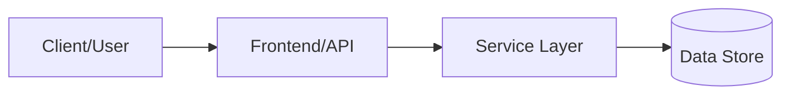
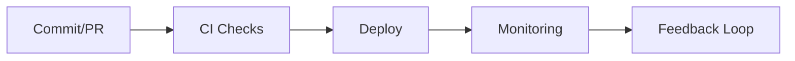

# 📘 Project README Template (Portfolio Standard)

Use this template to document projects with consistent depth, evidence quality, and status transparency.

## ✅ How to use this template

- Keep all sections, even if a section is "planned".
- Replace prompt text with project-specific details.
- Match the requested **detail level** for each section.
- Link evidence (code, tests, screenshots, runbooks, CI logs) whenever possible.

> **Status key:** 🟢 Done · 🟠 In Progress · 🔵 Planned · 🔄 Recovery/Rebuild · 📝 Documentation Pending

---
## 1) Project Overview

**Prompt (what to provide):**
- What problem does this project solve?
- Who are the intended users/stakeholders?
- What outcomes does success look like?

**Expected detail level:**
- 1 concise paragraph (4–8 sentences)
- 3–6 bullet points for business/technical outcomes

**Template:**

```md
## 🎯 Overview
[1 paragraph: problem, users, and value]

### Outcomes
- [Outcome 1]
- [Outcome 2]
- [Outcome 3]
```

---
## 2) Scope and Status

**Prompt:**
- What is in scope right now?
- What is explicitly out of scope?
- Current status and rationale?

**Expected detail level:**
- 1 status table + 1 short scope note
- Include current phase and next milestone

**Template:**

```md
## 📌 Scope & Status

| Area | Status | Notes | Next Milestone |
|---|---|---|---|
| [Core feature/workstream] | 🟠 In Progress | [Current state] | [Near-term target] |
| [Ops/Docs/Testing] | 🔵 Planned | [Current state] | [Near-term target] |

> **Scope note:** [What is in scope now and what is intentionally deferred]
```

---
## 3) Architecture

**Prompt:**
- What are the core components and boundaries?
- How do data/control flows work end-to-end?
- Key interfaces/APIs/services?

**Expected detail level:**
- 1 architecture paragraph + 1 Mermaid diagram
- 1 table mapping component → responsibility

**Template:**

```md
## 🏗️ Architecture
[Short paragraph describing components and boundaries]



| Component | Responsibility | Key Interfaces |
|---|---|---|
| [frontend/] | [UI workflows] | [routes/hooks] |
| [backend/] | [business logic] | [API endpoints] |
| [infra/] | [deployment/runtime] | [IaC modules] |
```

---
## 4) Setup and Runbook

**Prompt:**
- How to install, configure, run, and validate?
- What prerequisites are required?
- How to recover from common failures?

**Expected detail level:**
- Command table with expected outputs
- Troubleshooting for top 3 failure cases

**Template:**

```md
## 🚀 Setup & Runbook

### Prerequisites
- [Runtime versions]
- [Environment variables]
- [External dependencies]

### Commands
| Step | Command | Expected Result |
|---|---|---|
| Install | `[command]` | [result] |
| Run | `[command]` | [result] |
| Validate | `[command]` | [result] |

### Troubleshooting
| Issue | Likely Cause | Resolution |
|---|---|---|
| [Issue 1] | [Cause] | [Fix] |
| [Issue 2] | [Cause] | [Fix] |
| [Issue 3] | [Cause] | [Fix] |
```

---
## 5) Testing and Quality Evidence

**Prompt:**
- What testing layers are covered (unit/integration/e2e/manual)?
- What evidence proves current quality?
- What remains untested?

**Expected detail level:**
- 1 test strategy paragraph
- 1 table of test commands/results
- Explicit known gaps section

**Template:**

```md
## ✅ Testing & Quality Evidence
[Short test strategy paragraph]

| Test Type | Command / Location | Current Result | Evidence Link |
|---|---|---|---|
| Unit | `[command]` | [pass/fail/n/a] | [link/path] |
| Integration | `[command]` | [pass/fail/n/a] | [link/path] |
| E2E/Manual | [steps/doc] | [pass/fail/n/a] | [link/path] |

### Known Gaps
- [Gap 1]
- [Gap 2]
```

---
## 6) Security, Risk, and Reliability

**Prompt:**
- Primary risks (security/operational/data)?
- What controls are in place?
- Recovery/rollback strategy?

**Expected detail level:**
- 1 risk matrix table
- 3–5 concrete controls

**Template:**

```md
## 🔐 Security, Risk & Reliability

| Risk | Impact | Current Control | Residual Risk |
|---|---|---|---|
| [Risk 1] | [High/Med/Low] | [Control] | [Residual level] |
| [Risk 2] | [High/Med/Low] | [Control] | [Residual level] |

### Reliability Controls
- [Backups/snapshots]
- [Monitoring + alerts]
- [Rollback path]
- [Runbook ownership]
```

---
## 7) Delivery, CI/CD, and Observability

**Prompt:**
- How changes are built, tested, and deployed?
- Which metrics/logs/traces are monitored?
- Which SLOs or service health indicators are tracked?

**Expected detail level:**
- 1 delivery flow diagram
- 1 table of operational signals with thresholds/owners

**Template:**

```md
## 🔄 Delivery & Observability



| Signal | Source | Threshold/Expectation | Owner |
|---|---|---|---|
| Error rate | [tool] | [target] | [team/person] |
| Latency | [tool] | [target] | [team/person] |
| Availability | [tool] | [target] | [team/person] |
```

---
## 8) Roadmap and Milestones

**Prompt:**
- What was completed recently?
- What is next (near-term and mid-term)?
- Which dependencies/blockers exist?

**Expected detail level:**
- At least 3 upcoming milestones with dates/owners where possible

**Template:**

```md
## 🗺️ Roadmap

| Milestone | Status | Target | Owner | Dependency/Blocker |
|---|---|---|---|---|
| [Milestone 1] | 🟠 In Progress | [date/sprint] | [owner] | [dependency] |
| [Milestone 2] | 🔵 Planned | [date/sprint] | [owner] | [dependency] |
| [Milestone 3] | 🔵 Planned | [date/sprint] | [owner] | [dependency] |
```

---
## 9) Evidence Index

**Prompt:**
- Where can reviewers verify implementation quickly?
- Which files/docs prove delivery?

**Expected detail level:**
- 5+ links across code, docs, tests, CI, screenshots

**Template:**

```md
## 📎 Evidence Index
- [Architecture doc](./docs/architecture.md)
- [Runbook](./docs/runbook.md)
- [Test report](./docs/tests.md)
- [CI workflow](./.github/workflows/ci.yml)
- [Key source file](./src/...)
```

---
## 10) Documentation Freshness

**Prompt:**
- How often is this README updated?
- Who owns updates?

**Expected detail level:**
- Clear cadence and owner table

**Template:**

```md
## 🧾 Documentation Freshness

| Cadence | Action | Owner |
|---|---|---|
| Per major merge | Update status + milestone notes | [owner] |
| Weekly | Validate links and evidence index | [owner] |
| Monthly | README quality audit | [owner] |
```

---
## 11) Final Quality Checklist (Before Merge)

- [ ] Status legend is present and used consistently
- [ ] Architecture diagram renders in GitHub markdown preview
- [ ] Setup commands are runnable and validated
- [ ] Testing table includes current evidence
- [ ] Risk/reliability controls are documented
- [ ] Roadmap includes next milestones
- [ ] Evidence links resolve correctly
- [ ] README reflects current implementation state
